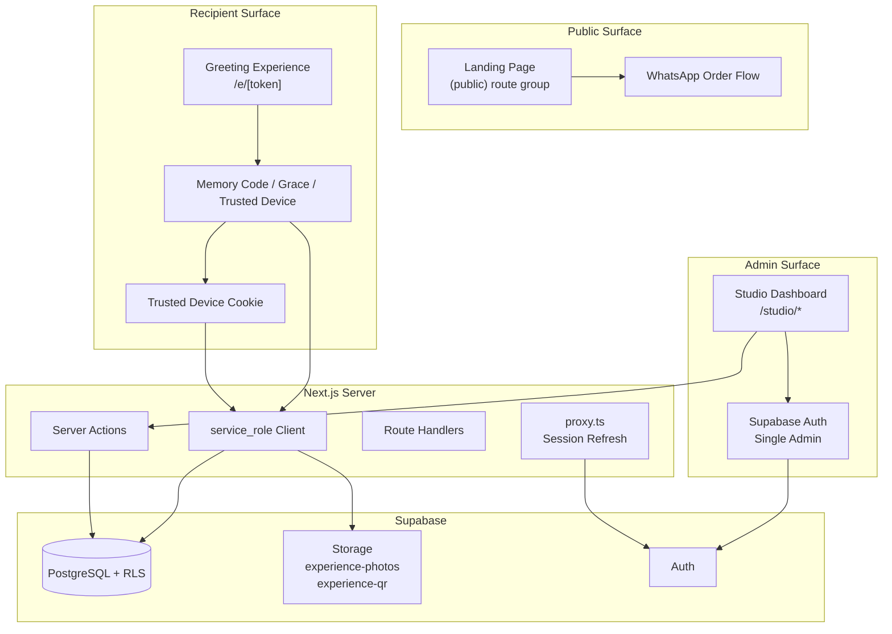

# 01 — Project Context

> **Related:** [Architecture](./02_ARCHITECTURE.md) · [Database](./03_DATABASE.md) · [Security](./04_SECURITY.md) · [Founder Decisions](./05_FOUNDER_DECISIONS.md) · [AI Guide](./07_AI_GUIDE.md)

---

## Project Overview

**Celebrate Florist** is a single-brand florist in Surakarta, Indonesia, that pairs physical flower bouquets with a **digital Greeting Experience** — a private, themed web page containing a personal letter, memory photos, and an ephemeral photobooth.

The product is **not** a marketplace, SaaS platform, or multi-tenant system. It is a bespoke gift experience for one florist, operated by one administrator.

### What the Customer Gets

1. A physical bouquet (ordered offline via WhatsApp).
2. A QR code on the bouquet that opens a private digital experience.
3. A themed greeting page with a personal letter and up to 6 memory photos.
4. An in-browser photobooth (photos never stored server-side).

### What the Admin Gets

1. **Studio** — an internal dashboard to manage orders, design experiences, send preview links, and publish gifts.
2. Full control over the order lifecycle from draft to delivery.
3. Audit logs and security events for accountability.

---

## Product Vision

Celebrate Florist turns a flower delivery into a **lasting memory**. The physical bouquet is the hook; the digital experience is the emotional payload.

Design principles (from implementation):

- **Warm, personal, not corporate** — typography and copy reflect a friendly florist, not a tech startup.
- **Privacy by default** — Memory Code after 24-hour grace period; content never publicly browsable.
- **Simplicity over features** — every feature must earn its complexity.
- **Offline-first commerce** — no payment gateway; human relationship via WhatsApp.

---

## Business Model

| Aspect       | Decision                                                        |
| ------------ | --------------------------------------------------------------- |
| Revenue      | Direct bouquet sales (offline payment)                          |
| Pricing      | Manually set per bouquet in static catalog config               |
| Orders       | Placed via WhatsApp — no checkout flow                          |
| Customers    | No accounts — buyers and recipients are anonymous to the system |
| Admin        | Single administrator (`ADMIN_EMAIL` in `.env.local`)            |
| Scale target | Single-store beachhead in Surakarta                             |

See [05_FOUNDER_DECISIONS.md](./05_FOUNDER_DECISIONS.md) for the full list of locked decisions and rationale.

---

## Founder Decisions (Summary)

These are non-negotiable without explicit founder approval:

- Single florist, single admin, no multi-tenant
- No payment gateway — WhatsApp/offline orders only
- No customer accounts
- One Order → One Experience (1:1 enforced in database)
- Preview Link ≠ Experience Link (separate tokens and workflows)
- Memory Code + 24-hour grace period + trusted devices (hashed, never stored plaintext) — implemented
- Maximum 6 memory photos per experience
- Photobooth photos **never** stored in Supabase
- Gifts archived after 365 days of inactivity
- `anon` role has **zero** direct access to Gift domain tables
- All recipient reads mediated server-side via `service_role`

Full rationale: [05_FOUNDER_DECISIONS.md](./05_FOUNDER_DECISIONS.md)

---

## Current Implementation Status

The status below is historical and wrong. Studio, recipient delivery, Memory Code, preview, photobooth, and the service-role client are all implemented.

**Read [17_CURRENT_HANDOFF.md](./17_CURRENT_HANDOFF.md).** That file is the current handoff for a new programmer. Sprint folders under `docs/sprint-*` are records of how the work was planned, not a list of unfinished work.

---

## High-Level Architecture



**Key architectural rule:** Recipients never read Gift domain data via the `anon` key. The server uses `service_role` after verifying Memory Code, grace-period rules, or trusted session. See [02_ARCHITECTURE.md](./02_ARCHITECTURE.md) and [04_SECURITY.md](./04_SECURITY.md).

---

## Repository Structure

```
celebrate-florist/
├── app/
│   ├── layout.tsx              # Root layout, brand fonts, metadata
│   ├── globals.css             # Tailwind 4 + design tokens
│   ├── (public)/               # Marketing site
│   ├── (studio)/               # Studio
│   ├── (experience)/           # /e/[token] and the trust route
│   ├── (preview)/              # /preview/[token]
│   └── (theme-lab)/            # Present in the repo; 404 in production
│
├── components/
│   ├── providers/              # MotionProvider (Framer Motion)
│   ├── shared/                 # PhotoSlot, ScrollReveal, SectionHeading
│   └── ui/                     # shadcn: Button, Sheet, Accordion
│
├── config/
│   ├── env.ts                  # Public env (Zod validated)
│   └── env.server.ts           # Server-only env (server-only guard)
│
├── features/
│   ├── landing/                # Marketing site
│   ├── themes/                 # Bloom, Warm, Sky are the live themes
│   ├── studio/                 # Orders, website settings, strips, auth
│   ├── experience/             # Recipient flow and scene engine
│   ├── access/                 # Memory Code, grace, trusted devices
│   ├── preview/                # Buyer preview
│   ├── photobooth/             # Client-only capture plus stored strip templates
│   ├── quiz/ match/ treasures/ # The other three experience modes
│   └── analytics/              # experience_opened inserts
│
├── lib/
│   ├── supabase/
│   │   ├── client.ts           # Browser client (anon key)
│   │   ├── server.ts           # Server client (anon key + cookies)
│   │   └── admin.ts            # service_role, server only
│   ├── utils.ts                # cn() helper
│   └── whatsapp.ts             # WhatsApp deep-link builder
│
├── proxy.ts                    # Studio gate, gift throttle, Theme Lab 404
├── next.config.ts              # CSP, security headers, image domains
├── scripts/
│   └── verify-supabase.ts      # Connectivity health check
├── supabase/
│   └── migrations/             # 26 SQL files; all applied on celebrate-florist-prod
├── types/
│   └── theme.ts                # Theme type for landing page
└── docs/                       # This documentation
```

---

## Tech Stack

| Layer      | Technology                      | Version   |
| ---------- | ------------------------------- | --------- |
| Framework  | Next.js (App Router)            | 16.2.10   |
| UI         | React                           | 19.2.4    |
| Language   | TypeScript (strict)             | 5.x       |
| Styling    | Tailwind CSS                    | 4.x       |
| Components | shadcn/ui + Radix UI            | —         |
| Animation  | Framer Motion                   | 12.x      |
| Forms      | React Hook Form + Zod           | 7.x / 4.x |
| Database   | Supabase (PostgreSQL)           | —         |
| Auth       | Supabase Auth                   | —         |
| Storage    | Supabase Storage                | —         |
| Deployment | Vercel                          | —         |
| Linting    | ESLint (next config) + Prettier | —         |
| Git hooks  | Husky + lint-staged             | —         |

### TypeScript Compiler Options (Notable)

- `strict: true`
- `noUncheckedIndexedAccess: true`
- `noImplicitOverride: true`
- Path alias: `@/*` → project root

---

## Deployment Target

- **Platform:** Vercel
- **Branch:** `rebuild/foundation` (active development)
- **Production URL:** Set via `NEXT_PUBLIC_APP_URL`
- **Supabase region:** `ap-southeast-1`
- **Image optimization:** `next/image` with Supabase storage remote patterns configured

The landing page (`(public)` route group) is deployable today. Studio and Experience routes will require additional environment variables (`SUPABASE_SERVICE_ROLE_KEY`, `MEMORY_KEY_PEPPER`, `ADMIN_EMAIL`) once implemented.

---

## Coding Philosophy

Derived from codebase conventions and sprint comments:

1. **Validate env at build time** — never read `process.env` directly outside `config/env.ts` and `config/env.server.ts`.
2. **Guard secrets with `server-only`** — importing server env from a Client Component must fail the build.
3. **Feature modules own their domain** — `features/<domain>/` contains components, hooks, actions, services for that domain.
4. **Static config for V1 content** — bouquet catalog, FAQ, nav items live in `features/landing/config/`; not database-driven yet.
5. **Comments explain _why_, not _what_** — especially for security and non-obvious business rules.
6. **No speculative code** — proxy has no auth redirect yet because no protected routes exist; do not add them early.
7. **Database is source of truth for Gift domain** — landing content is static; orders/experiences are relational.

---

## Future Work

Items referenced in design docs or folder structure but **not yet implemented**:

- Studio dashboard and admin auth gate (Sprint 04+)
- Experience delivery pages and Memory Code grace-period flow (**Planned Sprint 07**)
- `lib/supabase/admin.ts` service role client
- `lib/crypto/`, `lib/tokens/`, `lib/validation/` modules (folders may exist empty)
- `IP_HASH_PEPPER` environment variable (referenced in security design; not in `.env.example` yet)
- Photobooth canvas rendering and browser-only export
- QR code generation at publish time
- 365-day automatic archival cron/job
- Real theme preview images in `/public/themes/`
- Supabase TypeScript type generation (`supabase gen types`)
- Automated test suite (no tests exist today)
- README update (still describes Sprint 00 only)

---

## Related Documents

- [02_ARCHITECTURE.md](./02_ARCHITECTURE.md) — technical architecture details
- [03_DATABASE.md](./03_DATABASE.md) — full schema reference
- [04_SECURITY.md](./04_SECURITY.md) — security model
- [05_FOUNDER_DECISIONS.md](./05_FOUNDER_DECISIONS.md) — locked business rules
- [06_DEVELOPMENT_GUIDE.md](./06_DEVELOPMENT_GUIDE.md) — how to run and contribute
- [07_AI_GUIDE.md](./07_AI_GUIDE.md) — rules for AI assistants
