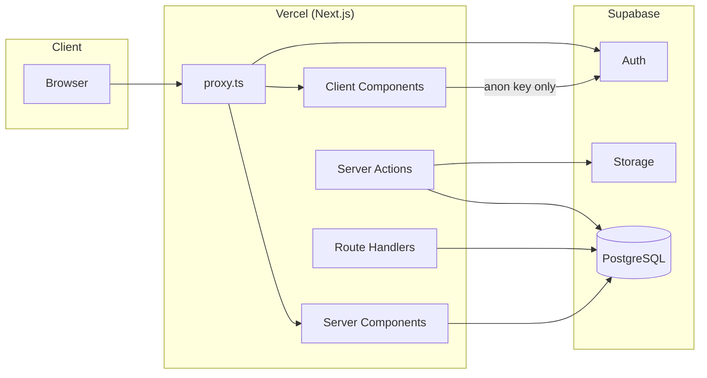
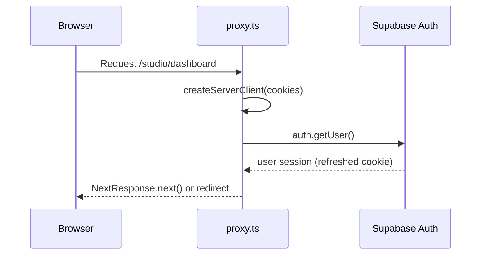
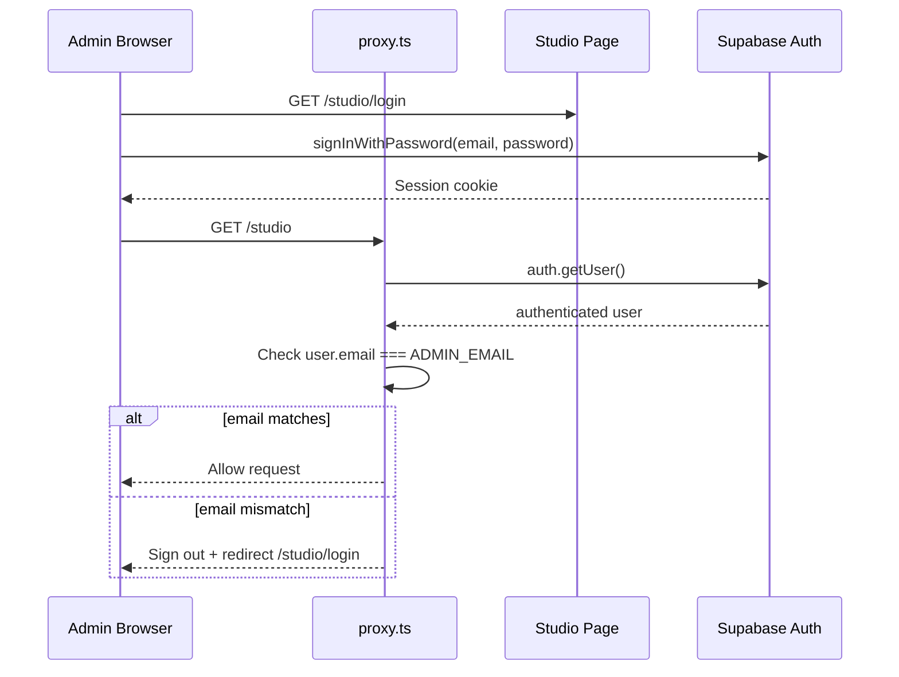
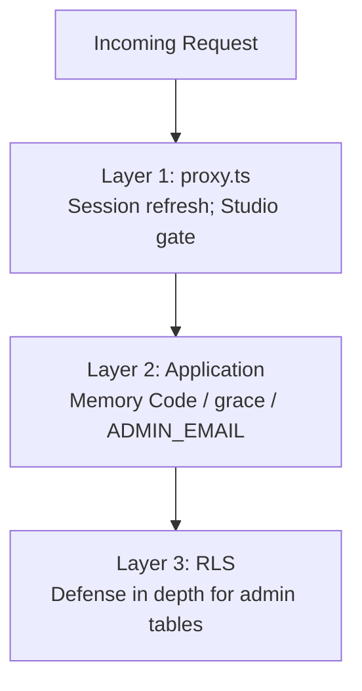
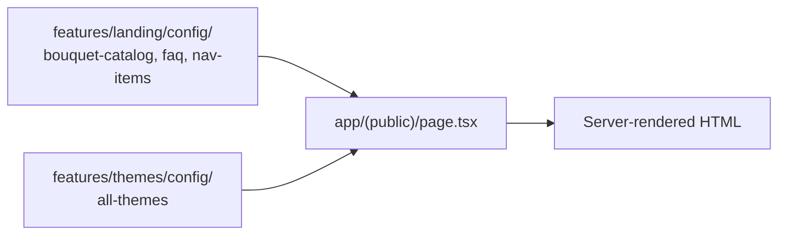
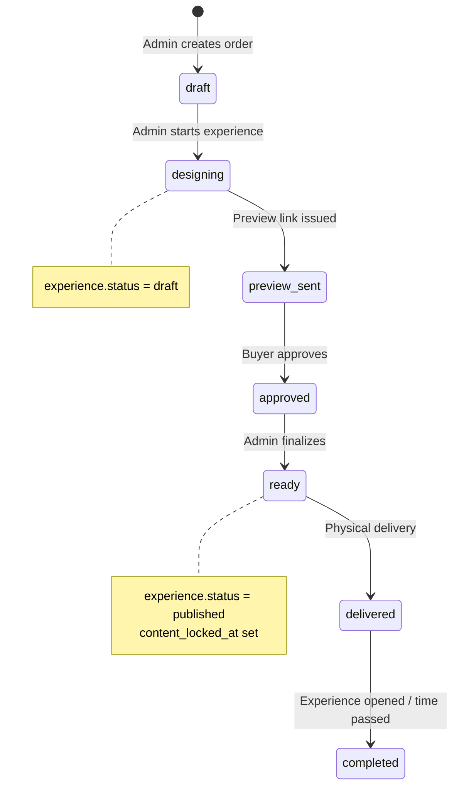
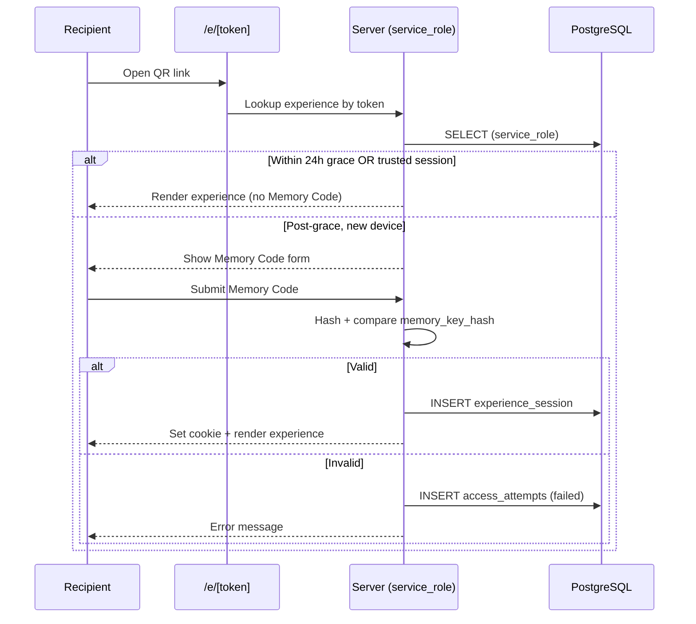
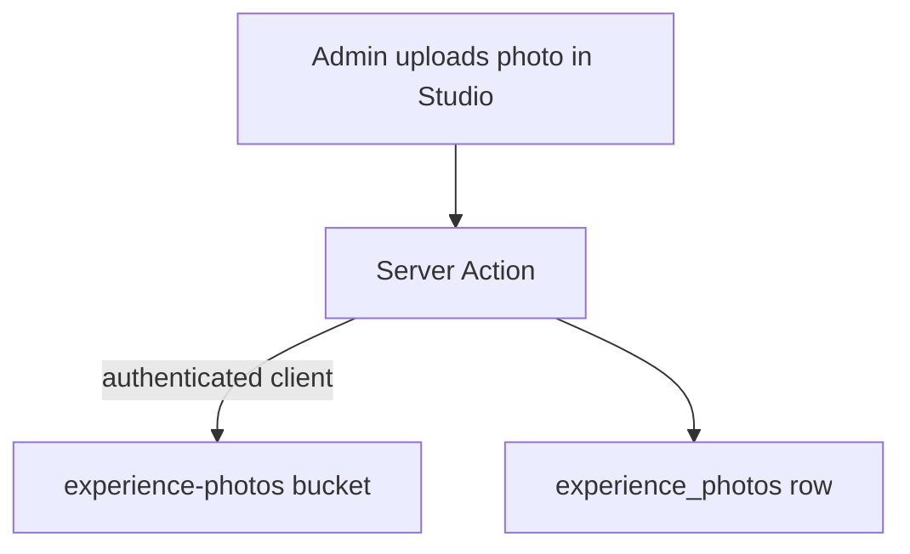
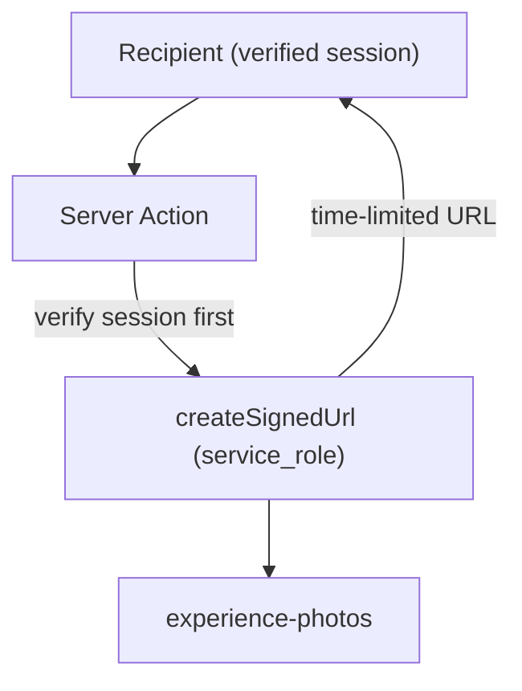
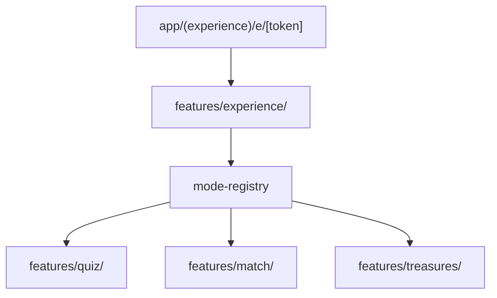

# 02 — Architecture

> **Related:** [Project Context](./01_PROJECT_CONTEXT.md) · [Database](./03_DATABASE.md) · [Security](./04_SECURITY.md) · [Founder Decisions](./05_FOUNDER_DECISIONS.md) · [AI Guide](./07_AI_GUIDE.md)

---

## Overall Architecture

Celebrate Florist is a **Next.js 16 monolith** deployed on Vercel, backed by **Supabase** (PostgreSQL, Auth, Storage). There is no separate API server, no microservices, and no edge functions beyond Vercel's platform defaults.



### Three Surfaces

| Surface        | Route prefix   | Route group    | Auth                                  | Status                                           |
| -------------- | -------------- | -------------- | ------------------------------------- | ------------------------------------------------ |
| **Public**     | `/`            | `(public)`     | None                                  | ✅ Implemented                                   |
| **Studio**     | `/studio/*`    | `(studio)`     | Supabase Auth (single admin)          | ✅ Partial — login, home, proxy gate (Sprint 05) |
| **Experience** | `/e/[token]/*` | `(experience)` | Memory Code + grace + trusted session | 📋 Planned — Sprint 07+                          |

---

## Next.js Architecture

### App Router

The project uses the **Next.js App Router** exclusively. There is no `pages/` directory.

| File                      | Role                                                                            |
| ------------------------- | ------------------------------------------------------------------------------- |
| `app/layout.tsx`          | Root layout — fonts (Poppins, Fraunces, Fira Code), metadata, `<html>`/`<body>` |
| `app/(public)/layout.tsx` | Public shell — navbar, footer, skip link, `MotionProvider`                      |
| `app/(public)/page.tsx`   | Landing page — composes all landing sections                                    |

### Route Groups

Route groups `(public)`, `(studio)`, `(experience)` organize code without affecting URL paths.

```
app/
├── layout.tsx
├── (public)/          → URLs: /
│   ├── layout.tsx
│   └── page.tsx
├── (studio)/          → URLs: /studio/*
│   └── studio/
│       ├── login/     ✅ Sprint 05
│       ├── orders/    📋 Sprint 06 — list, new, [id] unified editor
│       └── (home)     📋 Sprint 06 — action-queue dashboard
└── (experience)/      → URLs: /e/*       📋 Sprint 07+
    └── e/
        └── [token]/
            └── ...
```

**Why route groups?** Each surface has different layout needs (public marketing vs. admin dashboard vs. immersive experience). Groups keep layouts isolated without URL pollution.

---

## Server Components vs Client Components

### Current Pattern

| Component type                         | Usage today                                                                       |
| -------------------------------------- | --------------------------------------------------------------------------------- |
| **Server Components** (default)        | `app/(public)/page.tsx`, section components that don't need interactivity         |
| **Client Components** (`"use client"`) | `MotionProvider`, interactive nav (`Sheet`), scroll animations, `BackToTopButton` |

### Rules (from codebase)

1. **Default to Server Components** — only add `"use client"` when hooks, browser APIs, or event handlers are required.
2. **Never import `config/env.server.ts` or `server-only` modules from Client Components** — build will fail.
3. **Never import `lib/supabase/server.ts` from Client Components** — use `lib/supabase/client.ts` instead.
4. **Framer Motion** is isolated behind `MotionProvider` to limit client boundary scope.

---

## Server Actions

**Status:** Infrastructure and Studio auth **implemented** (Sprint 04–05). Domain mutations (orders, experience, modes) **planned** Sprint 06+.

### Layering

| Layer          | Location                          | Role                                                                                             |
| -------------- | --------------------------------- | ------------------------------------------------------------------------------------------------ |
| Wrappers       | `lib/actions/`                    | `withActionHandler`, `withAdminAction`, `validateActionInput`, `actionSuccess` / `actionFailure` |
| Entry points   | `features/<domain>/actions/`      | Thin `"use server"` functions — validate input, call service, return `ActionResult`              |
| Business rules | `features/<domain>/services/`     | Publish validation, mode routing, grace period, trusted device logic                             |
| Data access    | `features/<domain>/repositories/` | Supabase queries only — no business rules                                                        |

**Rule:** Server Actions stay **thin**. Do not put publish validation, grace-period rules, or mode routing inside actions or repositories.

### Domain action locations (planned)

```
features/studio/actions/      # Order CRUD, experience draft, publish (admin)
features/access/actions/    # Memory Code verification, session creation
features/experience/actions/ # Recipient shell data fetch (service_role, post-gate)
features/quiz/actions/      # Connection mode — admin + recipient
features/match/actions/     # Memories mode
features/treasures/actions/ # Treasures mode
features/analytics/actions/ # Coarse event recording
```

### Implemented pattern (Sprint 05)

```typescript
"use server";

import { validateActionInput, withActionHandler } from "@/lib/actions";

export async function loginAction(input: unknown) {
  return withActionHandler(async () => {
    const data = validateActionInput(schema, input);
    // delegate to supabase / services — return typed result
  });
}
```

Admin-only mutations use `withAdminAction` (combines `requireAdminUser` + `withActionHandler`).

Recipient reads and game submissions use `service_role` via `lib/supabase/admin.ts` **after** Memory Code / grace / trusted-session checks in `features/access/services/`.

---

## Proxy (`proxy.ts`)

Next.js 16 renamed `middleware.ts` to `proxy.ts`. Same runtime behavior.

### Current Behavior (Sprint 05)

1. Matches only `/studio/:path*` and `/e/:path*` (opt-in, not opt-out).
2. Creates Supabase server client with cookie read/write.
3. Calls `supabase.auth.getUser()` to refresh session cookie.
4. **Studio branch:** redirects unauthenticated users to `/studio/login`; rejects non-admin email; redirects authenticated admin away from login page.
5. **`/e/*` branch:** session refresh only — Memory Code / grace logic lives in application layer (Sprint 07).

### Future Extensions

| Extension                                    | When       |
| -------------------------------------------- | ---------- |
| Rate limiting on `/e/*` Memory Code attempts | Sprint 07  |
| IP-based throttling                          | Sprint 07+ |



### Why `(public)` Is Excluded

Marketing pages are fully static/cacheable. Matching them would add an unnecessary Supabase Auth round trip on every page view.

---

## Authentication Flow

### Admin Auth (Studio) — ✅ Implemented (Sprint 05)



### Key Rules

- **Single admin** — email verified against `ADMIN_EMAIL` (`config/env.server.ts` + Edge `proxy.ts`).
- **No role/claims table** — authorization is "authenticated + correct email".
- **No customer auth** — recipients use Memory Code + trusted device, not Supabase Auth.

See [04_SECURITY.md](./04_SECURITY.md) for Memory Code grace period and trusted device flows.

---

## Authorization Flow

Authorization operates at **three layers**:



| Layer           | Gift Domain (experiences, photos, etc.)                          | Admin Domain (orders, studio)                              |
| --------------- | ---------------------------------------------------------------- | ---------------------------------------------------------- |
| **proxy.ts**    | Session refresh; future rate limit on `/e/*`                     | Requires Supabase session + `ADMIN_EMAIL` match            |
| **Application** | Memory Code, grace period, or trusted session via `service_role` | `authenticated` + `ADMIN_EMAIL` match                      |
| **RLS**         | `anon` has **zero policies**                                     | `authenticated` has full CRUD on orders, experiences, etc. |

**Critical rule:** RLS is defense-in-depth for Gift domain, not the primary gate. Application code using `service_role` must enforce Memory Code / grace rules before returning content.

---

## Data Flow

### Landing Page (Current)



No database queries on the landing page. All content is static TypeScript config.

### Order → Experience Lifecycle (Future)



### Recipient Experience Access (Planned — Sprint 07)

Full Memory Code grace-period flow: [04_SECURITY.md](./04_SECURITY.md).



---

## Storage Flow

### Buckets

| Bucket              | Public | Purpose                          | Written by        | Read by                                  |
| ------------------- | ------ | -------------------------------- | ----------------- | ---------------------------------------- |
| `experience-photos` | No     | Memory photo gallery (max 6)     | Admin (Studio)    | Recipient via signed URL (server-minted) |
| `experience-qr`     | No     | Printable QR code per experience | Server at publish | Admin download                           |

**No photobooth bucket exists by design.** Photobooth images live only in browser memory/canvas.

### Upload Flow (Future)



### Recipient Read Flow (Future)



Recipients never receive direct storage paths or anon-key access to private buckets.

---

## Security Architecture

Security is layered across HTTP headers, proxy, application gates, RLS, and database constraints. Full detail: [04_SECURITY.md](./04_SECURITY.md).

### HTTP Layer (`next.config.ts`)

| Header                      | Value                                  | Purpose                                 |
| --------------------------- | -------------------------------------- | --------------------------------------- |
| `Strict-Transport-Security` | 2 years, preload                       | Force HTTPS                             |
| `X-Content-Type-Options`    | `nosniff`                              | Prevent MIME sniffing                   |
| `X-Frame-Options`           | `SAMEORIGIN`                           | Clickjacking defense                    |
| `Referrer-Policy`           | `strict-origin-when-cross-origin`      | Don't leak experience tokens in Referer |
| `Permissions-Policy`        | camera=self only                       | Limit browser APIs                      |
| `Content-Security-Policy`   | See [04_SECURITY.md](./04_SECURITY.md) | XSS mitigation                          |

### Environment Classification

| Class  | File                   | Variables                                                       | Client-safe? |
| ------ | ---------------------- | --------------------------------------------------------------- | ------------ |
| Public | `config/env.ts`        | `NEXT_PUBLIC_*`                                                 | Yes          |
| Server | `config/env.server.ts` | `SUPABASE_SERVICE_ROLE_KEY`, `MEMORY_KEY_PEPPER`, `ADMIN_EMAIL` | No           |

`ADMIN_EMAIL` is required in `config/env.server.ts` (Sprint 04). `proxy.ts` reads `process.env.ADMIN_EMAIL` directly on Edge runtime.

---

## Code Architecture (Sprint 05.5 — Founder Decisions)

> Locked in [05_FOUNDER_DECISIONS.md](./05_FOUNDER_DECISIONS.md) · Product context: [07_PRODUCT_REVISION_V2.md](./07_PRODUCT_REVISION_V2.md)

### Repository Convention — Feature-First

Domain repositories live **inside their feature folder**. `lib/repositories/` holds **only** cross-domain infrastructure — not business repositories.

```
lib/repositories/
└── base.ts              # Repository abstract base class (constructor injection)

features/
├── studio/repositories/     # OrdersRepository, ExperiencesRepository
├── experience/repositories/ # Shell-level reads (if needed)
├── quiz/repositories/       # Quiz questions, score bands
├── match/repositories/      # Match pairs
└── treasures/repositories/  # Envelopes
```

**Note:** `ThemesRepository` currently lives in `lib/repositories/` as the Sprint 04 reference implementation. New domain repos follow the feature-first rule above; `ThemesRepository` may move to `features/themes/repositories/` in a future cleanup sprint.

Repositories contain **database access only** — no publish rules, no grace-period logic.

### Services Layer

Business rules live in `features/<domain>/services/`:

| Service domain         | Examples                                             |
| ---------------------- | ---------------------------------------------------- |
| `studio/services/`     | Publish validation, order lifecycle checks           |
| `access/services/`     | Grace period evaluation, trusted device registration |
| `experience/services/` | Mode routing, shared experience orchestration        |
| `quiz/services/`       | Quiz grading, template application                   |
| `match/services/`      | Match validation, unlock rules                       |
| `treasures/services/`  | Envelope sequence enforcement                        |

### Experience Mode Structure — Hybrid Shell + Independent Modes

`features/experience/` is the **shell / orchestrator** for recipients:

- Routing entry at `/e/[token]`
- Shared layout, letter, gallery, photobooth
- **Mode registry** (`config/mode-registry.ts`) — maps `experience_mode` → mode module
- Shared experience services

Each interactive mode is a **separate feature** with its own Studio editor, repository, actions, services, and validation:

```
features/
├── experience/    # Shell + registry + shared recipient UI
├── quiz/          # Connection mode
├── match/         # Memories mode
└── treasures/     # Treasures mode
```



### Dependency Rules

| Rule                         | Detail                                   |
| ---------------------------- | ---------------------------------------- |
| `experience` → mode features | ✅ Via mode registry only                |
| Mode features → `studio`     | ❌ Forbidden                             |
| Feature → feature (direct)   | ❌ Forbidden except registry indirection |
| Any feature → `lib/`         | ✅ Shared infrastructure                 |
| `lib/` → `features/`         | ❌ Forbidden                             |

Mode features each include a **Studio editor panel** (components under `features/quiz/components/` etc.) composed into the Unified Order Editor at `/studio/orders/[id]` — not separate Studio routes per mode.

---

## Feature Module Structure

Each domain in `features/` follows a consistent layout:

```
features/<domain>/
├── components/     # UI components
├── hooks/          # React hooks
├── actions/        # Server Actions ("use server") — thin entry points
├── services/       # Business logic
├── repositories/   # Database query layer (feature-first)
└── config/         # Static configuration, templates, registry
```

**Implemented modules:**

| Module              | Status                                                    |
| ------------------- | --------------------------------------------------------- |
| `features/landing/` | ✅ 12 section components + config                         |
| `features/themes/`  | ✅ 5 theme configs + aggregator                           |
| `features/studio/`  | ✅ Auth (login, logout, proxy gate); 📋 orders Sprint 06+ |

**Scaffolded (planned):** `match`, `treasures`

**Implemented (Sprint 07–08):** `experience`, `access`, `preview`, `photobooth`, `analytics`, `quiz`

---

## Supabase Client Architecture

| Client  | File                     | Key            | RLS      | Use case                                      |
| ------- | ------------------------ | -------------- | -------- | --------------------------------------------- |
| Browser | `lib/supabase/client.ts` | anon           | Yes      | Client Components (Studio login form)         |
| Server  | `lib/supabase/server.ts` | anon + cookies | Yes      | Server Components, admin reads/writes via RLS |
| Admin   | `lib/supabase/admin.ts`  | service_role   | Bypasses | Recipient reads post-gate; privileged writes  |

```typescript
// lib/supabase/server.ts — admin Studio operations
import "server-only";
import { createServerClient } from "@supabase/ssr";
import { env } from "@/config/env";
// Uses anon key; RLS applies for authenticated admin
```

The server client uses the **anon key** for Studio (admin authenticated via RLS). The **admin client** (`service_role`) is used only server-side after application-layer gates for recipient flows.

**Implemented:** All three clients exist (Sprint 04). `lib/supabase/admin.ts` has `server-only` guard.

---

## Related Documents

- [01_PROJECT_CONTEXT.md](./01_PROJECT_CONTEXT.md) — product overview and status
- [03_DATABASE.md](./03_DATABASE.md) — schema, RLS, storage
- [04_SECURITY.md](./04_SECURITY.md) — threat model, secrets, CSP
- [05_FOUNDER_DECISIONS.md](./05_FOUNDER_DECISIONS.md) — locked rules
- [07_PRODUCT_REVISION_V2.md](./07_PRODUCT_REVISION_V2.md) — Product V2 architecture context
- [09_ARCHITECTURE_IMPACT.md](./09_ARCHITECTURE_IMPACT.md) — V2 impact matrix
- [11_IMPLEMENTATION_ROADMAP_V2.md](./11_IMPLEMENTATION_ROADMAP_V2.md) — sprint plan
- [12_STUDIO_UX.md](./12_STUDIO_UX.md) — Studio admin UX
- [07_AI_GUIDE.md](./07_AI_GUIDE.md) — coding rules for AI
