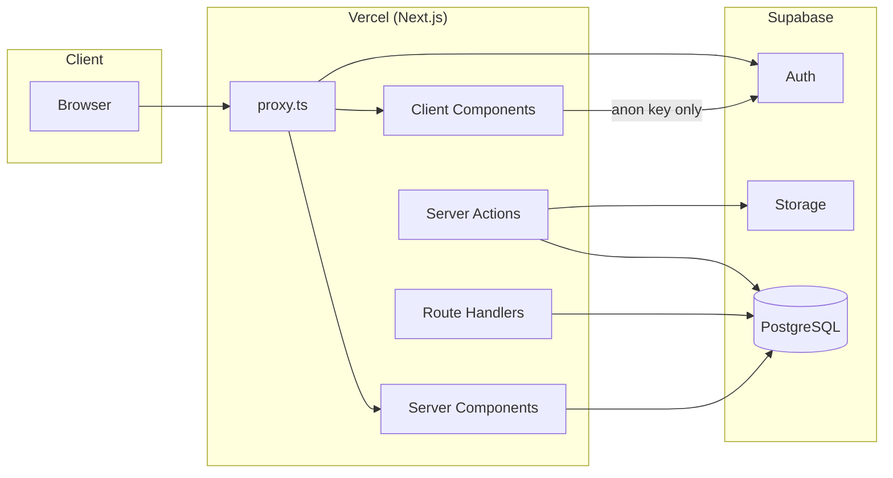
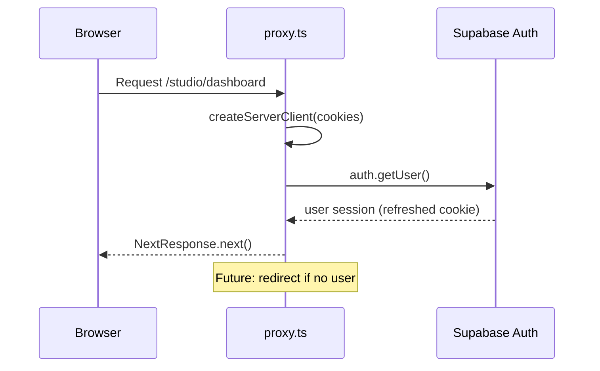
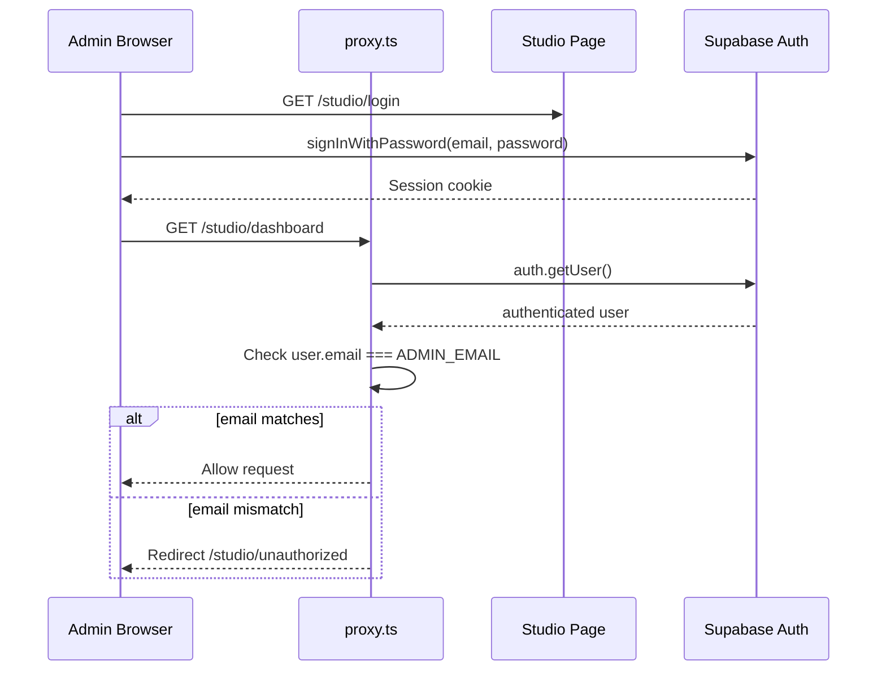
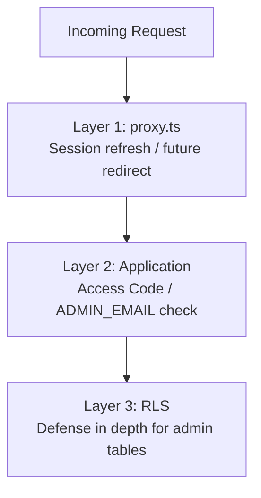
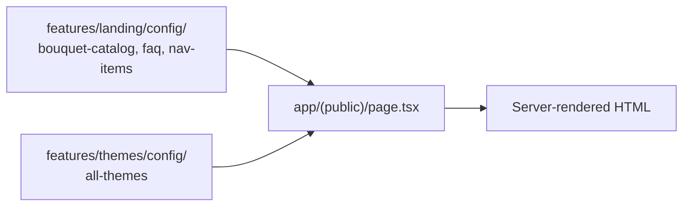
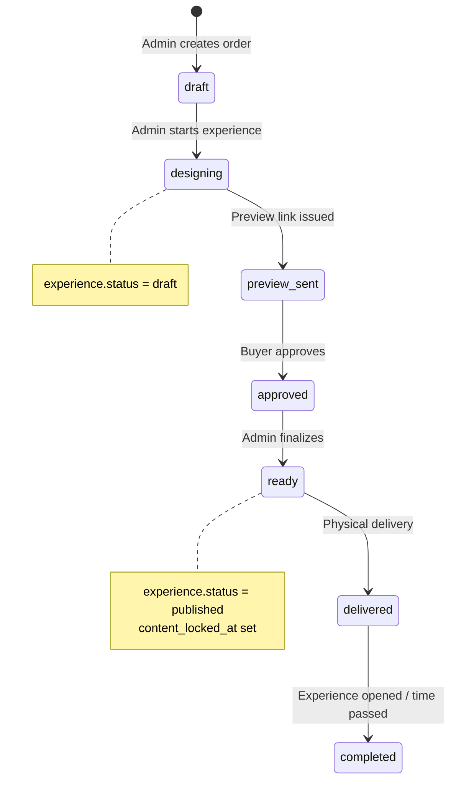
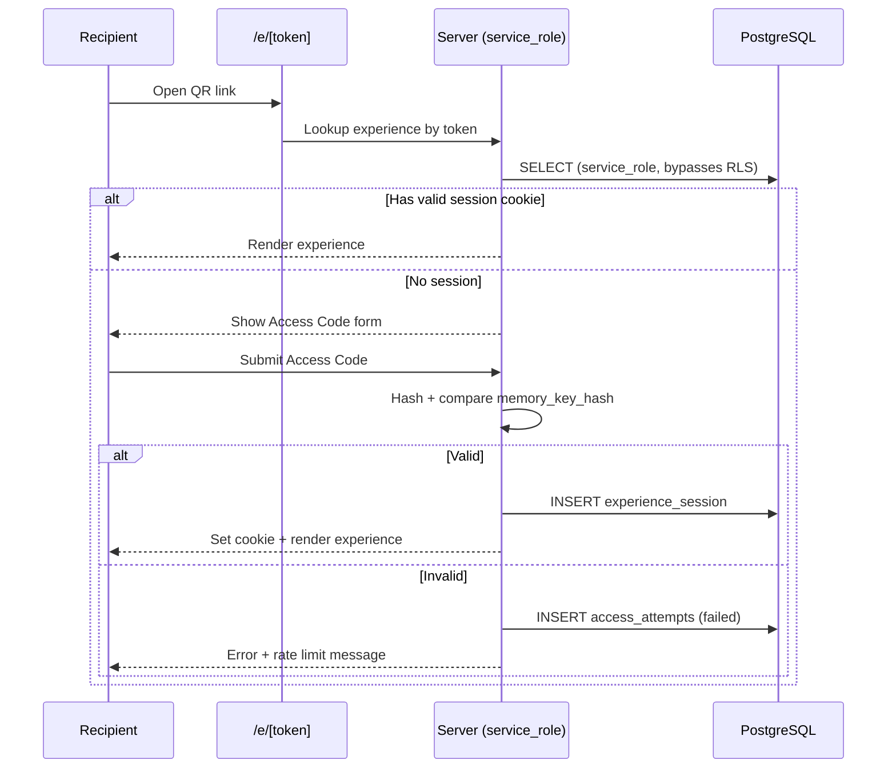
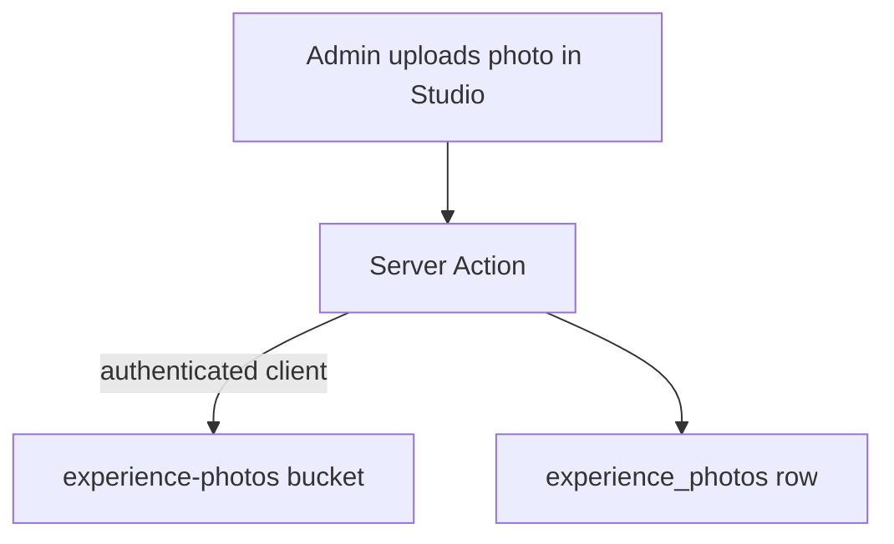
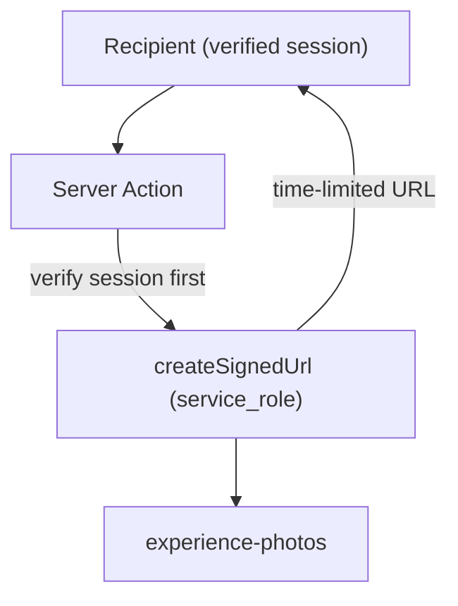

# 02 — Architecture

> **Related:** [Project Context](./01_PROJECT_CONTEXT.md) · [Database](./03_DATABASE.md) · [Security](./04_SECURITY.md) · [Founder Decisions](./05_FOUNDER_DECISIONS.md) · [AI Guide](./07_AI_GUIDE.md)

---

## Overall Architecture

Celebrate Florist is a **Next.js 16 monolith** deployed on Vercel, backed by **Supabase** (PostgreSQL, Auth, Storage). There is no separate API server, no microservices, and no edge functions beyond Vercel's platform defaults.



### Three Surfaces

| Surface        | Route prefix   | Route group    | Auth                          | Status         |
| -------------- | -------------- | -------------- | ----------------------------- | -------------- |
| **Public**     | `/`            | `(public)`     | None                          | ✅ Implemented |
| **Studio**     | `/studio/*`    | `(studio)`     | Supabase Auth (single admin)  | 📁 Planned     |
| **Experience** | `/e/[token]/*` | `(experience)` | Access Code + trusted session | 📁 Planned     |

---

## Next.js Architecture

### App Router

The project uses the **Next.js App Router** exclusively. There is no `pages/` directory.

| File                      | Role                                                                            |
| ------------------------- | ------------------------------------------------------------------------------- |
| `app/layout.tsx`          | Root layout — fonts (Poppins, Fraunces, Fira Code), metadata, `<html>`/`<body>` |
| `app/(public)/layout.tsx` | Public shell — navbar, footer, skip link, `MotionProvider`                      |
| `app/(public)/page.tsx`   | Landing page — composes all landing sections                                    |

### Route Groups

Route groups `(public)`, `(studio)`, `(experience)` organize code without affecting URL paths.

```
app/
├── layout.tsx
├── (public)/          → URLs: /
│   ├── layout.tsx
│   └── page.tsx
├── (studio)/          → URLs: /studio/*  [Future]
│   └── studio/
│       └── ...
└── (experience)/      → URLs: /e/*       [Future]
    └── e/
        └── [token]/
            └── ...
```

**Why route groups?** Each surface has different layout needs (public marketing vs. admin dashboard vs. immersive experience). Groups keep layouts isolated without URL pollution.

---

## Server Components vs Client Components

### Current Pattern

| Component type                         | Usage today                                                                       |
| -------------------------------------- | --------------------------------------------------------------------------------- |
| **Server Components** (default)        | `app/(public)/page.tsx`, section components that don't need interactivity         |
| **Client Components** (`"use client"`) | `MotionProvider`, interactive nav (`Sheet`), scroll animations, `BackToTopButton` |

### Rules (from codebase)

1. **Default to Server Components** — only add `"use client"` when hooks, browser APIs, or event handlers are required.
2. **Never import `config/env.server.ts` or `server-only` modules from Client Components** — build will fail.
3. **Never import `lib/supabase/server.ts` from Client Components** — use `lib/supabase/client.ts` instead.
4. **Framer Motion** is isolated behind `MotionProvider` to limit client boundary scope.

---

## Server Actions

**Status:** Not yet implemented.

Planned location per folder structure:

```
features/studio/actions/     # Order CRUD, experience publish
features/experience/actions/ # Experience data fetch (service_role)
features/access/actions/     # Access Code verification, session creation
features/analytics/actions/  # Event recording
```

### Expected Pattern (Future)

```typescript
"use server";

import { serverEnv } from "@/config/env.server";
// import admin client from lib/supabase/admin.ts

export async function verifyAccessCode(experienceToken: string, code: string) {
  // 1. Lookup experience by token (service_role)
  // 2. Hash code with MEMORY_KEY_PEPPER
  // 3. Compare to memory_key_hash
  // 4. Create experience_session on success
  // 5. Log to access_attempts and security_events
}
```

Server Actions will be the primary mutation path for Studio. Experience reads will also use Server Actions or Route Handlers with `service_role`.

---

## Proxy (`proxy.ts`)

Next.js 16 renamed `middleware.ts` to `proxy.ts`. Same runtime behavior.

### Current Behavior

1. Matches only `/studio/:path*` and `/e/:path*` (opt-in, not opt-out).
2. Creates Supabase server client with cookie read/write.
3. Calls `supabase.auth.getUser()` to refresh session cookie.
4. Returns `NextResponse.next()` — **no redirects, no rate limiting**.

### Why `(public)` Is Excluded

Marketing pages are fully static/cacheable. Matching them would add an unnecessary Supabase Auth round trip on every page view.

### Future Extensions (documented in file comments)

| Extension                                       | When              |
| ----------------------------------------------- | ----------------- |
| Redirect unauthenticated users from `/studio/*` | Sprint 04+        |
| Rate limiting on `/e/*` Access Code attempts    | Experience sprint |
| IP-based throttling                             | Experience sprint |



---

## Authentication Flow

**Status:** Infrastructure only — no login UI or route protection.

### Planned Admin Auth (Studio)



### Key Rules

- **Single admin** — only one Supabase Auth user is expected; email verified against `ADMIN_EMAIL` env var.
- **No role/claims table** — authorization is "authenticated + correct email".
- **No customer auth** — recipients authenticate via Access Code, not Supabase Auth.

See [04_SECURITY.md](./04_SECURITY.md) for Memory Key and trusted device flows.

---

## Authorization Flow

Authorization operates at **three layers**:



| Layer           | Gift Domain (experiences, photos, etc.)           | Admin Domain (orders, studio)                              |
| --------------- | ------------------------------------------------- | ---------------------------------------------------------- |
| **proxy.ts**    | No auth check (future: rate limit)                | Future: require Supabase session                           |
| **Application** | Access Code or trusted session via `service_role` | `authenticated` + `ADMIN_EMAIL` match                      |
| **RLS**         | `anon` has **zero policies**                      | `authenticated` has full CRUD on orders, experiences, etc. |

**Critical rule:** RLS is defense-in-depth for Gift domain, not the primary gate. Application code using `service_role` must enforce Access Code before returning content.

---

## Data Flow

### Landing Page (Current)



No database queries on the landing page. All content is static TypeScript config.

### Order → Experience Lifecycle (Future)



### Recipient Experience Access (Future)



---

## Storage Flow

### Buckets

| Bucket              | Public | Purpose                          | Written by        | Read by                                  |
| ------------------- | ------ | -------------------------------- | ----------------- | ---------------------------------------- |
| `experience-photos` | No     | Memory photo gallery (max 6)     | Admin (Studio)    | Recipient via signed URL (server-minted) |
| `experience-qr`     | No     | Printable QR code per experience | Server at publish | Admin download                           |

**No photobooth bucket exists by design.** Photobooth images live only in browser memory/canvas.

### Upload Flow (Future)



### Recipient Read Flow (Future)



Recipients never receive direct storage paths or anon-key access to private buckets.

---

## Security Architecture

Security is layered across HTTP headers, proxy, application gates, RLS, and database constraints. Full detail: [04_SECURITY.md](./04_SECURITY.md).

### HTTP Layer (`next.config.ts`)

| Header                      | Value                                  | Purpose                                 |
| --------------------------- | -------------------------------------- | --------------------------------------- |
| `Strict-Transport-Security` | 2 years, preload                       | Force HTTPS                             |
| `X-Content-Type-Options`    | `nosniff`                              | Prevent MIME sniffing                   |
| `X-Frame-Options`           | `SAMEORIGIN`                           | Clickjacking defense                    |
| `Referrer-Policy`           | `strict-origin-when-cross-origin`      | Don't leak experience tokens in Referer |
| `Permissions-Policy`        | camera=self only                       | Limit browser APIs                      |
| `Content-Security-Policy`   | See [04_SECURITY.md](./04_SECURITY.md) | XSS mitigation                          |

### Environment Classification

| Class  | File                   | Variables                                        | Client-safe?                  |
| ------ | ---------------------- | ------------------------------------------------ | ----------------------------- |
| Public | `config/env.ts`        | `NEXT_PUBLIC_*`                                  | Yes                           |
| Server | `config/env.server.ts` | `SUPABASE_SERVICE_ROLE_KEY`, `MEMORY_KEY_PEPPER` | No                            |
| Admin  | `.env.local` only      | `ADMIN_EMAIL`                                    | No (not yet in env.server.ts) |

---

## Feature Module Structure

Each domain in `features/` follows a consistent layout (scaffolded, not all populated):

```
features/<domain>/
├── components/     # UI components
├── hooks/          # React hooks
├── actions/        # Server Actions ("use server")
├── services/       # Business logic (pure functions)
├── repositories/   # Database query layer
└── config/         # Static configuration (if applicable)
```

**Implemented modules:**

- `features/landing/` — 12 section components + 5 config files
- `features/themes/` — 5 theme configs + `all-themes.ts` aggregator

**Scaffolded (empty):** `studio`, `experience`, `access`, `preview`, `photobooth`, `analytics`

---

## Supabase Client Architecture

| Client  | File                     | Key            | RLS      | Use case                                        |
| ------- | ------------------------ | -------------- | -------- | ----------------------------------------------- |
| Browser | `lib/supabase/client.ts` | anon           | Yes      | Future client-side auth in Studio               |
| Server  | `lib/supabase/server.ts` | anon + cookies | Yes      | Server Components, future admin reads           |
| Admin   | `lib/supabase/admin.ts`  | service_role   | Bypasses | **Future** — recipient reads, privileged writes |

```typescript
// lib/supabase/server.ts — pattern today
import "server-only";
import { createServerClient } from "@supabase/ssr";
import { env } from "@/config/env";
// Uses anon key; RLS applies
```

The server client intentionally uses the **anon key**, not service role. Privileged operations will use a separate admin client introduced in Sprint 04+.

---

## Related Documents

- [01_PROJECT_CONTEXT.md](./01_PROJECT_CONTEXT.md) — product overview and status
- [03_DATABASE.md](./03_DATABASE.md) — schema, RLS, storage
- [04_SECURITY.md](./04_SECURITY.md) — threat model, secrets, CSP
- [05_FOUNDER_DECISIONS.md](./05_FOUNDER_DECISIONS.md) — locked rules
- [07_AI_GUIDE.md](./07_AI_GUIDE.md) — coding rules for AI
