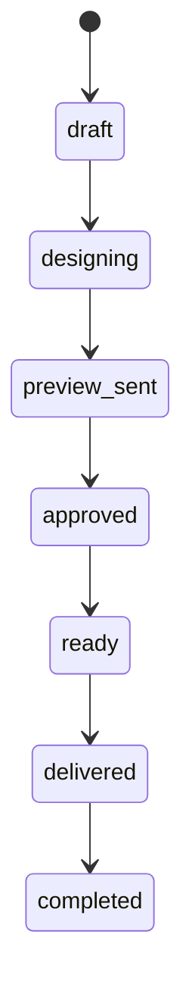
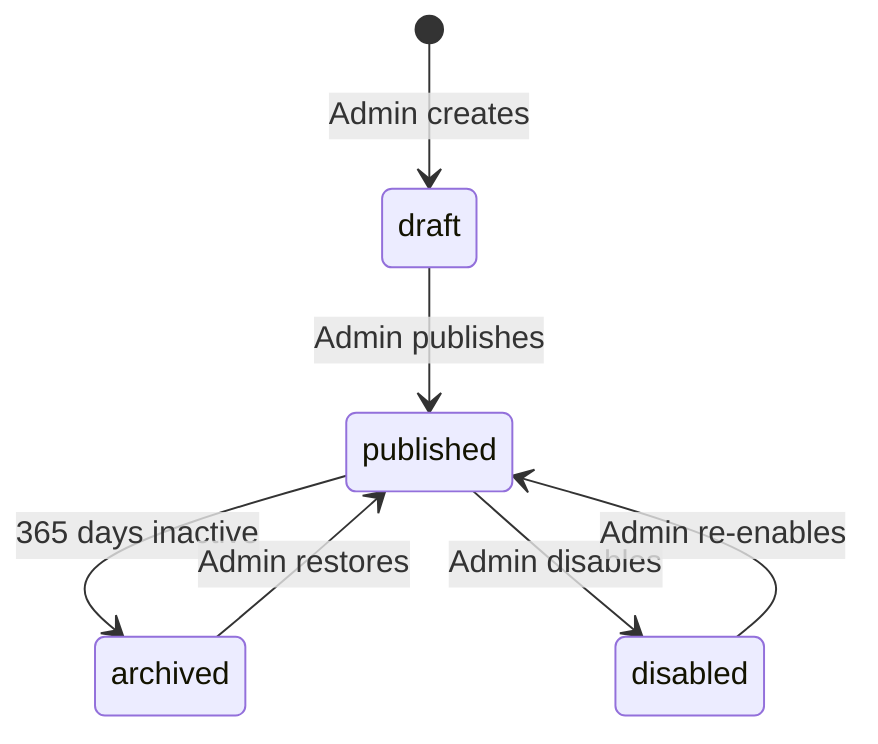

# 03 — Database

> **Related:** [Project Context](./01_PROJECT_CONTEXT.md) · [Architecture](./02_ARCHITECTURE.md) · [Security](./04_SECURITY.md) · [Founder Decisions](./05_FOUNDER_DECISIONS.md)

---

## Overview

> **Current as of 2026-09-24:** the hosted project has every migration in `supabase/migrations/` applied, including `20260923160000_studio_admin_rls.sql`. The table and policy narrative below stops at the Sprint 08 era. For the live file list, buckets, and RLS rule, read [17_CURRENT_HANDOFF.md](./17_CURRENT_HANDOFF.md). Do not treat “13 tables / 2 buckets” as the current schema.

Celebrate Florist uses **Supabase PostgreSQL**. The schema was designed in Sprint 03 and implemented in Sprint 03A, then extended through Studio admin RLS (2026-09-23). Storage buckets in code are `experience-photos`, `experience-qr`, `photobooth-strips`, `website-assets`, and `catalog-photobooth-strips`.

**Supabase project:** `celebrate-florist-prod` (`jobknyooffpouniyqpkp`, `ap-southeast-1`)

### Entity Relationship Diagram

```mermaid
erDiagram
    themes ||--o{ orders : "theme_id"
    themes ||--o{ experiences : "theme_id (snapshot)"
    orders ||--|| experiences : "1:1 order_id"
    experiences ||--o{ experience_photos : "max 6"
    experiences ||--o{ experience_quiz_questions : "connection max 6"
    experiences ||--o{ experience_quiz_score_bands : "connection min 1"
    experiences ||--o{ preview_links : "preview workflow"
    experiences ||--o{ experience_sessions : "trusted devices"
    experiences ||--o{ access_attempts : "rate limiting"
    experiences ||--o{ experience_analytics : "engagement"
    experiences ||--o{ security_events : "optional FK"
    auth_users ||--o{ preview_links : "created_by"
    auth_users ||--o{ audit_logs : "actor_id (admin)"
    auth_users ||--o{ app_settings : "updated_by"

    themes {
        uuid id PK
        text slug UK
        text name
        boolean is_active
        integer sort_order
    }

    orders {
        uuid id PK
        text order_number UK
        uuid theme_id FK
        order_status status
    }

    experiences {
        uuid id PK
        uuid order_id FK UK
        text experience_token UK
        text memory_key_hash
        experience_status status
    }
```

---

## Enum Types

| Enum                | Values                                                                                             | Used by                           |
| ------------------- | -------------------------------------------------------------------------------------------------- | --------------------------------- |
| `order_status`      | `draft`, `designing`, `preview_sent`, `approved`, `ready`, `delivered`, `completed`                | `orders.status`                   |
| `experience_status` | `draft`, `published`, `archived`, `disabled`                                                       | `experiences.status`              |
| `analytics_event`   | `experience_opened`, `letter_read`, `gallery_viewed`, `photobooth_started`, `photobooth_completed` | `experience_analytics.event_type` |
| `audit_actor_type`  | `admin`, `system`                                                                                  | `audit_logs.actor_type`           |

**Intentionally TEXT + CHECK (not enums):** `orders.event_type`, `experiences.event_type`, `orders.experience_mode`, `experiences.experience_mode`, `security_events.event_type` — easier to extend without enum migration.

---

## Tables

### `themes`

**Purpose:** Reference data for the 5 Experience Themes. Database tracks identity and availability; visual config (colors, emoji, flower) lives in `features/themes/config/`.

| Column                     | Type        | Notes                  |
| -------------------------- | ----------- | ---------------------- |
| `id`                       | uuid PK     | `gen_random_uuid()`    |
| `slug`                     | text UNIQUE | Format: `^[a-z0-9-]+$` |
| `name`                     | text        | Display name           |
| `is_active`                | boolean     | Default `true`         |
| `sort_order`               | integer     | Display order          |
| `created_at`, `updated_at` | timestamptz | Auto-maintained        |

**Relationships:** Referenced by `orders.theme_id`, `experiences.theme_id` (ON DELETE RESTRICT)

**Lifecycle:** Seeded once (5 themes). Never deleted — no delete RLS policy.

**Seed data:** `bloom`, `sky`, `pure`, `warm`, `play` (migration 010)

---

### `orders`

**Purpose:** Business transaction domain — tracks the offline bouquet order from creation to completion.

| Column                     | Type             | Notes                                                                |
| -------------------------- | ---------------- | -------------------------------------------------------------------- |
| `id`                       | uuid PK          |                                                                      |
| `order_number`             | text UNIQUE      | Auto-generated: `ORD-YYYY-NNN` via trigger                           |
| `theme_id`                 | uuid FK → themes |                                                                      |
| `sender_name`              | text             | Not blank                                                            |
| `receiver_name`            | text             | Not blank                                                            |
| `event_type`               | text             | `birthday`, `anniversary`, `graduation`, `friendship`, `custom`      |
| `buyer_whatsapp`           | text             | Optional                                                             |
| `admin_notes`              | text             | Optional                                                             |
| `status`                   | order_status     | Default `draft`                                                      |
| `experience_mode`          | text             | `moments`, `connection`, `memories`, `treasures` — creation snapshot |
| `scheduled_delivery_at`    | timestamptz      | Optional                                                             |
| `delivered_at`             | timestamptz      | Only when status is `delivered` or `completed`                       |
| `created_at`, `updated_at` | timestamptz      |                                                                      |

**Relationships:** 1:1 with `experiences` (enforced by UNIQUE on `experiences.order_id`)

**Lifecycle:**



**Business rules:**

- Orders are never deleted (no delete RLS policy)
- `order_number` generated by `generate_order_number()` trigger — global sequence, not annual reset
- `delivered_at` requires status `delivered` or `completed`

**Indexes:** `status`, `scheduled_delivery_at`, `theme_id`, `receiver_name` (GIN trigram), `experience_mode`

---

### `experiences`

**Purpose:** The digital gift — letter, memory photos, Access Code, QR code. Core of the product.

| Column                     | Type              | Notes                                             |
| -------------------------- | ----------------- | ------------------------------------------------- |
| `id`                       | uuid PK           |                                                   |
| `order_id`                 | uuid FK UNIQUE    | 1:1 with orders                                   |
| `theme_id`                 | uuid FK           | Snapshot at creation time                         |
| `experience_token`         | text UNIQUE       | Public URL identifier `/e/[token]`                |
| `greeting_name`            | text              | Recipient greeting                                |
| `closing_name`             | text              | Letter sign-off                                   |
| `event_type`               | text              | Snapshot from order                               |
| `experience_mode`          | text              | Source of truth after creation; editable in draft |
| `quiz_title`               | text              | Nullable — Connection mode heading                |
| `letter_content`           | text              | Main letter body                                  |
| `letter_closing`           | text              | Closing line                                      |
| `memory_key_hash`          | text              | Hashed Access Code — **never plaintext**          |
| `status`                   | experience_status | Default `draft`                                   |
| `is_opened`                | boolean           | First-scan flag                                   |
| `is_locked`                | boolean           | Security lock                                     |
| `locked_reason`            | text              | Only when `is_locked = true`                      |
| `qr_storage_path`          | text              | Path in `experience-qr` bucket                    |
| `content_locked_at`        | timestamptz       | Set on publish — content immutable after          |
| `first_opened_at`          | timestamptz       | Set on first recipient open                       |
| `last_accessed_at`         | timestamptz       | Updated on each access                            |
| `published_at`             | timestamptz       | Required for non-draft status                     |
| `archived_at`              | timestamptz       | Set when status = `archived`                      |
| `created_at`, `updated_at` | timestamptz       |                                                   |

**Lifecycle:**



**Business rules:**

- One experience per order (UNIQUE `order_id`)
- `content_locked_at` set on publish — letter and photos immutable after
- `is_opened` must agree with `first_opened_at`
- `published_at` required for all non-draft statuses
- `archived_at` only when status = `archived`
- Experiences never deleted — only `disabled`

**Indexes:** `status`, `theme_id` (+ UNIQUE indexes on `experience_token`, `order_id`)

---

### `experience_photos`

**Purpose:** Permanent memory photo gallery. Maximum 6 per experience.

| Column          | Type        | Notes                              |
| --------------- | ----------- | ---------------------------------- |
| `id`            | uuid PK     |                                    |
| `experience_id` | uuid FK     | ON DELETE CASCADE                  |
| `storage_path`  | text        | Path in `experience-photos` bucket |
| `sort_order`    | integer     | 1–6                                |
| `caption`       | text        | Optional                           |
| `created_at`    | timestamptz | No `updated_at` — immutable        |

**Business rules:**

- `sort_order` between 1 and 6 (CHECK)
- UNIQUE `(experience_id, sort_order)` — structurally caps at 6 photos
- Photos are immutable — replacement is delete + insert, never update
- No update RLS policy

---

### `experience_quiz_questions`

**Purpose:** Connection mode — multiple-choice quiz questions (max 6 per experience).

| Column                 | Type        | Notes                                     |
| ---------------------- | ----------- | ----------------------------------------- |
| `id`                   | uuid PK     |                                           |
| `experience_id`        | uuid FK     | ON DELETE CASCADE                         |
| `sort_order`           | integer     | 1–6                                       |
| `prompt`               | text        | Question text                             |
| `options`              | jsonb       | Array of A/B/C choice strings (auxiliary) |
| `correct_option_index` | integer     | 0-based index into `options`              |
| `created_at`           | timestamptz | No `updated_at` — immutable after publish |

**Business rules:**

- `sort_order` between 1 and 6 (CHECK)
- UNIQUE `(experience_id, sort_order)`
- `options` must be JSON array (CHECK)
- `correct_option_index >= 0` — upper bound validated in application layer
- Connection mode only — no rows on other modes at publish
- No update RLS policy — draft edits use delete + insert

---

### `experience_quiz_score_bands`

**Purpose:** Connection mode — score band messages shown after quiz grading.

| Column          | Type    | Notes                               |
| --------------- | ------- | ----------------------------------- |
| `id`            | uuid PK |                                     |
| `experience_id` | uuid FK | ON DELETE CASCADE                   |
| `min_percent`   | integer | 0–100                               |
| `max_percent`   | integer | 0–100, `min_percent <= max_percent` |
| `message`       | text    | Shown to recipient for this band    |

**Business rules:**

- At least 1 band required at publish (application layer)
- Overlapping bands not allowed (application layer — OD-3)
- No update RLS policy

---

### `preview_links`

**Purpose:** Admin-controlled buyer approval workflow. Separate token from experience link.

| Column          | Type                 | Notes                    |
| --------------- | -------------------- | ------------------------ |
| `id`            | uuid PK              |                          |
| `experience_id` | uuid FK              | ON DELETE CASCADE        |
| `preview_token` | text UNIQUE          | `/preview/[token]` route |
| `is_active`     | boolean              | Default `true`           |
| `created_by`    | uuid FK → auth.users |                          |
| `disabled_at`   | timestamptz          | Set when deactivated     |
| `created_at`    | timestamptz          |                          |

**Business rules:**

- At most **one active** preview link per experience (partial unique index)
- Previews disabled, never deleted — audit trail preserved
- `is_active`/`disabled_at` consistency enforced by CHECK

**Indexes:** `experience_id`, partial unique on `(experience_id) WHERE is_active`

---

### `experience_sessions`

**Purpose:** Trusted-device cookie backing store. After successful Access Code entry, a session cookie allows return visits without re-entering the code.

| Column               | Type        | Notes                   |
| -------------------- | ----------- | ----------------------- |
| `id`                 | uuid PK     |                         |
| `experience_id`      | uuid FK     | ON DELETE CASCADE       |
| `session_token_hash` | text        | Hashed cookie value     |
| `ip_hash`            | text        | Hashed IP (optional)    |
| `user_agent_hash`    | text        | Hashed UA (optional)    |
| `verified_at`        | timestamptz | Session creation time   |
| `expires_at`         | timestamptz | Must be > `verified_at` |
| `last_seen_at`       | timestamptz | Updated on each visit   |
| `is_revoked`         | boolean     | Admin can revoke        |

**RLS:** **No policies** for `anon` or `authenticated` — service_role only.

**Indexes:** `session_token_hash`, `expires_at`, `experience_id`

---

### `access_attempts`

**Purpose:** Access Code rate-limiting. Records outcomes only — **never stores the code itself**.

| Column           | Type        | Notes             |
| ---------------- | ----------- | ----------------- |
| `id`             | uuid PK     |                   |
| `experience_id`  | uuid FK     | ON DELETE CASCADE |
| `ip_hash`        | text        | Hashed IP         |
| `was_successful` | boolean     |                   |
| `attempted_at`   | timestamptz |                   |

**RLS:** **No policies** — service_role only.

**Indexes:** `(experience_id, ip_hash, attempted_at)` — rate limit query

---

### `experience_analytics`

**Purpose:** Privacy-respecting engagement events for admin dashboard.

| Column          | Type            | Notes                                  |
| --------------- | --------------- | -------------------------------------- |
| `id`            | uuid PK         |                                        |
| `experience_id` | uuid FK         | ON DELETE CASCADE                      |
| `event_type`    | analytics_event |                                        |
| `device_type`   | text            | `mobile`, `tablet`, `desktop`, or null |
| `occurred_at`   | timestamptz     |                                        |

**RLS:** Admin SELECT only. Writes via service_role (Server Actions).

**Indexes:** `(experience_id, event_type)`

---

### `audit_logs`

**Purpose:** Immutable record of admin and system actions.

| Column         | Type                 | Notes                                   |
| -------------- | -------------------- | --------------------------------------- |
| `id`           | uuid PK              |                                         |
| `actor_type`   | audit_actor_type     | `admin` or `system`                     |
| `actor_id`     | uuid FK → auth.users | Required for `admin`, null for `system` |
| `action`       | text                 | Free text vocabulary                    |
| `target_table` | text                 |                                         |
| `target_id`    | uuid                 |                                         |
| `metadata`     | jsonb                | Optional context                        |
| `created_at`   | timestamptz          |                                         |

**Immutability:** `prevent_audit_log_mutation()` trigger blocks UPDATE and DELETE for **all roles** including `service_role`.

**RLS:** Admin SELECT only. Inserts via service_role (no RLS policy needed).

**Indexes:** `(target_table, target_id)`, `created_at`

---

### `security_events`

**Purpose:** Security-relevant events for monitoring and alerting.

| Column          | Type        | Notes                   |
| --------------- | ----------- | ----------------------- |
| `id`            | uuid PK     |                         |
| `event_type`    | text        | Closed CHECK vocabulary |
| `experience_id` | uuid FK     | Optional                |
| `ip_hash`       | text        | Optional                |
| `metadata`      | jsonb       | Optional                |
| `created_at`    | timestamptz |                         |

**Allowed `event_type` values:**
`memory_key_failed`, `memory_key_exhausted`, `experience_locked`, `experience_brute_forced`, `rate_limit_triggered`, `suspicious_multi_device_access`, `admin_login_failed`, `admin_session_expired`

**RLS:** Admin SELECT only. Writes via service_role.

**Retention:** 90-day cleanup job (future — not yet implemented).

**Indexes:** `created_at`, `experience_id`

---

### `app_settings`

**Purpose:** Studio runtime configuration key/value store.

| Column       | Type                 | Notes              |
| ------------ | -------------------- | ------------------ |
| `id`         | uuid PK              |                    |
| `key`        | text UNIQUE          |                    |
| `value`      | text                 |                    |
| `updated_by` | uuid FK → auth.users | ON DELETE SET NULL |
| `updated_at` | timestamptz          |                    |

**Known keys:**

- `admin_email` — set at deploy time from `ADMIN_EMAIL` env var (Sprint 04 bootstrap)

**RLS:** Admin SELECT and UPDATE only. No insert/delete via RLS.

---

## RLS Summary

| Table                         | anon        | authenticated          | service_role |
| ----------------------------- | ----------- | ---------------------- | ------------ |
| `themes`                      | SELECT      | SELECT, INSERT, UPDATE | Bypasses RLS |
| `orders`                      | ❌ none     | SELECT, INSERT, UPDATE | Bypasses RLS |
| `experiences`                 | ❌ **none** | SELECT, INSERT, UPDATE | Bypasses RLS |
| `experience_photos`           | ❌ **none** | SELECT, INSERT, DELETE | Bypasses RLS |
| `experience_quiz_questions`   | ❌ **none** | SELECT, INSERT, DELETE | Bypasses RLS |
| `experience_quiz_score_bands` | ❌ **none** | SELECT, INSERT, DELETE | Bypasses RLS |
| `preview_links`               | ❌ **none** | SELECT, INSERT, UPDATE | Bypasses RLS |
| `experience_sessions`         | ❌ none     | ❌ none                | Bypasses RLS |
| `access_attempts`             | ❌ none     | ❌ none                | Bypasses RLS |
| `experience_analytics`        | ❌ none     | SELECT                 | Bypasses RLS |
| `audit_logs`                  | ❌ none     | SELECT                 | Bypasses RLS |
| `security_events`             | ❌ none     | SELECT                 | Bypasses RLS |
| `app_settings`                | ❌ none     | SELECT, UPDATE         | Bypasses RLS |

**Core principle:** `anon` has **zero policies** on Gift domain tables. Recipient access is entirely server-mediated via `service_role`. See [04_SECURITY.md](./04_SECURITY.md).

### Storage RLS

| Bucket              | anon    | authenticated          |
| ------------------- | ------- | ---------------------- |
| `experience-photos` | ❌ none | SELECT, INSERT, DELETE |
| `experience-qr`     | ❌ none | SELECT, INSERT, DELETE |

Recipients receive signed URLs minted server-side — never direct bucket access.

---

## Storage Buckets

| Bucket              | Public | Purpose                                     |
| ------------------- | ------ | ------------------------------------------- |
| `experience-photos` | **No** | Memory photo gallery (max 6 per experience) |
| `experience-qr`     | **No** | Printable QR code generated at publish      |

**No photobooth bucket** — by design. Photobooth images never touch Supabase Storage.

---

## Functions & Triggers

| Function                         | Trigger                                                    | Purpose                                         |
| -------------------------------- | ---------------------------------------------------------- | ----------------------------------------------- |
| `set_updated_at()`               | BEFORE UPDATE on themes, orders, experiences, app_settings | Auto-update `updated_at`                        |
| `generate_order_number()`        | BEFORE INSERT on orders                                    | Generate `ORD-YYYY-NNN`                         |
| `create_order_with_experience()` | RPC (no trigger)                                           | Atomic order + experience bootstrap (Sprint 06) |
| `prevent_audit_log_mutation()`   | BEFORE UPDATE/DELETE on audit_logs                         | Enforce immutability                            |

**Sequence:** `order_number_seq` — global counter (does not reset annually).

---

## Migration History

| #   | File                                                             | Purpose                                                                                    |
| --- | ---------------------------------------------------------------- | ------------------------------------------------------------------------------------------ |
| 001 | `20260710210001_extensions.sql`                                  | `pgcrypto`, `pg_trgm`                                                                      |
| 002 | `20260710210002_enums.sql`                                       | 4 enum types                                                                               |
| 003 | `20260710210003_tables.sql`                                      | 11 tables                                                                                  |
| 004 | `20260710210004_constraints.sql`                                 | FK, UNIQUE, CHECK constraints                                                              |
| 005 | `20260710210005_indexes.sql`                                     | 16 performance indexes + partial unique                                                    |
| 006 | `20260710210006_functions.sql`                                   | 3 functions + sequence                                                                     |
| 007 | `20260710210007_triggers.sql`                                    | updated_at, order_number, audit immutability                                               |
| 008 | `20260710210008_rls.sql`                                         | 20 RLS policies                                                                            |
| 009 | `20260710210009_storage.sql`                                     | 2 private buckets + policies                                                               |
| 010 | `20260710210010_seed.sql`                                        | 5 themes                                                                                   |
| 011 | `20260710210011_harden_function_search_path.sql`                 | Pin `search_path` on functions                                                             |
| 012 | `20260710210012_revoke_rls_auto_enable_execute_from_public.sql`  | Close platform function RPC                                                                |
| 013 | `20260710210013_fix_missing_base_table_grants.sql`               | Revoke anon DML on sensitive tables                                                        |
| 014 | `20260710210014_revoke_trigger_function_execute_from_public.sql` | Close trigger function EXECUTE                                                             |
| 015 | `20260710210015_seed_admin_email.sql`                            | Documents deploy-time config (no INSERT)                                                   |
| 016 | `20260712160000_experience_mode.sql`                             | `experience_mode`, `quiz_title`, atomic create RPC                                         |
| 017 | `20260712200000_experience_quiz.sql`                             | `experience_quiz_questions`, `experience_quiz_score_bands` + RLS                           |
| 018 | `20260713020000_experience_quiz_service_role_grants.sql`         | Hotfix — `service_role` SELECT on quiz tables (Migration 017 gap)                          |
| —   | `20260713160000_experience_match_pairs.sql`                      | Sprint 09A — `experience_match_pairs`, `final_unlock_message`, RLS + `service_role` grants |

**Status:** **19** migration files in repo. **19** applied on remote Supabase (`celebrate-florist-prod`).

### Repo vs Remote Migration History

| Context                                 | Count          | Notes                                                                                                           |
| --------------------------------------- | -------------- | --------------------------------------------------------------------------------------------------------------- |
| Repo `supabase/migrations/`             | **18 files**   | Source of truth for development and new environments                                                            |
| Remote `celebrate-florist-prod` history | **19 entries** | Includes `experience_quiz` (017) + service_role grants hotfix (018); Sprint 03A `rls_auto_enable` history split |

During the Sprint 03A security audit, remote received two discrete migrations:

1. `revoke_rls_auto_enable_public_execute`
2. `revoke_rls_auto_enable_execute_from_public`

The repository consolidates both into a single file: `20260710210012_revoke_rls_auto_enable_execute_from_public.sql`. This is a **history-count discrepancy only** — effective schema and privileges are identical. Remote timestamps (`2026071015xxxx`) differ from repo filenames (`202607102100xx`) because files were re-timestamped when written to the repository.

---

## Privilege Hardening (Migrations 011–015)

Post-implementation security audit findings addressed:

| Migration | Fix                                                               |
| --------- | ----------------------------------------------------------------- |
| 011       | `SET search_path = ''` on all public functions                    |
| 012       | `REVOKE EXECUTE ON rls_auto_enable()` from PUBLIC                 |
| 013       | `REVOKE INSERT, UPDATE, DELETE` from `anon` on Gift domain tables |
| 014       | `REVOKE EXECUTE` on trigger functions from PUBLIC                 |
| 015       | Admin email is deploy-time config, not migration data             |

---

## V2 Schema (Sprint 06+)

> Design locked in [10_DATABASE_REVISION_PLAN.md](./10_DATABASE_REVISION_PLAN.md). New migrations use **timestamp filenames** only (see D-1 in [05_FOUNDER_DECISIONS.md](./05_FOUNDER_DECISIONS.md)).

### Migration naming convention (D-1 — Locked)

- **Source of truth:** filename in `supabase/migrations/` (e.g. `20260713160000_experience_match_pairs.sql`)
- **Do not** refer to logical ordinals "018"/"019" in new documentation or implementation
- Historical table below uses `#` for readability; **filename column is authoritative**

### Migration 016 (Sprint 06) — Implemented

| Table / Column                   | Change                                                 |
| -------------------------------- | ------------------------------------------------------ |
| `orders.experience_mode`         | TEXT + CHECK — creation-time snapshot for reporting    |
| `experiences.experience_mode`    | TEXT + CHECK — source of truth after experience exists |
| `experiences.quiz_title`         | Nullable TEXT — Connection mode heading                |
| `create_order_with_experience()` | RPC — atomic order + experience bootstrap              |

**Sync rule:** Copy `experience_mode` from order to experience at creation. Do **not** sync back to `orders` on subsequent edits.

### Migration 017 (Sprint 08) — Implemented

| Table / Column                | Change                                                           |
| ----------------------------- | ---------------------------------------------------------------- |
| `experience_quiz_questions`   | Connection MCQ questions — `options` JSONB, max 6 per experience |
| `experience_quiz_score_bands` | Score band messages — `min_percent`/`max_percent`/`message`      |
| RLS + privileges              | `anon` zero; `authenticated` SELECT/INSERT/DELETE; **no UPDATE** |

### Migrations (Sprint 09A–10) — Implemented

| Filename                                                           | Sprint | Status                                                                                                       |
| ------------------------------------------------------------------ | ------ | ------------------------------------------------------------------------------------------------------------ |
| `20260713160000_experience_match_pairs.sql`                        | 09A    | **Implemented** — `experience_match_pairs`, `experiences.final_unlock_message`                               |
| `20260714100000_experience_envelopes.sql`                          | 09B    | **Implemented** — `experience_envelopes`, `experience_envelope_opens`; `service_role` SELECT/INSERT on opens |
| `20260714110000_experience_envelope_opens_service_role_delete.sql` | 10     | **Implemented** — CRIT-01: `service_role` DELETE on `experience_envelope_opens` (CF-R2 replay reset)         |

Each new migration **must** include `service_role` SELECT grants on day one (Sprint 08 lesson — MED-06). Recipient-progress tables that require admin-client writes must also grant DELETE where applicable (CRIT-01).

### Publish Validation Matrix

Enforced in `features/studio/services/` at publish. Reference for Sprint 08–09 implementation.

#### Per-mode requirements

| Mode         | Required at publish                               | Limits                                        |
| ------------ | ------------------------------------------------- | --------------------------------------------- |
| `moments`    | Core experience fields only                       | No mode child rows                            |
| `connection` | ≥ 1 question, ≥ 1 score band                      | ≤ 6 questions; A/B/C only                     |
| `memories`   | ≥ 2 match pairs, `final_unlock_message` not blank | 2–6 pairs; unique `photo_sort_order` per pair |
| `treasures`  | ≥ 2 envelopes, exactly 1 `is_final`               | ≤ 6 envelopes                                 |

#### Cross-cutting rules

| Rule                             | Detail                                                                                             |
| -------------------------------- | -------------------------------------------------------------------------------------------------- |
| Child tables match mode          | No quiz rows unless `connection`; no match rows unless `memories`; no envelopes unless `treasures` |
| `photo_sort_order` valid         | Every reference in match pairs and photo-type envelopes must have `experience_photos` at that slot |
| One final envelope               | Exactly one `is_final = true` for Treasures                                                        |
| Envelope content                 | `message` type requires `message_text`; `photo` type requires `photo_sort_order`                   |
| Mode immutable after publish     | `experience_mode` cannot change when `content_locked_at` is set                                    |
| Child immutability after publish | Mode child tables: no UPDATE after publish (same as `experience_photos`)                           |

#### Mode change before publish

When admin changes mode on draft: auto-delete incompatible child rows after Studio confirmation dialog. See [10_DATABASE_REVISION_PLAN.md](./10_DATABASE_REVISION_PLAN.md).

### Grace period (Sprint 07 — no schema change)

Computed in application: `first_opened_at + 24 hours`. No `grace_expires_at` column.

### Deferred columns

| Column         | Status                                                                            |
| -------------- | --------------------------------------------------------------------------------- |
| `shuffle_seed` | Deferred — new migration only if Memories needs deterministic shuffle persistence |

---

## Future Considerations

| Item                           | Notes                                                    |
| ------------------------------ | -------------------------------------------------------- |
| Annual order number reset      | Current: global sequence. Flag if annual reset needed    |
| `IP_HASH_PEPPER` env var       | Referenced in security design; not yet in `.env.example` |
| 365-day archival cron          | Schema supports `archived` status; job not implemented   |
| 90-day security_events cleanup | Designed; job not implemented                            |
| Supabase TypeScript types      | `supabase gen types` not yet run                         |
| Theme visual config in DB      | Intentionally in app code for V1                         |
| `audit_logs.action` vocabulary | Free TEXT — grows without migration                      |

---

## Related Documents

- [02_ARCHITECTURE.md](./02_ARCHITECTURE.md) — data flow and storage patterns
- [04_SECURITY.md](./04_SECURITY.md) — RLS strategy and Access Code design
- [05_FOUNDER_DECISIONS.md](./05_FOUNDER_DECISIONS.md) — business rules enforced in schema
- [06_DEVELOPMENT_GUIDE.md](./06_DEVELOPMENT_GUIDE.md) — migration workflow
- [10_DATABASE_REVISION_PLAN.md](./10_DATABASE_REVISION_PLAN.md) — planned V2 schema (no SQL)
