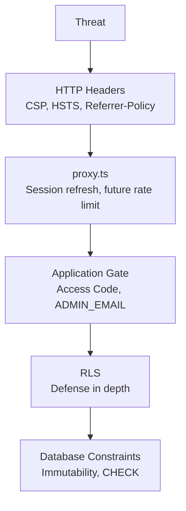
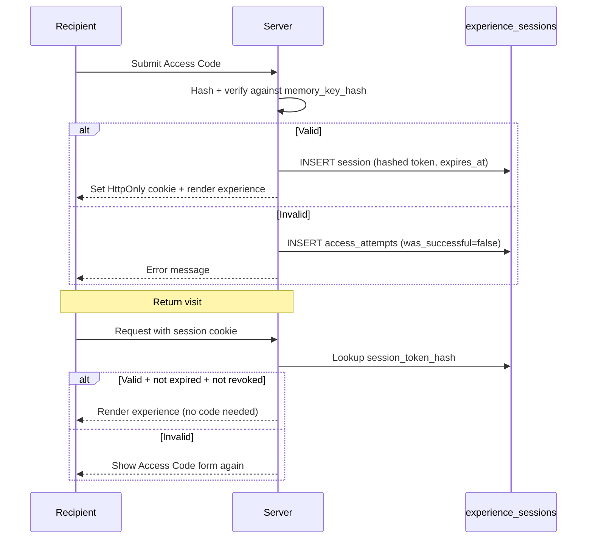

# 04 — Security

> **Related:** [Architecture](./02_ARCHITECTURE.md) · [Database](./03_DATABASE.md) · [Founder Decisions](./05_FOUNDER_DECISIONS.md) · [AI Guide](./07_AI_GUIDE.md)

---

## Security Philosophy

Celebrate Florist handles **personal, emotional content** — love letters, memory photos, private moments. Security is not optional.

Three guiding principles (from implementation):

1. **Data Minimization** — collect only what is needed; hash what must be stored (Access Code, IP, session tokens).
2. **Least Privilege** — `anon` has zero access to Gift domain; recipients never touch the database directly.
3. **Security by Default** — RLS enabled on all tables; CSP and security headers configured before features need them.

---

## Threat Model

### Assets to Protect

| Asset             | Sensitivity | Storage                                                 |
| ----------------- | ----------- | ------------------------------------------------------- |
| Personal letters  | High        | `experiences.letter_content`                            |
| Memory photos     | High        | `experience-photos` bucket                              |
| Access Code       | Critical    | `experiences.memory_key_hash` (hashed only)             |
| Experience tokens | High        | URL path `/e/[token]`                                   |
| Preview tokens    | Medium      | URL path for buyer approval                             |
| Admin credentials | Critical    | Supabase Auth                                           |
| Order PII         | Medium      | `orders.sender_name`, `receiver_name`, `buyer_whatsapp` |

### Threat Actors

| Actor                       | Capability                  | Primary risk                            |
| --------------------------- | --------------------------- | --------------------------------------- |
| **Unauthenticated visitor** | Public internet access      | Token guessing, Access Code brute force |
| **Recipient (legitimate)**  | Has QR link                 | Should only see their experience        |
| **Recipient (shared link)** | Has URL but not Access Code | Must be blocked without code            |
| **Malicious admin**         | Compromised admin account   | Data exfiltration, content tampering    |
| **Automated scanner**       | Bots, crawlers              | Discovery of experience URLs            |

### Mitigations by Layer

---

## Authentication

### Admin (Studio)

| Aspect       | Implementation                                   |
| ------------ | ------------------------------------------------ |
| Provider     | Supabase Auth (email + password)                 |
| Users        | Single admin account expected                    |
| Verification | `ADMIN_EMAIL` env var compared server-side       |
| Session      | Cookie managed by `@supabase/ssr`                |
| Refresh      | `proxy.ts` calls `auth.getUser()` on `/studio/*` |

**Status:** Infrastructure ready; login UI and email gate not yet implemented (Sprint 04).

### Recipients (Experience)

Recipients do **not** use Supabase Auth. Authentication is:

1. **Access Code** — required on first visit from a new device
2. **Trusted Device Cookie** — `experience_sessions` row backs a session cookie after successful code entry

---

## Authorization

### Three-Layer Model

| Layer           | Gift Domain                            | Admin Domain                               |
| --------------- | -------------------------------------- | ------------------------------------------ |
| **Application** | Access Code or valid session cookie    | `authenticated` + email = `ADMIN_EMAIL`    |
| **RLS**         | `anon`: zero policies                  | `authenticated`: full CRUD (except delete) |
| **Privileges**  | `service_role` for all recipient reads | `authenticated` client for Studio writes   |

### Why `service_role` for Recipients

The `anon` key is bundled into the browser. If RLS allowed `anon` to read `experiences`, anyone with the anon key (visible in network tab) could query all experiences. Instead:

1. Recipient submits Access Code to a Server Action
2. Server verifies hash using `MEMORY_KEY_PEPPER`
3. Server reads experience data with `service_role` (bypasses RLS)
4. Server returns only authorized content

RLS on Gift domain tables is **defense in depth**, not the primary gate.

---

## RLS Strategy

Full policy matrix: [03_DATABASE.md#rls-summary](./03_DATABASE.md#rls-summary)

### Key Rules

| Rule                                     | Rationale                                            |
| ---------------------------------------- | ---------------------------------------------------- |
| `anon` has zero Gift domain policies     | Prevents direct database reads from browser          |
| `experience_sessions` has zero policies  | Only service_role manages sessions                   |
| `access_attempts` has zero policies      | Rate-limit data not exposed to any client role       |
| `audit_logs` is immutable via trigger    | RLS alone cannot protect against service_role UPDATE |
| No delete policies on orders/experiences | Soft lifecycle only — audit trail preserved          |

### Privilege Hardening (Post-Audit)

Migrations 011–015 (repo files) address findings from the Sprint 03A security audit. Remote history lists **16 entries** because two `rls_auto_enable` revokes were applied separately during the live audit before repo consolidation — see [03_DATABASE.md#repo-vs-remote-migration-history](./03_DATABASE.md#repo-vs-remote-migration-history).

- Revoked `anon` DML grants on sensitive tables
- Revoked PUBLIC EXECUTE on trigger functions and `rls_auto_enable()`
- Pinned `search_path` on all public functions

---

## Memory Key (Access Code)

The Access Code is the recipient's password to their gift experience.

| Aspect        | Rule                                                                          |
| ------------- | ----------------------------------------------------------------------------- |
| Storage       | `experiences.memory_key_hash` — **never plaintext**                           |
| Hashing       | Application-side with `MEMORY_KEY_PEPPER` env var                             |
| Verification  | Server Action compares hash after peppered input                              |
| Transmission  | HTTPS only; never logged                                                      |
| UI            | Never displayed after initial admin setup                                     |
| Rate limiting | `access_attempts` table tracks failed attempts per `(experience_id, ip_hash)` |

### Trusted Device Flow

**Status:** Schema ready; application logic not yet implemented.

---

## Rate Limiting

### Access Code Attempts

- Data: `access_attempts` table
- Query index: `(experience_id, ip_hash, attempted_at)`
- Logic: Count failed attempts in last hour per experience + IP hash
- Enforcement: Application layer (Server Action) — not yet implemented
- Events: `rate_limit_triggered`, `memory_key_exhausted` in `security_events`

### Future: proxy.ts Rate Limiting

`proxy.ts` comments note this is the correct place for IP-based throttling on `/e/*` routes. Not implemented yet — no limits defined.

---

## Audit Logs

| Property          | Value                                                                       |
| ----------------- | --------------------------------------------------------------------------- |
| Immutability      | `prevent_audit_log_mutation()` trigger — blocks UPDATE/DELETE for all roles |
| Actor types       | `admin` (with `actor_id`) or `system` (null `actor_id`)                     |
| Writes            | service_role only (no RLS insert policy needed)                             |
| Reads             | Admin via `authenticated` SELECT policy                                     |
| Action vocabulary | Free TEXT — grows without migration                                         |

System-initiated actions (e.g., 365-day archival) use `actor_type = 'system'`.

---

## Security Events

| Property    | Value                                      |
| ----------- | ------------------------------------------ |
| Retention   | 90-day cleanup (designed, not implemented) |
| Writes      | service_role only                          |
| Reads       | Admin SELECT                               |
| Event types | Closed CHECK constraint (8 values)         |

### Event Types

| Event                            | Trigger                               |
| -------------------------------- | ------------------------------------- |
| `memory_key_failed`              | Wrong Access Code submitted           |
| `memory_key_exhausted`           | Rate limit reached                    |
| `experience_locked`              | Too many failures — experience locked |
| `experience_brute_forced`        | Suspicious brute force pattern        |
| `rate_limit_triggered`           | General rate limit hit                |
| `suspicious_multi_device_access` | Unusual device pattern                |
| `admin_login_failed`             | Failed Studio login                   |
| `admin_session_expired`          | Admin session timeout                 |

---

## Secrets & Environment Variables

### Classification

| Class      | Variables                                                                          | Where defined          | Client-safe? |
| ---------- | ---------------------------------------------------------------------------------- | ---------------------- | ------------ |
| **Public** | `NEXT_PUBLIC_SUPABASE_URL`, `NEXT_PUBLIC_SUPABASE_ANON_KEY`, `NEXT_PUBLIC_APP_URL` | `config/env.ts`        | Yes          |
| **Server** | `SUPABASE_SERVICE_ROLE_KEY`, `MEMORY_KEY_PEPPER`                                   | `config/env.server.ts` | No           |
| **Admin**  | `ADMIN_EMAIL`                                                                      | `.env.local` only      | No           |

### Rules

1. **Never read `process.env` directly** outside `config/env.ts` and `config/env.server.ts`.
2. **`server-only` guard** on `config/env.server.ts` — build fails if imported from Client Component.
3. **`ADMIN_EMAIL` never in Git** — placeholder in `.env.example`, real value in `.env.local`.
4. **Rotate immediately** if `SUPABASE_SERVICE_ROLE_KEY` or `MEMORY_KEY_PEPPER` is leaked.

### Future Work

| Variable                         | Status                                                     |
| -------------------------------- | ---------------------------------------------------------- |
| `IP_HASH_PEPPER`                 | Referenced in security design; not in `.env.example` yet   |
| `ADMIN_EMAIL` in `env.server.ts` | In `.env.example`; not wired in Zod schema yet (Sprint 04) |

---

## Security Headers

Configured in `next.config.ts`:

| Header                      | Value                                          | Purpose                                 |
| --------------------------- | ---------------------------------------------- | --------------------------------------- |
| `Strict-Transport-Security` | `max-age=63072000; includeSubDomains; preload` | Force HTTPS for 2 years                 |
| `X-Content-Type-Options`    | `nosniff`                                      | Prevent MIME sniffing                   |
| `X-Frame-Options`           | `SAMEORIGIN`                                   | Clickjacking defense                    |
| `Referrer-Policy`           | `strict-origin-when-cross-origin`              | Don't leak experience tokens in Referer |
| `Permissions-Policy`        | `camera=(self), microphone=(), geolocation=()` | Camera for photobooth only              |
| `X-Powered-By`              | Removed                                        | Don't advertise Next.js                 |

---

## Content Security Policy (CSP)

Built dynamically in `next.config.ts` via `buildContentSecurityPolicy()`.

| Directive         | Production                                         | Dev                                    |
| ----------------- | -------------------------------------------------- | -------------------------------------- |
| `default-src`     | `'self'`                                           | `'self'`                               |
| `script-src`      | `'self'`                                           | `'self' 'unsafe-eval' 'unsafe-inline'` |
| `style-src`       | `'self' 'unsafe-inline'`                           | `'self' 'unsafe-inline'`               |
| `img-src`         | `'self' data: https://*.supabase.co`               | Same                                   |
| `font-src`        | `'self' data:`                                     | Same                                   |
| `connect-src`     | `'self' https://*.supabase.co wss://*.supabase.co` | Same                                   |
| `frame-ancestors` | `'self'`                                           | Same                                   |
| `base-uri`        | `'self'`                                           | Same                                   |
| `form-action`     | `'self'`                                           | Same                                   |

### Accepted CSP Trade-offs

| Trade-off                         | Rationale                                                                |
| --------------------------------- | ------------------------------------------------------------------------ |
| `'unsafe-inline'` for `style-src` | Radix UI (Sheet, Accordion) sets inline styles via JS — no nonce control |
| `'unsafe-eval'` in dev only       | Next.js Fast Refresh requires it; production policy is stricter          |
| `https://*.supabase.co` wildcard  | Required for Storage and Realtime across all environments                |

---

## Proxy Strategy

`proxy.ts` (Next.js 16 middleware convention):

| Aspect              | Current                                     | Future                                |
| ------------------- | ------------------------------------------- | ------------------------------------- |
| Matcher             | `/studio/:path*`, `/e/:path*` only          | Add new route groups as needed        |
| Behavior            | Session cookie refresh via `auth.getUser()` | Admin auth redirect, rate limiting    |
| `(public)` excluded | Marketing pages stay cacheable              | Intentional — never add public routes |

**Why `getUser()` not `getSession()`:** `getUser()` revalidates against Supabase Auth server instead of trusting an unverified local cookie.

---

## Production Hardening Checklist

| Item                                  | Status                              |
| ------------------------------------- | ----------------------------------- |
| HTTPS enforced (HSTS)                 | ✅ Configured                       |
| CSP deployed                          | ✅ Configured                       |
| RLS on all tables                     | ✅ 11/11 tables                     |
| `anon` zero Gift domain access        | ✅ Verified in audit                |
| Trigger function EXECUTE revoked      | ✅ Migration 014                    |
| `search_path` pinned on functions     | ✅ Migration 011                    |
| Admin email not in Git                | ✅ Migration 015 + commit `264b2e9` |
| Service role key not in client bundle | ✅ `server-only` guard              |
| Audit log immutability                | ✅ Trigger enforced                 |
| Private storage buckets               | ✅ Both buckets private             |
| Image domain allowlist                | ✅ Supabase storage only            |

---

## Known Accepted Risks

| Risk                                                 | Mitigation                | Accepted because                                     |
| ---------------------------------------------------- | ------------------------- | ---------------------------------------------------- |
| `'unsafe-inline'` in CSP `style-src`                 | Radix requirement         | No alternative without ejecting Radix                |
| `experience_token` in URL                            | Access Code gate required | QR codes need shareable URLs; code protects content  |
| Single admin model                                   | Email verification        | Founder decision — no multi-admin needed             |
| No automated security scanning                       | Manual audit completed    | Early stage; add CI security checks in future        |
| Git history contains admin email in commit `452ba69` | Private repo              | Acceptable for private repo; rewrite if going public |
| `SUPABASE_SERVICE_ROLE_KEY` optional in env schema   | Tighten when Studio ships | Prevents build failure during landing-only phase     |

---

## Future Security Improvements

| Item                                                             | Priority          |
| ---------------------------------------------------------------- | ----------------- |
| Wire `ADMIN_EMAIL` into `env.server.ts` with required validation | Sprint 04         |
| Implement Access Code rate limiting in Server Actions            | Experience sprint |
| Add `IP_HASH_PEPPER` to env schema                               | Experience sprint |
| proxy.ts rate limiting on `/e/*`                                 | Experience sprint |
| 90-day `security_events` cleanup job                             | Post-launch       |
| Supabase Auth MFA for admin                                      | Post-launch       |
| CI security scanning (dependency audit)                          | Post-launch       |
| CSP nonce for inline scripts (if Radix allows)                   | Investigate       |
| Signed URL expiry tuning for memory photos                       | Experience sprint |

---

## Related Documents

- [02_ARCHITECTURE.md](./02_ARCHITECTURE.md) — auth flow and data flow diagrams
- [03_DATABASE.md](./03_DATABASE.md) — RLS policies and table security
- [05_FOUNDER_DECISIONS.md](./05_FOUNDER_DECISIONS.md) — security-related business rules
- [07_AI_GUIDE.md](./07_AI_GUIDE.md) — security rules for AI assistants
