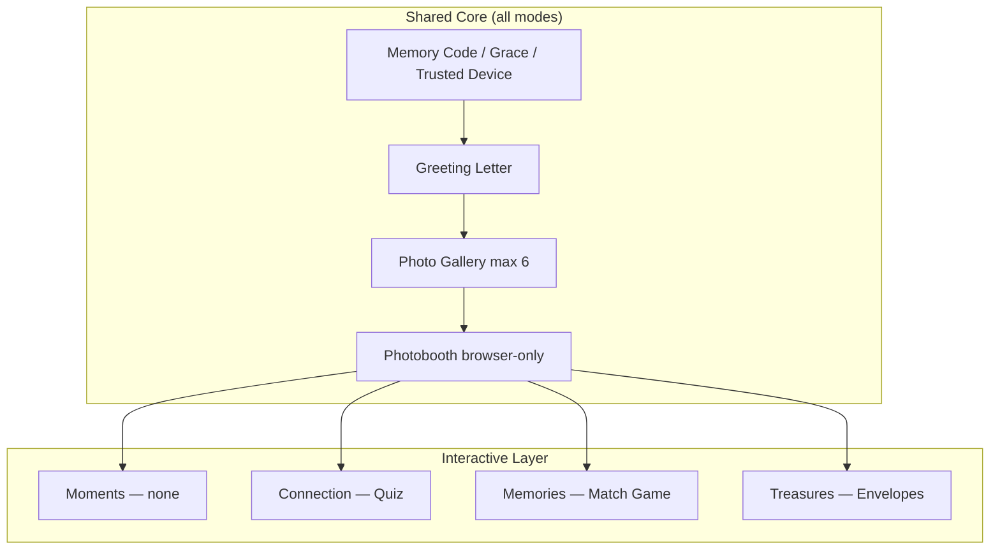
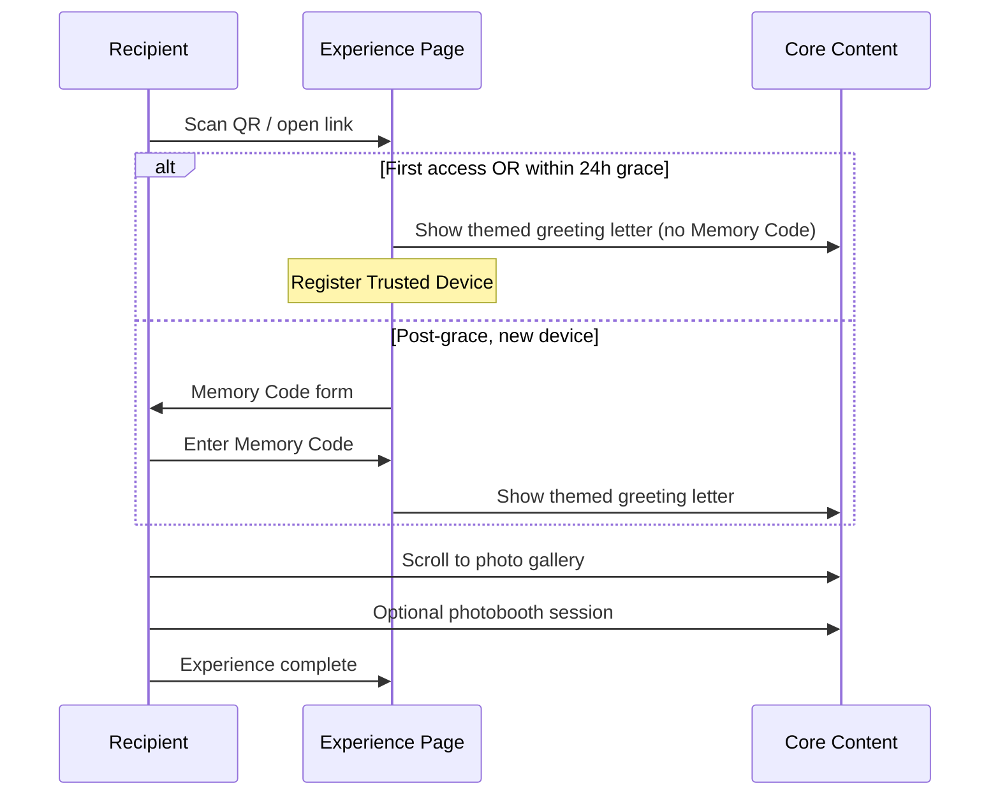
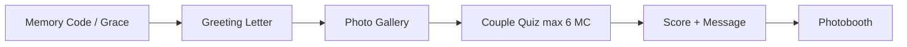
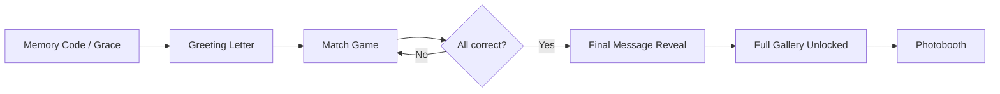
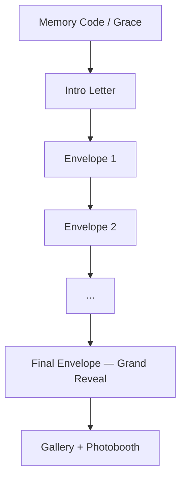

# 08 — Experience Modes

> **Sprint:** 05.5 — Product Revision V2 (documentation only)  
> **Related:** [Product Revision V2](./07_PRODUCT_REVISION_V2.md) · [Architecture Impact](./09_ARCHITECTURE_IMPACT.md) · [Database Revision Plan](./10_DATABASE_REVISION_PLAN.md) · [Founder Decisions](./05_FOUNDER_DECISIONS.md)

---

## Document Legend

| Label                   | Meaning                                        |
| ----------------------- | ---------------------------------------------- |
| **Already Implemented** | Exists in codebase or database today           |
| **Planned**             | Approved in Product Revision V2; not yet built |
| **Future Idea**         | Optional enhancement; not scheduled            |

---

## Overview

Celebrate offers **four experience products**. Every mode shares a **core layer** (Planned for recipient UI; schema-ready today):

| Core layer                                    | Status                                                                            |
| --------------------------------------------- | --------------------------------------------------------------------------------- |
| Memory Code gate + 24h grace + trusted device | **Already Implemented** (schema + auth infra); recipient UI **Planned Sprint 07** |
| Themed greeting letter                        | **Planned**                                                                       |
| Memory photo gallery (max 6)                  | **Planned** (schema + storage exist)                                              |
| In-browser photobooth (no server storage)     | **Planned** (folder scaffolded)                                                   |

Each mode adds an **interactive layer** on top of the core. Only **Moments** ships without mini-games.

---

## Mode 1 — Moments Experience

> Previously conceptualized as the only experience shape ("Classic").

### Purpose

Deliver the emotional core — letter, photos, photobooth — with **minimum friction** and **fast load**. No games, no extra setup.

### Target Customer

- Budget bouquet buyers
- Concert / event gifting (recipient may open on slow network)
- Senders who want simplicity
- Recipients on low-end Android devices

**First-visit rule (Founder Decision):** During the **24-hour grace period** after first successful access, Memory Code is **not** required — any device may open and becomes trusted. After grace, new devices require Memory Code. Full flow: [04_SECURITY.md](./04_SECURITY.md).

### User Journey (Planned — Sprint 07)

### Emotion

Warmth, immediacy, intimacy. "They wrote this for me" — no cognitive load from games.

### Advantages

- Fastest time-to-emotion
- Lowest admin configuration burden
- Smallest client bundle / fewest API round trips
- Best for crowded venues (concerts, graduations)

### Limitations

- Lowest differentiation vs Canva + Drive
- No upsell mechanics inside the experience
- Less "wow" for premium buyers

### Future Expansion Ideas

- Letter-open animation (Future Idea — emotional polish for Moments)
- Optional ambient music (Future Idea)
- Letter read-aloud TTS (Future Idea)
- Seasonal letter templates (Future Idea)

### Admin Configuration (Planned)

| Field                          | Required                                             |
| ------------------------------ | ---------------------------------------------------- |
| Theme                          | ✅                                                   |
| Greeting / closing names       | ✅                                                   |
| Letter content + closing       | ✅                                                   |
| Up to 6 photos + captions      | ✅                                                   |
| Memory Code                    | ✅ (admin sets; grace rules apply at recipient open) |
| Quiz / match / envelope config | ❌                                                   |

### Analytics (Simple Business Level Only)

| Event                | Notes                                  |
| -------------------- | -------------------------------------- |
| `experience_opened`  | **Already Implemented**                |
| Experience completed | **Planned** — coarse completion signal |
| Mode used            | Derived from `experience_mode`         |

No per-section micro-analytics in V2. Photobooth/letter events optional — founder prioritizes simplicity.

### Security Considerations

- Memory Code grace period + trusted device model (**Planned Sprint 07**)
- No additional attack surface (no user-generated quiz answers stored pre-auth)
- Photobooth stays client-only (**Founder Decision**)

---

## Mode 2 — Connection Experience

### Purpose

Add a **personal couple quiz** — "How well do you know me?" — that turns reading into participation and produces a shareable score.

### Target Customer

- Couples (anniversary, Valentine's, apology/reconciliation)
- Close friends with inside jokes
- Premium bouquet tier buyers

### User Journey (**Already Implemented** — Sprint 08)

Recipient answers **multiple-choice (A/B/C) questions, maximum 6**, authored by admin. Score displayed with personalized message tier (e.g. "You know them 80%!"). Buyer preview shows questions and score band messages **without** correct answers (OD-2).

### Templates (Founder Decision — **Already Implemented** Sprint 08)

**New Connection** offers starter templates — admin edits, does not start from blank:

| Template    | Use case                |
| ----------- | ----------------------- |
| Anniversary | Couples milestone       |
| Graduation  | Celebration achievement |
| Birthday    | Personal celebration    |
| Proposal    | Romantic escalation     |

### Emotion

Playfulness, validation, competitive warmth. "Let me prove I pay attention."

### Advantages

- Strong differentiation — not replicable with static PDF
- High social share potential (score screenshot + photobooth)
- Clear premium upsell narrative

### Limitations

- Admin must author questions (time cost)
- Wrong question design feels generic
- More client JS than Moments

### Future Expansion Ideas

- Timed questions (Future Idea)
- Audio/video question prompts (Future Idea)
- Leaderboard for group events (Future Idea — conflicts with privacy model; needs founder review)

### Admin Configuration (**Already Implemented** — Sprint 08)

Everything in Moments, plus:

| Field                                        | Notes                                                        |
| -------------------------------------------- | ------------------------------------------------------------ |
| Questions (**max 6**, multiple choice A/B/C) | Prompt, options, correct answer                              |
| Score bands (**≥ 1 required** at publish)    | Message per band; single band allowed for simple quizzes     |
| Quiz title                                   | Optional custom heading — stored as `experiences.quiz_title` |
| Template                                     | Optional: Anniversary, Graduation, Birthday, Proposal        |

### Analytics (Simple Business Level Only — OD-1 Locked)

| Event               | Purpose      | Status                                                                                                                                        |
| ------------------- | ------------ | --------------------------------------------------------------------------------------------------------------------------------------------- |
| `experience_opened` | Engagement   | **Already Implemented** — recorded on granted recipient access                                                                                |
| Mode = connection   | Segmentation | **Already Implemented** — derive via `experiences.experience_mode` JOIN at query time; **no** `experience_completed` event (no migration 020) |

No per-section micro-analytics in V2.

### Security Considerations

- Quiz answers are recipient input — validate length, sanitize display (**Already Implemented** — Zod schemas)
- Correct answers must not leak before submission (**Already Implemented** — `RecipientQuizView` / `PreviewQuizView` strip `correct_option_index`; grading server-side only)
- Rate-limit answer submissions per session — **Deferred** (see MED-05 in [06_DEVELOPMENT_GUIDE.md](./06_DEVELOPMENT_GUIDE.md))
- No PII required from recipient (no accounts)

---

## Mode 3 — Memories Experience

### Purpose

**Match The Memory** — recipient pairs story descriptions with the correct photo from the gallery. All correct → unlock final message.

### Target Customer

- Relationship milestones with shared photo history
- Family gifts (parent → child graduation)
- Premium buyers wanting narrative depth

### User Journey (Planned)

### Emotion

Nostalgia, effort rewarded, "you were there for these moments."

### Advantages

- Photos become gameplay, not passive grid
- Encourages admin to curate meaningful captions
- Unlock mechanic creates a second emotional peak

### Limitations

- Requires at least 3–4 photos with distinct stories
- Drag/drop UX challenging on small screens — tap-to-match fallback needed
- Higher admin setup than Connection

### Future Expansion Ideas

- Progressive hints (Future Idea)
- Voice-recorded story clips (Future Idea)
- Multi-round matching (Future Idea)

### Admin Configuration (Planned)

Everything in Moments, plus:

| Field                | Notes                                                                     |
| -------------------- | ------------------------------------------------------------------------- |
| Match pairs          | `story_text` ↔ `photo sort_order`                                         |
| Final unlock message | Shown after all matches correct                                           |
| Shuffle presentation | Client-side randomization — **no `shuffle_seed` in V2 schema** (deferred) |

### Analytics (Simple Business Level Only)

| Event                | Purpose      |
| -------------------- | ------------ |
| `experience_opened`  | Engagement   |
| Experience completed | Funnel end   |
| Mode = memories      | Segmentation |

### Security Considerations

- Game state validated server-side — client cannot skip to final message
- Photo URLs still signed and server-minted (**Already Implemented** pattern)
- Prevent brute-force match by limiting server-side attempts per session

---

## Mode 4 — Treasures Experience

### Purpose

**Secret Envelopes** — sequential reveals. Each envelope contains a hidden message or hidden photo. Final envelope holds the biggest surprise.

### Target Customer

- Maximum-impact gifts (proposal hints, major birthdays)
- Signature bouquet tier
- Senders who want ceremony and pacing

### User Journey (Planned)

Recipient taps envelopes one by one. Earlier envelopes cannot be skipped. Animation reinforces anticipation.

### Emotion

Anticipation, ceremony, layered surprise. "There's more…"

### Advantages

- Highest perceived value
- Strongest "unboxing" metaphor
- Works even with few photos (envelopes can be text-only)

### Limitations

- Longest experience — poor fit for concerts/quick opens
- Most admin authoring work
- Risk of fatigue if too many envelopes

### Future Expansion Ideas

- Custom envelope artwork per theme (Future Idea)
- Haptic feedback on mobile (Future Idea)
- Envelope open sound design (Future Idea)

### Admin Configuration (Planned)

Everything in Moments, plus:

| Field                      | Notes                                  |
| -------------------------- | -------------------------------------- |
| Envelope count (**max 6**) | Order matters; aligns with 6-photo cap |
| Per-envelope content type  | `message` or `photo`                   |
| Per-envelope body          | Text or photo reference                |
| Final envelope flag        | Exactly one envelope marked final      |

### Analytics (Simple Business Level Only)

| Event                | Purpose      |
| -------------------- | ------------ |
| `experience_opened`  | Engagement   |
| Experience completed | Funnel end   |
| Mode = treasures     | Segmentation |

### Security Considerations

- Envelope order enforced server-side — no client skip
- Hidden photo content not in API response until envelope opened
- Final envelope content especially protected in preview vs experience link separation

---

## Cross-Mode Design Principles (Planned)

| Principle               | Application                                                  |
| ----------------------- | ------------------------------------------------------------ |
| Mobile-first            | All interactions work on 360px width                         |
| Progressive enhancement | Moments works without WebGL/heavy animation                  |
| Theme consistency       | Interactive UI inherits theme tokens from `features/themes/` |
| Accessible tap targets  | Minimum 44px; drag optional, tap required                    |
| Offline-resilient core  | Letter readable if images slow-load                          |
| No recipient accounts   | Progress stored in session/server, not login                 |

---

## Mode Selection Rules (Planned)

| Rule                                    | Rationale                                         |
| --------------------------------------- | ------------------------------------------------- |
| Mode chosen at order creation in Studio | Business segmentation; pricing owned by marketing |
| Mode immutable after publish            | Same rule as letter immutability                  |
| Mode visible on preview link            | Buyer approves correct experience                 |
| Recipient cannot switch modes           | Prevents confusion                                |

---

## Related Documents

- [07_PRODUCT_REVISION_V2.md](./07_PRODUCT_REVISION_V2.md) — why four modes exist
- [09_ARCHITECTURE_IMPACT.md](./09_ARCHITECTURE_IMPACT.md) — engineering impact
- [10_DATABASE_REVISION_PLAN.md](./10_DATABASE_REVISION_PLAN.md) — how modes persist
- [11_IMPLEMENTATION_ROADMAP_V2.md](./11_IMPLEMENTATION_ROADMAP_V2.md) — build order
