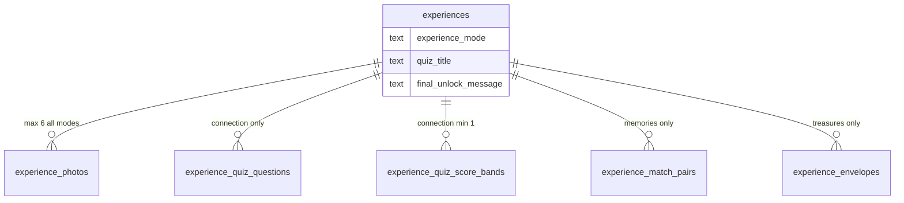

# 10 — Database Revision Plan

> **Sprint:** 05.5 — Product Revision V2 (documentation only — **no SQL, no migrations**)  
> **Status:** Database Design Review closed — founder decisions final (Sprint 05.5)  
> **Related:** [Architecture Impact](./09_ARCHITECTURE_IMPACT.md) · [Database](./03_DATABASE.md) · [Experience Modes](./08_EXPERIENCE_MODES.md) · [Founder Decisions](./05_FOUNDER_DECISIONS.md)

---

## Document Legend

| Label                   | Meaning                                   |
| ----------------------- | ----------------------------------------- |
| **Already Implemented** | In migrations 001–015 today               |
| **Planned**             | Recommended for a future migration (016+) |
| **Future Idea**         | Alternative or deferred design            |

This document provides **recommendations only**. Implementation requires founder approval and a proper migration sprint.

---

## Current State (Already Implemented)

The V1 schema supports a **single implicit experience shape**:

- `experiences` — letter fields, `memory_key_hash`, status lifecycle
- `experience_photos` — up to 6 photos with `sort_order` and optional `caption`
- No `experience_mode` column
- No quiz, match, or envelope tables
- `analytics_event` enum — letter, gallery, photobooth events only

**This schema is valid and deployed.** Product Revision V2 requires **additive** changes, not replacement.

---

## Design Goals

| Goal                                                             | Priority                            |
| ---------------------------------------------------------------- | ----------------------------------- |
| Support four experience modes with one `experiences` row         | High                                |
| **Hybrid storage:** normalized primary + limited JSONB auxiliary | High — **Founder decision (final)** |
| Preserve 1:1 order ↔ experience                                  | Non-negotiable                      |
| Preserve immutability after publish                              | Non-negotiable                      |
| Minimize migration risk                                          | High                                |
| Simple business analytics only (no micro-funnel)                 | High — **Founder decision (final)** |
| Allow future fifth mode without rewrite                          | Medium                              |
| Keep `anon` zero-access on all Gift tables                       | Non-negotiable                      |

---

## Founder Decision — Hybrid Database Design (Final)

| Layer                  | Rule                                                                                                                                                  |
| ---------------------- | ----------------------------------------------------------------------------------------------------------------------------------------------------- |
| **Primary structure**  | Normalized tables: `experience_mode`, quiz questions, match pairs, envelopes, etc.                                                                    |
| **JSONB (limited)**    | Only for small auxiliary data that does **not** require query or complex analytics — e.g. quiz `options` array (A/B/C choices), simple metadata blobs |
| **JSONB forbidden as** | Primary storage for mode content, quiz questions body, envelope sequences, or analytics payloads                                                      |
| **Rationale**          | Celebrate is not SaaS/marketplace. Priorities: speed-to-market, maintainability, security — not complex analytics dashboards                          |

This supersedes the open "normalized vs JSONB" tradeoff discussion below. JSONB shortcut for full mode config is **withdrawn** unless founder explicitly reopens.

---

## Question 1 — Should `experience_type` / `experience_mode` Exist?

### Recommendation: **Yes (Planned)**

Add a column on `experiences` (and optionally `orders`):

| Column            | Type         | Values                                           |
| ----------------- | ------------ | ------------------------------------------------ |
| `experience_mode` | TEXT + CHECK | `moments`, `connection`, `memories`, `treasures` |

Default: `moments` (backward-compatible for any test rows).

**Founder decision (final):** Use **TEXT + CHECK**, not PostgreSQL ENUM — easier to extend when a fifth mode is added without enum migration complexity.

### Pros

- Single source of truth for recipient UI routing
- Studio can filter/report by mode
- Publish validation can branch on mode
- Clear mode segmentation for Studio and coarse analytics

### Cons

- Requires migration 016+
- Existing docs/types must be updated when implemented

### Alternatives Considered

| Alternative                            | Verdict                                                                          |
| -------------------------------------- | -------------------------------------------------------------------------------- |
| Infer mode from presence of child rows | **Future Idea** — fragile; empty child rows ambiguous                            |
| Separate experience tables per mode    | **Rejected** — breaks 1:1 model and duplicates letter/photo fields               |
| Mode only on `orders`                  | **Rejected** — experience is the gift; mode must snapshot at experience creation |

### `orders.experience_mode` — Founder Decision (Final)

**Approved.** Add `experience_mode` on `orders` for reporting and filtering **before** an experience row exists.

| Rule                                    | Detail                                                                       |
| --------------------------------------- | ---------------------------------------------------------------------------- |
| Set at                                  | Order creation in Studio                                                     |
| Type                                    | TEXT + CHECK — `moments`, `connection`, `memories`, `treasures`              |
| Source of truth after experience exists | `experiences.experience_mode`                                                |
| Sync back to `orders`                   | **Not required** — `orders.experience_mode` is a creation-time snapshot only |

When the experience row is created, copy `experience_mode` from order to experience. Do not update `orders` when experience mode changes during draft editing.

---

## Question 2 — Should Quiz Tables Exist?

### Recommendation: **Yes (Planned)** — for Connection mode

#### Proposed structure (conceptual, not SQL)

**`experience_quiz_questions`**

| Column                 | Purpose                                                                          |
| ---------------------- | -------------------------------------------------------------------------------- |
| `id`                   | PK                                                                               |
| `experience_id`        | FK → experiences                                                                 |
| `sort_order`           | Display order (1–6 max — founder decision)                                       |
| `prompt`               | Question text                                                                    |
| `options`              | **JSONB** — array of A/B/C choice strings (auxiliary; not queried independently) |
| `correct_option_index` | Grading (0-based index into options)                                             |
| `created_at`           | Immutable after publish                                                          |

**`experience_quiz_score_bands`**

| Column                       | Purpose            |
| ---------------------------- | ------------------ |
| `experience_id`              | FK                 |
| `min_percent`, `max_percent` | Band range         |
| `message`                    | Shown to recipient |

**Founder decision (final):** At least **1 score band** required before publish. Multiple bands are optional — admin may use a single result message for simple quizzes.

#### Pros

- Normalized; easy to add/remove questions in Studio
- Grading logic reads structured rows
- RLS: `authenticated` CRUD; `anon` none

#### Cons

- Two new tables (or one table + JSON bands)
- Admin must author content

#### Alternative: JSONB on `experiences`

Store `quiz_config JSONB` on experiences row.

| Pros                    | Cons                                   |
| ----------------------- | -------------------------------------- |
| One migration, no joins | Harder to query per-question analytics |
| Faster to ship          | Weaker validation at DB layer          |
|                         | Large JSON blobs in main row           |

**Verdict:** Normalized question rows + JSONB `options` only (**Founder decision — final**). Max **6 questions**, multiple choice A/B/C enforced in application layer.

---

## Question 3 — Should Memory Match Tables Exist?

### Recommendation: **Yes (Planned)** — for Memories mode

#### Proposed structure (conceptual)

**`experience_match_pairs`**

| Column             | Purpose                                                      |
| ------------------ | ------------------------------------------------------------ |
| `id`               | PK                                                           |
| `experience_id`    | FK                                                           |
| `story_text`       | Description shown to recipient                               |
| `photo_sort_order` | FK logical reference to `experience_photos.sort_order` (1–6) |
| `sort_order`       | Presentation order                                           |
| `created_at`       | Immutable after publish                                      |

**`experiences.final_unlock_message`** (column on experiences)

| Column                 | Purpose                                       |
| ---------------------- | --------------------------------------------- |
| `final_unlock_message` | TEXT, nullable — shown when all pairs matched |

#### Pros

- Reuses existing `experience_photos` — no duplicate photo storage
- Clear admin UX: pick photo slot + write story
- Server validates match attempts against `photo_sort_order`

#### Cons

- FK to `sort_order` is logical, not strict FK (photo may not exist yet at pair creation)
- Application must ensure referenced `sort_order` has a photo before publish

#### Alternative: `photo_id` FK

Direct FK to `experience_photos.id`.

| Pros                  | Cons                                         |
| --------------------- | -------------------------------------------- |
| Referential integrity | Admin must upload photo before creating pair |
|                       | Reordering photos breaks pairs               |

**Verdict:** `photo_sort_order` **recommended** — aligns with immutable slot model (1–6). App validates at publish.

---

## Question 4 — Should Envelope Tables Exist?

### Recommendation: **Yes (Planned)** — for Treasures mode

#### Proposed structure (conceptual)

**`experience_envelopes`**

| Column             | Purpose                                    |
| ------------------ | ------------------------------------------ |
| `id`               | PK                                         |
| `experience_id`    | FK                                         |
| `sort_order`       | Open sequence (1–6 max — founder decision) |
| `content_type`     | `message` or `photo`                       |
| `message_text`     | When content_type = message                |
| `photo_sort_order` | When content_type = photo (1–6)            |
| `is_final`         | BOOLEAN — exactly one true per experience  |
| `created_at`       | Immutable after publish                    |

#### Pros

- Ordered reveal enforced by `sort_order`
- Mixed text/photo envelopes
- Final envelope flag enables special UI

#### Cons

- Admin must sequence carefully
- More rows than quiz (typically 3–7 envelopes)

#### Alternative: JSONB `envelopes` array on experiences

**Future Idea** for MVP — acceptable if Treasures ships last and founder wants speed.

**Verdict:** Normalized table **recommended** — ordered reveal enforced by `sort_order`; mixed text/photo envelopes; `is_final` flag for grand reveal UI. Coarse analytics only (no per-envelope events in V2).

---

## Normalization Strategy

**Rule:** Child tables exist only for their mode, but schema allows empty children for Moments.

### Mode change before publish (Founder Decision — Final)

When admin changes `experience_mode` on a draft experience, **auto-delete incompatible child data** after Studio confirmation dialog:

| From mode            | Deleted child data                                         |
| -------------------- | ---------------------------------------------------------- |
| Any → non-Connection | `experience_quiz_questions`, `experience_quiz_score_bands` |
| Any → non-Memories   | `experience_match_pairs`; clear `final_unlock_message`     |
| Any → non-Treasures  | `experience_envelopes`                                     |

Studio **must** show a confirmation dialog before deletion. Implemented in `features/studio/services/` — not a database trigger.

### Publish validation matrix (Founder Decision — Final)

Enforced in `features/studio/services/` at publish time. Documented here as implementation reference for Sprint 08–09.

#### Mode requirements

| Mode         | Required                                          | Limits                               |
| ------------ | ------------------------------------------------- | ------------------------------------ |
| `moments`    | Core fields only (letter, names, Memory Code)     | No mode child rows                   |
| `connection` | ≥ 1 quiz question, ≥ 1 score band                 | ≤ 6 questions; A/B/C multiple choice |
| `memories`   | ≥ 2 match pairs, `final_unlock_message` not blank | Pairs reference valid photo slots    |
| `treasures`  | ≥ 2 envelopes, exactly 1 `is_final = true`        | ≤ 6 envelopes                        |

#### Cross-cutting rules (all modes with child data)

| Rule                                 | Validation                                                                                                                      |
| ------------------------------------ | ------------------------------------------------------------------------------------------------------------------------------- |
| Child tables match `experience_mode` | No quiz rows on Memories/Treasures/Moments; no match rows on Connection; etc.                                                   |
| `photo_sort_order` references        | Every `photo_sort_order` in match pairs and photo-type envelopes must have a corresponding `experience_photos` row at that slot |
| Envelope final flag                  | Exactly one `is_final = true` per Treasures experience                                                                          |
| Envelope content consistency         | `content_type = message` → `message_text` required; `content_type = photo` → `photo_sort_order` required                        |
| Quiz grading safety                  | `correct_option_index` within bounds of `options` array (0–2 for A/B/C)                                                         |
| Mode immutability                    | `experience_mode` cannot change after `content_locked_at` is set                                                                |

Optional DB CHECK via trigger — **Future Idea**. Application layer is authoritative.

**Publish CHECK summary (Planned):**

| Mode         | Required children                                      |
| ------------ | ------------------------------------------------------ |
| `moments`    | None                                                   |
| `connection` | ≥ 1 quiz question, ≥ 1 score band, ≤ **6** questions   |
| `memories`   | ≥ 2 match pairs + `final_unlock_message`               |
| `treasures`  | ≥ 2 envelopes, ≤ **6** envelopes, exactly 1 `is_final` |

Enforced in application layer; optional DB CHECK via trigger (Future Idea).

---

## Future Extensibility

| Extension                 | Approach                                                                                            |
| ------------------------- | --------------------------------------------------------------------------------------------------- |
| Fifth mode                | Add CHECK value + new child table; do not alter core `experiences` shape                            |
| `shuffle_seed` (Memories) | **Deferred** — no column in V2. New migration only if deterministic shuffle persistence is required |
| Per-question media        | Add nullable `media_path` to quiz questions                                                         |
| Recipient progress        | **Future Idea:** `experience_progress` table (session-bound) — not V2 MVP                           |
| JSON metadata fallback    | `experiences.mode_config JSONB` for experimental modes only                                         |

---

## Memory Code Grace Period (Planned — Sprint 07)

**Founder decision:** Memory Code must not interrupt first emotional experience. **24-hour grace** from first successful access.

| Aspect                    | Status                                                                                        |
| ------------------------- | --------------------------------------------------------------------------------------------- |
| Product rule              | Locked — [05_FOUNDER_DECISIONS.md](./05_FOUNDER_DECISIONS.md)                                 |
| Schema                    | **No new columns required** — grace computed dynamically: `first_opened_at + 24 hours`        |
| `grace_expires_at` column | **Not needed** — founder decision final. Revisit only if performance or reporting requires it |
| `experience_sessions`     | Trusted devices registered during grace or after Memory Code                                  |

**Do not** create migrations for grace period schema in Sprint 06. Sprint 07 implements application logic only.

---

## Analytics Revision (Founder Decision — Final)

**Simple business analytics only:**

| Event                | Purpose                       |
| -------------------- | ----------------------------- |
| Experience opened    | Recipient entered experience  |
| Experience completed | Recipient finished full flow  |
| Mode used            | From `experience_mode` column |

**Withdrawn from V2 scope:** per-question, per-photo, per-envelope, quiz score, match attempt micro-events.

**Already Implemented:** `experience_analytics.event_type` enum with letter/gallery/photobooth events.

**Founder decision (final):** OD-1 locked — **no** `experience_completed` analytics event, **no** migration for analytics enum expansion. Continue `experience_opened` only; segment by `experiences.experience_mode` JOIN.

**No** `metadata JSONB` required for V2 unless completion signal needs auxiliary data (Future Idea).

---

## RLS & Security (Planned)

All new tables:

| Role            | Access                                                      |
| --------------- | ----------------------------------------------------------- |
| `anon`          | None                                                        |
| `authenticated` | SELECT, INSERT (draft editing); **no UPDATE** after publish |
| `service_role`  | Bypasses — recipient reads after Memory Code / grace rules  |

**Founder decision (final):** After publish (`content_locked_at` set), mode child tables follow the **`experience_photos` immutability pattern** — no UPDATE via RLS or Studio. Admin may still INSERT during draft; published content is locked.

Same `anon` zero-access pattern as **Already Implemented** Gift domain admin tables.

Recipient-submitted data (quiz answers, match attempts):

**Future Idea:** `experience_recipient_responses` table — session-scoped, short TTL. Not required if grading is stateless per request.

---

## Tradeoff Summary

| Approach                               | Status                                            |
| -------------------------------------- | ------------------------------------------------- |
| **Hybrid: normalized + limited JSONB** | ✅ **Founder decision (final)**                   |
| Full JSONB blobs on `experiences`      | ❌ Withdrawn                                      |
| Full normalization with no JSONB       | ❌ Rejected — quiz `options` uses JSONB auxiliary |

---

## Final Recommendation

| Item                                    | Decision                                                                                                              |
| --------------------------------------- | --------------------------------------------------------------------------------------------------------------------- |
| `experience_mode` on `experiences`      | **Planned — Yes** (TEXT + CHECK)                                                                                      |
| `experience_mode` on `orders`           | **Planned — Yes** (creation-time snapshot; no sync back)                                                              |
| `quiz_title` on `experiences`           | **Planned — Yes** (nullable; one per experience)                                                                      |
| `final_unlock_message` on `experiences` | **Planned — Yes** (Memories mode)                                                                                     |
| `shuffle_seed`                          | **Deferred** — not in V2 schema                                                                                       |
| Quiz tables                             | **Planned — Yes** (`experience_quiz_questions` + score bands); max 6 questions; ≥ 1 band at publish; options in JSONB |
| Match tables                            | **Planned — Yes** (`experience_match_pairs` + `final_unlock_message`)                                                 |
| Envelope tables                         | **Planned — Yes** (`experience_envelopes`); max 6 envelopes                                                           |
| Mode change pre-publish                 | **Auto-delete** incompatible children with Studio confirmation                                                        |
| Child immutability post-publish         | **Yes** — no UPDATE on mode child tables (match `experience_photos`)                                                  |
| Publish validation matrix               | **Documented** — see § Publish validation matrix                                                                      |
| JSONB for primary mode content          | **No** — withdrawn                                                                                                    |
| JSONB for quiz options only             | **Yes** — auxiliary                                                                                                   |
| Grace period schema                     | **No new columns** — `first_opened_at + 24h` computed in services                                                     |
| Recipient progress table                | **Future Idea** — defer                                                                                               |
| Analytics micro-events                  | **No** — coarse business events only                                                                                  |
| Migration number                        | **016+**                                                                                                              |

**Migration sequencing (Planned — use timestamp filenames, D-1):**

1. `20260712160000_experience_mode.sql` — implemented
2. `20260712200000_experience_quiz.sql` — implemented
3. `20260713020000_experience_quiz_service_role_grants.sql` — implemented (hotfix)
4. `20260713160000_experience_match_pairs.sql` — Sprint 09A
5. `*_experience_envelopes.sql` — Sprint 09B (timestamp TBD at implementation)

**Withdrawn:** logical migration `020` for `experience_completed` — superseded by OD-1 (Sprint 08). Do **not** add `experience_completed` to analytics enum.

Each migration independently deployable and documented in `03_DATABASE.md` when implemented.

---

## What NOT to Do

- Do not edit migrations 001–015
- Do not add `anon` policies on new tables
- Do not create photobooth storage
- Do not break UNIQUE `experiences.order_id`
- Do not store Memory Code plaintext
- Do not delete experiences/orders — status lifecycle only

---

## Related Documents

- [03_DATABASE.md](./03_DATABASE.md) — current schema (V1, Already Implemented)
- [09_ARCHITECTURE_IMPACT.md](./09_ARCHITECTURE_IMPACT.md)
- [11_IMPLEMENTATION_ROADMAP_V2.md](./11_IMPLEMENTATION_ROADMAP_V2.md)
- [04_SECURITY.md](./04_SECURITY.md)
