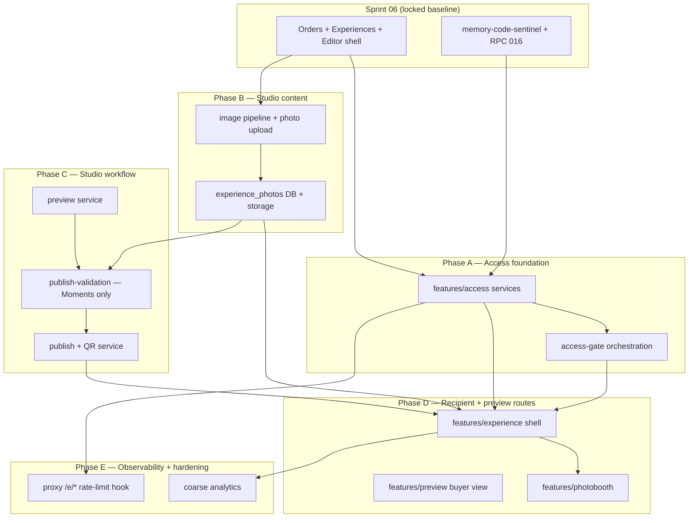

np# 11 — Implementation Roadmap V2

> **Sprint:** 05.5 — Product Revision V2 (documentation only)  
> **Status:** **Supersedes** pre-revision Sprint 06–09 scope in [00_INDEX.md](./00_INDEX.md)  
> **Related:** [Product Revision V2](./07_PRODUCT_REVISION_V2.md) · [Experience Modes](./08_EXPERIENCE_MODES.md) · [Architecture Impact](./09_ARCHITECTURE_IMPACT.md) · [Database Revision Plan](./10_DATABASE_REVISION_PLAN.md)

---

## Document Legend

| Label                   | Meaning                          |
| ----------------------- | -------------------------------- |
| **Already Implemented** | Shipped in Sprints 00–05         |
| **Planned**             | Approved roadmap — not yet built |
| **Future Idea**         | Post-V2 or optional              |

---

## Roadmap Principles

1. **Each sprint is independently deployable** — no "big bang" release.
2. **Moments ships first** — validates full pipeline before premium modes.
3. **Database changes precede UI** that depends on them.
4. **Founder decisions unchanged** — see [05_FOUNDER_DECISIONS.md](./05_FOUNDER_DECISIONS.md).
5. **Docs updated per sprint** — schema changes update `03_DATABASE.md`.

---

## Pre-Revision vs V2

| Pre-revision plan                                              | V2 plan                                                                     |
| -------------------------------------------------------------- | --------------------------------------------------------------------------- |
| Sprint 06: Order management + experience drafts (single shape) | Sprint 06: Order management + **mode selection** + schema migration         |
| Sprint 07+: Experience delivery                                | Sprint 07: **Moments** E2E + **Memory Code grace period + trusted devices** |
| —                                                              | Sprint 08: **Connection** (quiz + templates)                                |
| —                                                              | Sprint 09A: **Memories**                                                    |
| —                                                              | Sprint 09B: **Treasures**                                                   |
| —                                                              | Sprint 10: **CF-R2 Treasures replay reset** (Phase A closure)               |
| —                                                              | **Roadmap V1 (post–Sprint 10):** Phase B Experience Layer (Sprint 11–16)    |
| —                                                              | **Roadmap V1 (post–Sprint 10):** Phase C Release Layer (Sprint 17–19)       |

---

## Roadmap V1 — Post Sprint 10 (Founder Approved)

> **Engineering freeze remains in effect for Scene Engine implementation.** Sprint 11 **architecture is complete** (2026-07-16). This section is the **official long-term roadmap** after Phase A closure (post–audit revision — Founder 2026-07-14). It **replaces** the previous placeholder _"Sprint 10+ → Polish / Marketing / Analytics"_.

Celebrate has entered a new development stage. Sprint 00–10 delivered the **functional platform core**. Remaining work transforms that core into a **premium emotional experience** ready for public V1 launch — not additional backend feature development.

### Phase structure

| Phase                            | Sprints | Status          | Purpose                                                                                                                                                                                            |
| -------------------------------- | ------- | --------------- | -------------------------------------------------------------------------------------------------------------------------------------------------------------------------------------------------- |
| **Phase A — Product Foundation** | 00–10   | ✅ **Complete** | Engineering foundation, architecture, security, four experience modes, replayability (CF-R1/CF-R2), platform core. **No additional core product features planned.**                                |
| **Phase B — Experience Layer**   | 11–16   | 🔄 In progress  | Sprint 11 **architecture complete**; Sprints 12–16 planned. Premium recipient experience + Studio operational UX + polish. **No backend redesign** unless a critical production bug is discovered. |
| **Phase C — Release Layer**      | 17–19   | 📋 Planned      | QA, production readiness, and official V1 launch. **No new features.**                                                                                                                             |

### Dependency philosophy

Each sprint depends only on the previous sprint. No sprint should require redesigning decisions made by earlier sprints.

```
Sprint 11 → 12 → 13 → 14 → 15 → 16 → 17 → 18 → 19
```

---

## Sprint Map Overview

```mermaid
flowchart LR
    subgraph PhaseA["Phase A — Product Foundation ✅"]
        S00["Sprint 00–05"]
        S06["Sprint 06–07"]
        S08["Sprint 08–08R"]
        S09["Sprint 09A–09B"]
        S10["Sprint 10"]
    end

    subgraph PhaseB["Phase B — Experience Layer 📋"]
        S11["Sprint 11<br/>Experience Architecture"]
        S12["Sprint 12<br/>UI System"]
        S13["Sprint 13<br/>Motion System"]
        S14["Sprint 14<br/>Experience Components"]
        S15["Sprint 15<br/>Studio UX"]
        S16["Sprint 16<br/>Polish"]
    end

    subgraph PhaseC["Phase C — Release Layer 📋"]
        S17["Sprint 17<br/>QA"]
        S18["Sprint 18<br/>Production Readiness"]
        S19["Sprint 19<br/>Launch"]
    end

    S00 --> S06 --> S08 --> S09 --> S10 --> S11 --> S12 --> S13 --> S14 --> S15 --> S16 --> S17 --> S18 --> S19
```



Dates are illustrative — founder sets actual schedule.

---

| Sprint 05.5 — Product Revision V2 ✅ (amended) |

**Status:** Already Implemented (documentation)

| Deliverable                       | Status                                                                                                                      |
| --------------------------------- | --------------------------------------------------------------------------------------------------------------------------- |
| `07_PRODUCT_REVISION_V2.md`       | ✅                                                                                                                          |
| `08_EXPERIENCE_MODES.md`          | ✅                                                                                                                          |
| `09_ARCHITECTURE_IMPACT.md`       | ✅                                                                                                                          |
| `10_DATABASE_REVISION_PLAN.md`    | ✅                                                                                                                          |
| `11_IMPLEMENTATION_ROADMAP_V2.md` | ✅                                                                                                                          |
| `00_INDEX.md` updated             | ✅                                                                                                                          |
| Code / SQL changes                | None                                                                                                                        |
| Founder amendments (post-V2)      | Memory Code grace, hybrid DB, templates, quiz/envelope limits, 09A/09B split                                                |
| Database Design Review            | Founder decisions locked — publish validation matrix in `03_DATABASE.md`                                                    |
| Studio Design Review              | Founder decisions locked — [12_STUDIO_UX.md](./12_STUDIO_UX.md)                                                             |
| Sprint 06 Readiness Review        | ✅ Closed — READY WITH MINOR NOTES; checklist in [11](./11_IMPLEMENTATION_ROADMAP_V2.md#sprint-06-implementation-checklist) |
| **Sprint 05.5 status**            | **CLOSED** — official implementation baseline for Sprint 06+                                                                |

**Deployable:** Yes — docs only, no runtime impact. **Sprint 06 implementation cleared.**

---

## Sprint 06 — Studio Foundation + Mode Schema ✅

**Status:** **Complete** — accepted and closed (Sprint 06 Acceptance Review).

**Goal:** Order-centric Studio with unified editor shell. Admin creates orders (all modes), edits core experience drafts. Database supports modes.

> **UX spec:** [12_STUDIO_UX.md](./12_STUDIO_UX.md) — mandatory read before implementation.

### Deliverables

| Area           | Work                                                                                                               | Status |
| -------------- | ------------------------------------------------------------------------------------------------------------------ | ------ |
| Migration 016  | `experience_mode` on `experiences` + `orders` (TEXT + CHECK); nullable `quiz_title` on `experiences`               | ✅     |
| Repositories   | `OrdersRepository`, `ExperiencesRepository` in `features/studio/repositories/`                                     | ✅     |
| Studio IA      | Sidebar: **Dashboard** + **Orders** only (no Experiences/Themes/Templates)                                         | ✅     |
| Studio routes  | `/studio`, `/studio/orders`, `/studio/orders/new`, `/studio/orders/[id]`                                           | ✅     |
| Studio UI      | Dashboard — **action queue** (not analytics)                                                                       | ✅     |
| Studio UI      | Order list with filters (status, mode, delivery date)                                                              | ✅     |
| Studio UI      | **Single create-order form** (mode + sender + recipient + theme + basics)                                          | ✅     |
| Studio UI      | **Unified Order Editor** on order detail — core sections (letter, **photos shell only**, Memory Code)              | ✅     |
| Studio UI      | Premium mode panels — **"Coming in Sprint X"** stubs (Connection 08, Memories 09A, Treasures 09B)                  | ✅     |
| Server Actions | Order + experience **atomic create**; experience draft save; mode change                                           | ✅     |
| Services       | Mode change handler — confirmation dialog; column update in Sprint 06; child auto-delete when tables 017–019 exist | ✅     |
| Schemas        | `experienceModeSchema`, order/experience input schemas                                                             | ✅     |
| Docs           | Update `03_DATABASE.md` after migration                                                                            | ✅     |

### Deployable Outcome

- Admin logs in → Dashboard shows action queue → creates order (any mode) in one form → edits core draft on unified editor
- Premium orders allowed — core experience editable; premium panel shows stub until Sprint 08–09B
- Recipient experience **not yet live**; publish deferred to Sprint 07

### Dependencies

- **Already Implemented:** Sprint 05 auth, Sprint 04 infrastructure
- **UX locked:** [12_STUDIO_UX.md](./12_STUDIO_UX.md), [05_FOUNDER_DECISIONS.md](./05_FOUNDER_DECISIONS.md)

### Not in Scope

- Quiz/match/envelope live editors (stubs only)
- Publish, preview, QR (Sprint 07)
- Recipient `/e/[token]` pages
- UX Backlog: auto-save, unsaved-changes warning (see [12_STUDIO_UX.md](./12_STUDIO_UX.md#ux-backlog))

### Sprint 06 Implementation Checklist

> From **Sprint 06 Readiness Review** (Sprint 05.5). These are **engineering implementation notes** — not product specification changes. Founder accepted as day-1 checklist. **All items complete.**

| #   | Checklist item              | Detail                                                                                                                                                                                                                                                                                                                                | Status |
| --- | --------------------------- | ------------------------------------------------------------------------------------------------------------------------------------------------------------------------------------------------------------------------------------------------------------------------------------------------------------------------------------- | ------ |
| 1   | **Atomic create**           | Prefer Postgres RPC in migration 016 for `order + experience` create; if not, sequential ops + compensating delete on failure. Do not rely on `runSequentialOperations` alone where rollback is required.                                                                                                                             | ✅     |
| 2   | **Bootstrap draft values**  | Create form fields ≠ all `experiences` NOT NULL columns. On atomic create: generate `experience_token`; map `greeting_name` ← `receiver_name`, `closing_name` ← `sender_name`; use approved non-blank draft placeholders for `letter_content` / `letter_closing`; temporary `memory_key_hash` until admin sets Memory Code in editor. | ✅     |
| 3   | **Photos section**          | **Shell only** in Sprint 06 — slot UI, no upload. Upload pipeline is Sprint 07.                                                                                                                                                                                                                                                       | ✅     |
| 4   | **Mode change (Sprint 06)** | Update `experience_mode` + confirmation dialog. Child-row auto-delete activates when migrations 017–019 exist.                                                                                                                                                                                                                        | ✅     |
| 5   | **AI Guide sync**           | Follow [02_ARCHITECTURE.md](./02_ARCHITECTURE.md) / [05_FOUNDER_DECISIONS.md](./05_FOUNDER_DECISIONS.md) for feature dependency rules over stale [07_AI_GUIDE.md](./07_AI_GUIDE.md) cross-import wording. Add `12_STUDIO_UX.md` to pre-code reading.                                                                                  | ✅     |
| 6   | **Implementation order**    | Migration 016 → types/schemas → repositories → services → actions → Studio layout → routes (list, new, detail) → dashboard                                                                                                                                                                                                            | ✅     |

**Sprint 06 status:** **CLOSED** — fully accepted. Sprint 07 cleared to begin.

### Recommended implementation order

```
016 migration (+ optional RPC) → schemas/types → repositories →
order-creation service → server actions → Studio shell →
/studio/orders* → /studio dashboard → update 03_DATABASE.md
```

---

## Sprint 07 — Moments Experience End-to-End + Memory Code

**Goal:** Full recipient flow for **Moments** mode. Implements **Memory Code grace period (24h)**, trusted devices, Access Code flow (engineering term) for post-grace new devices.

> **Status:** **Complete** — all Sprint 07 deliverables implemented per checklist below. Sprint 08 cleared to begin.

### Founder Decisions (Sprint 07 Kickoff — Locked)

| #   | Decision                                        | Ruling                                                                                                                                                         |
| --- | ----------------------------------------------- | -------------------------------------------------------------------------------------------------------------------------------------------------------------- |
| 1   | **Migration 020** (`experience_completed` enum) | **No** — no new migrations in Sprint 07 unless unavoidable. Derive completion from existing analytics where needed.                                            |
| 2   | **Photo upload pipeline**                       | **Yes** — implement production image processing (resize/compress/WebP per architecture) in Sprint 07. No asset reprocessing later.                             |
| 3   | **Premium mode publish**                        | **Block** — Connection, Memories, Treasures publish **blocked** with clear Studio message (Sprint 08–09B). **Moments only** for full publish E2E in Sprint 07. |

### Planned Deliverables

| Area                   | Work                                                                                         |
| ---------------------- | -------------------------------------------------------------------------------------------- |
| `features/access/`     | Memory Code verification, **24-hour grace period**, trusted device sessions                  |
| `features/experience/` | Recipient shell, themed letter, gallery (Moments)                                            |
| `features/photobooth/` | Browser-only photobooth component                                                            |
| `features/preview/`    | Buyer preview link flow                                                                      |
| Studio                 | **Unified publish** — lock + QR in one action; buyer approval default; Skip Preview override |
| Studio                 | Preview link flow; pre-publish checklist; live photo upload (6 slots)                        |
| Storage                | Photo upload pipeline with **image processing** (admin → `experience-photos`)                |
| Analytics              | Coarse events: `experience_opened` (+ existing events); mode from `experience_mode`          |
| Database               | **No new migrations** — grace from `first_opened_at + 24h` in services                       |
| Proxy                  | Rate limiting extension point on `/e/*` (basic)                                              |

### Memory Code Product Rules (Founder Decision)

1. First successful access starts 24h grace — no Memory Code required.
2. Any device opening during grace becomes Trusted Device.
3. After grace: trusted devices → no code; new devices → Memory Code → trusted.

**Terminology:** Product/UI = Memory Code. Code/schema = `memory_key_hash`, `access_attempts`, etc.

### Deployable Outcome

- **Moments** bouquets sold end-to-end with grace-period first experience
- Connection/Memories/Treasures orders in Studio — core editing only; **publish blocked** until Sprint 08–09B; recipient interactive UI deferred

### Not in Scope

- Quiz, match, envelope recipient UI
- Connection templates (Sprint 08)
- Migrations 017–020
- Premium mode publish (Connection, Memories, Treasures)

### Sprint 07 Implementation Checklist

> **Engineering contract** for Sprint 07. Locked at founder kickoff. Not a product spec change — implements [12_STUDIO_UX.md](./12_STUDIO_UX.md), [08_EXPERIENCE_MODES.md](./08_EXPERIENCE_MODES.md), [02_ARCHITECTURE.md](./02_ARCHITECTURE.md), and founder decisions in [05_FOUNDER_DECISIONS.md](./05_FOUNDER_DECISIONS.md).

#### Engineering principles (mandatory)

- Feature-first architecture; repositories in `features/<domain>/repositories/`
- UI → Server Action → Service → Repository → Supabase
- Business logic in **services only**; thin actions; Zod validation
- No `server-only` leak to Client Components
- Preserve Sprint 06 security hardening (bootstrap sentinel, order scoping, env abstraction)
- Stop and request founder decision if implementation would change locked product or database design

#### Module dependency graph



#### Recommended implementation order

```
1. lib/storage image pipeline (resize/compress/WebP) — unblocks upload
2. features/access/ — grace, trusted session, Memory Code verify, access-gate
3. features/studio/ — photo repos/services/actions; replace photos shell UI
4. features/studio/ — publish-validation (Moments only), preview, publish+QR services
5. features/studio/ — action bar, checklist, preview panel, skip-preview, QR download
6. app/(experience)/e/[token] — recipient shell (Moments: letter + gallery)
7. features/photobooth/ — client-only component composed into experience
8. app/(preview)/preview/[token] — buyer preview + approve
9. features/analytics/ — coarse event recording
10. proxy.ts — basic /e/* rate-limit extension for Memory Code attempts
11. docs/03_DATABASE.md — update only if implementation discovers doc drift (no new migration expected)
```

#### Deliverables checklist

| #                                      | Deliverable                                                                                     | Location / notes                                 |
| -------------------------------------- | ----------------------------------------------------------------------------------------------- | ------------------------------------------------ |
| **A — Access & security**              |
| A1                                     | Grace period service (`first_opened_at + 24h`)                                                  | `features/access/services/`                      |
| A2                                     | Trusted device session (cookie + `experience_sessions`)                                         | `features/access/services/`                      |
| A3                                     | Memory Code verification (reject bootstrap sentinel)                                            | `features/access/services/` + Sprint 06 sentinel |
| A4                                     | Access-gate orchestration (grace → trusted → code form)                                         | `features/access/services/`                      |
| A5                                     | `access_attempts` logging + basic rate limit                                                    | `features/access/repositories/` + service        |
| A6                                     | Access repositories (`sessions`, `attempts`)                                                    | `features/access/repositories/`                  |
| A7                                     | Thin access actions (verify Memory Code)                                                        | `features/access/actions/`                       |
| **B — Image pipeline & photos**        |
| B1                                     | Production image pipeline (resize/compress/WebP)                                                | `lib/storage/image-pipeline.ts`                  |
| B2                                     | Experience photos repository                                                                    | `features/studio/repositories/`                  |
| B3                                     | Upload + delete photo services (max 6, immutable replace)                                       | `features/studio/services/`                      |
| B4                                     | Photo upload/delete server actions                                                              | `features/studio/actions/`                       |
| B5                                     | Live photo upload UI (replaces Sprint 06 shell)                                                 | `features/studio/components/`                    |
| **C — Studio publish workflow**        |
| C1                                     | Publish validation service — **Moments passable**; premium modes **blocked** with clear message | `features/studio/services/`                      |
| C2                                     | Send preview service (`preview_links`, order → `preview_sent`)                                  | `features/preview/` + studio                     |
| C3                                     | Skip preview override service                                                                   | `features/studio/services/`                      |
| C4                                     | Publish service (lock, `published`, QR → `experience-qr`)                                       | `features/studio/services/`                      |
| C5                                     | Preview links repository                                                                        | `features/preview/repositories/`                 |
| C6                                     | Extend experiences/orders repos for publish + status transitions                                | `features/studio/repositories/`                  |
| C7                                     | Pre-publish checklist UI (green/red)                                                            | `features/studio/components/`                    |
| C8                                     | Action bar: Save draft · Send preview · Publish                                                 | `order-editor-form` or sibling                   |
| C9                                     | Preview link copy panel (+ WhatsApp template per UX backlog)                                    | `features/studio/components/`                    |
| C10                                    | Skip preview confirmation dialog                                                                | `features/studio/components/`                    |
| C11                                    | Post-publish QR download panel                                                                  | `features/studio/components/`                    |
| C12                                    | Publish/preview/skip server actions                                                             | `features/studio/actions/`                       |
| **D — Recipient experience (Moments)** |
| D1                                     | Route `app/(experience)/e/[token]`                                                              | `(experience)` route group + layout              |
| D2                                     | Experience shell + mode routing (Moments core only)                                             | `features/experience/`                           |
| D3                                     | Memory Code gate UI (post-grace new devices)                                                    | `features/experience/components/`                |
| D4                                     | Themed greeting letter                                                                          | `features/experience/components/`                |
| D5                                     | Photo gallery (signed URLs, max 6)                                                              | `features/experience/components/`                |
| D6                                     | First-open + grace start (`first_opened_at`)                                                    | `features/experience/services/`                  |
| D7                                     | Post-gate recipient fetch via `service_role`                                                    | `features/experience/services/`                  |
| **E — Buyer preview**                  |
| E1                                     | Route `app/(preview)/preview/[token]`                                                           | Separate from `/e/[token]`                       |
| E2                                     | Buyer preview shell (core content only)                                                         | `features/preview/components/`                   |
| E3                                     | Buyer approve action → order `approved`                                                         | `features/preview/actions/`                      |
| **F — Photobooth**                     |
| F1                                     | Browser-only photobooth component                                                               | `features/photobooth/components/`                |
| F2                                     | No server storage — client-only per founder rule                                                | —                                                |
| **G — Analytics & proxy**              |
| G1                                     | Coarse `experience_opened` recording                                                            | `features/analytics/`                            |
| G2                                     | Mode segmentation from `experience_mode` (no new enum migration)                                | Application layer                                |
| G3                                     | Basic `/e/*` rate-limit hook in `proxy.ts`                                                      | Extension point only                             |
| **H — Schemas & types**                |
| H1                                     | Zod schemas for upload, preview, publish, access inputs                                         | `schemas/`                                       |
| H2                                     | Types aligned with existing tables (no invented columns)                                        | `types/database.ts` if needed                    |

#### Acceptance criteria

| #   | Criterion                                                                                              | Verification                                       |
| --- | ------------------------------------------------------------------------------------------------------ | -------------------------------------------------- |
| 1   | **Moments E2E** — create → upload photos → set Memory Code → preview → approve → publish → QR download | Manual Studio flow                                 |
| 2   | Recipient opens `/e/[token]` — first access within grace: letter **without** Memory Code               | Manual recipient test                              |
| 3   | Trusted device registered during grace; post-grace trusted device: no code                             | Multi-device / cookie test                         |
| 4   | Post-grace **new** device: Memory Code required; success → trusted                                     | Manual recipient test                              |
| 5   | Bootstrap sentinel **never** passes verification or publish checklist                                  | Security regression                                |
| 6   | Letter + gallery + photobooth work for published Moments                                               | Recipient UI test                                  |
| 7   | Buyer preview at `/preview/[token]` isolated from recipient token                                      | Token separation test                              |
| 8   | Skip preview override works with explicit admin confirmation                                           | Studio test                                        |
| 9   | **Premium modes blocked** at publish with clear Sprint 08–09B message                                  | Studio test (connection/memories/treasures orders) |
| 10  | `content_locked_at` prevents post-publish edits                                                        | Service + UI test                                  |
| 11  | Photos: max 6, processed assets in `experience-photos`, immutable replace                              | Upload test                                        |
| 12  | `experience_opened` analytics recorded; no migration 020                                               | DB / log check                                     |
| 13  | Architecture: no business logic in actions/repos; no server-only client leak                           | Code review                                        |
| 14  | `npm run typecheck` + `npm run lint` + `npm run build` pass                                            | CI local                                           |

#### Explicit out of scope (Sprint 07)

| Item                                                       | Deferred to                               |
| ---------------------------------------------------------- | ----------------------------------------- |
| Migration 017–020 (incl. `experience_completed` enum)      | Sprint 08+ / never unless founder reopens |
| Quiz builder, recipient quiz UI, Connection templates      | Sprint 08                                 |
| Match pair editor, recipient match game                    | Sprint 09A                                |
| Envelope sequencer, recipient envelope UI                  | Sprint 09B                                |
| Premium mode **publish** (Connection, Memories, Treasures) | Sprint 08–09B                             |
| Premium mode **recipient interactive** UI                  | Sprint 08–09B                             |
| Studio analytics dashboard / charts / funnel               | Sprint 10                                 |
| Full `IP_HASH_PEPPER` rate limiting                        | Post-V2 backlog                           |
| `grace_expires_at` column                                  | Never (founder locked)                    |
| Photobooth server storage                                  | Never (founder locked)                    |
| Auto-save, unsaved-changes warning                         | UX backlog                                |
| Letter-open animation, ambient music, TTS                  | Future Ideas                              |
| Fifth experience mode                                      | Founder gate                              |
| Product / architecture / database redesign                 | Never without founder reopen              |

#### Sprint 06 dependencies (must remain intact)

| Dependency                                       | Required for                                           |
| ------------------------------------------------ | ------------------------------------------------------ |
| Migration 016 + RPC atomic create                | Publish on existing order/experience                   |
| Unified Order Editor shell                       | Extend with photos + action bar                        |
| `memory-code-sentinel` + `hashMemoryCode` guards | Access verify + publish checklist                      |
| `updateExperienceDraft` order scoping            | Continued draft edits pre-publish                      |
| Studio auth + `proxy.ts` Studio gate             | All admin workflows                                    |
| Existing RLS (anon zero on Gift domain)          | All recipient/preview reads via service_role post-gate |

**Sprint 07 closed** — implementation complete. Acceptance: typecheck, lint, build pass; no migration 020.

---

## Sprint 08 — Connection Experience (Quiz + Templates)

> **Status:** **Complete** — all Sprint 08 deliverables implemented; Phase 8 acceptance + hotfix verified.

**Goal:** Ship **Connection** premium mode — couple quiz (max 6 multiple choice) with **starter templates**.

### Planned Deliverables

| Area               | Work                                                                                           |
| ------------------ | ---------------------------------------------------------------------------------------------- |
| Migration 017      | `experience_quiz_questions` (options JSONB) + score bands + RLS (no UPDATE post-publish)       |
| Studio             | Quiz builder UI; **templates:** Anniversary, Graduation, Birthday, Proposal                    |
| `features/quiz/`   | Recipient quiz UI (A/B/C, max 6 questions)                                                     |
| Server Actions     | Save quiz config (admin), submit answers (recipient, post-auth)                                |
| Analytics          | OD-1: `experience_opened` only; mode via `experiences.experience_mode` JOIN (no migration 020) |
| Publish validation | Connection: 1–6 questions, ≥ 1 score band required                                             |

### Sprint 08 Implementation Checklist

| Phase | Scope                                                                   | Status |
| ----- | ----------------------------------------------------------------------- | ------ |
| 1     | Migration 017 — quiz tables + RLS                                       | ✅     |
| 2     | Types, Zod schemas, quiz repositories                                   | ✅     |
| 3     | Quiz services, templates, grading, admin actions                        | ✅     |
| 4     | Studio Quiz Builder UI (replaces Connection stub)                       | ✅     |
| 5     | Publish validation + mode-change cleanup                                | ✅     |
| 6     | Recipient UI, mode registry, buyer preview quiz component               | ✅     |
| 7     | Buyer preview integration, OD-1 docs, regression verification, doc sync | ✅     |
| 8     | QA closure + final Sprint 08 acceptance + service_role hotfix           | ✅     |

### Deployable Outcome

- Connection tier fully sellable with templates (original letter-first flow — superseded by Sprint 08R)
- Moments + Connection production-ready

---

## Sprint 08R — Connection Journey Revision (Gate / Reward Architecture)

> **Status:** **Complete** — all phases 08R-A through 08R-D accepted and closed.  
> **SSOT:** [13_EXPERIENCE_JOURNEY.md](./13_EXPERIENCE_JOURNEY.md) · **Decisions:** CF-1–CF-5 in [05_FOUNDER_DECISIONS.md](./05_FOUNDER_DECISIONS.md)

**Goal:** Revise Connection recipient flow to **game-first reward architecture** — quiz gates letter and gallery; Gate Payload on load, Reward Payload after submit. Documentation synchronized in 08R-D.

**Context:** Sprint 08 shipped Connection with letter before quiz. Sprint 08R realigns implementation and docs with premium experience philosophy without changing quiz Studio/backend fundamentals.

### Sprint 08R Implementation Checklist

| Phase | Scope                                                                                  | Status |
| ----- | -------------------------------------------------------------------------------------- | ------ |
| 08R-A | Gate Payload + Reward Payload types, services, contracts                               | ✅     |
| 08R-B | `ConnectionExperienceFlow` orchestration; `QuizPlayer` refactor; sessionStorage unlock | ✅     |
| 08R-C | Verification, regression, buyer preview reorder, security evidence                     | ✅     |
| 08R-D | Documentation synchronization — SSOT linked; drift resolved                            | ✅     |

### Deliverables (08R-A–C)

| Area                             | Work                                                                        | Status |
| -------------------------------- | --------------------------------------------------------------------------- | ------ |
| `fetchConnectionGatePayload()`   | Safe experience projection + theme + recipient quiz                         | ✅     |
| `buildConnectionRewardPayload()` | Letter + signed photos after submit                                         | ✅     |
| `ConnectionExperienceFlow`       | Client orchestrator — quiz → unlock → score → letter → gallery → photobooth | ✅     |
| `connection-unlock-session.ts`   | `sessionStorage` only (CF-2)                                                | ✅     |
| Page wiring                      | Connection: gate fetch only; Moments: published fetch only                  | ✅     |
| Buyer preview                    | Quiz → Letter → Gallery → Approve (no gating)                               | ✅     |

### Deployable Outcome

- Connection recipient journey matches SSOT: Quiz → Score+Band → Letter → Gallery → Photobooth
- Security: no letter/photos in initial payload (CF-4); gallery gated (CF-3)
- **Sprint 09A Phase 5** cleared to resume

### Not in Scope (08R)

- Memories/Treasures recipient UI (Sprint 09A Phase 6+ / 09B)
- New migrations or server-side unlock persistence
- Analytics changes (OD-1 unchanged)

---

## Sprint 09A — Memories Experience ✅

> **Status:** **Complete** — Phases 1–7 shipped. See [13_EXPERIENCE_JOURNEY.md](./13_EXPERIENCE_JOURNEY.md).

**Goal:** Ship **Memories** mode — Match The Memory with cinematic reveal (FD-M2), single submission (FD-M3), reward never blocked (FD-M5), gate/reward architecture mirroring Sprint 08R.

### Planned Deliverables

| Area               | Work                                                                                                           |
| ------------------ | -------------------------------------------------------------------------------------------------------------- |
| Migration          | `20260713160000_experience_match_pairs.sql` — pairs table, `final_unlock_message`, RLS + `service_role` grants |
| Studio             | Match pair editor (story + photo slot); **no templates** (A-5 out of scope)                                    |
| `features/match/`  | Gate/Reward backend (6A); cinematic reveal UI + orchestration (6B–6C)                                          |
| Buyer preview      | Stories + full photos + structure; **no** correct mappings (A-3); cinematic note (7)                           |
| Publish validation | Memories: 2–6 pairs, unique photo slots, `final_unlock_message`; photo slot occupied                           |

### Sprint 09A Implementation Checklist

| Phase | Scope                                                                                       | Status |
| ----- | ------------------------------------------------------------------------------------------- | ------ |
| 0     | Doc sync + founder decision lock                                                            | ✅     |
| 1     | Migration + types                                                                           | ✅     |
| 2     | Repositories + Zod schemas                                                                  | ✅     |
| 3     | Services + validation + guards                                                              | ✅     |
| 4     | Studio Match Editor                                                                         | ✅     |
| 5     | Publish validation + mode-change cleanup                                                    | ✅     |
| 5.5   | FD-M1–FD-M5 founder decision lock (documentation)                                           | ✅     |
| 6A    | Gate/Reward backend (`fetchMemoriesGatePayload`, `buildMemoriesRewardPayload`, grade FD-M5) | ✅     |
| 6B    | Recipient UI (`MemoriesExperienceFlow`, `MatchCinematicReveal`)                             | ✅     |
| 6C    | Page wiring + `memories-unlock-session.ts`                                                  | ✅     |
| 7     | Buyer preview + regression + doc sync                                                       | ✅     |
| 8     | QA closure                                                                                  | ✅     |

### Phase 6 Architecture (Locked — Phase 5.5)

Mirror Sprint 08R Connection pattern:

| Layer          | Memories (Phase 6)                                                                                                      |
| -------------- | ----------------------------------------------------------------------------------------------------------------------- |
| Gate Payload   | `MemoriesGatePayload` — stories, masked photo URLs, theme; no letter, no unlock message, no mappings                    |
| Reward Payload | `MemoriesRewardPayload` — score result, unlock message, letter, signed gallery URLs (always after valid submit — FD-M5) |
| Fetch          | `fetchMemoriesGatePayload()` — Memories branch only in `page.tsx`                                                       |
| Build          | `buildMemoriesRewardPayload()` — via `submitMatchAnswersAction`                                                         |
| Orchestrator   | `MemoriesExperienceFlow` (client)                                                                                       |
| Reveal UI      | `MatchCinematicReveal` — single style (FD-M1, FD-M2)                                                                    |
| Unlock         | `memories-unlock-session.ts` — `cf_memories_unlock_${experienceId}` (FD-M3, mirrors CF-2)                               |

**Do not invent alternate architecture.** No difficulty config. No reveal strategy pattern. No DB migrations for reveal.

### Deployable Outcome

- Moments + Connection + **Memories** production-ready

### Dependencies

- Sprint 08 establishes mode-specific Studio + recipient pattern

---

## Sprint 09B — Treasures Experience ✅

> **Status:** **Complete** — Studio editor, recipient UI, per-envelope fetch (FD-T1–T5). See [13_EXPERIENCE_JOURNEY.md](./13_EXPERIENCE_JOURNEY.md).

**Goal:** Ship **Treasures** mode — Secret Envelopes (2–6, per-envelope fetch, any order — FD-T1).

### Deliverables (Shipped)

| Area                  | Work                                                                    | Status |
| --------------------- | ----------------------------------------------------------------------- | ------ |
| Migration             | `20260714100000_experience_envelopes.sql` + RLS + `service_role` grants | ✅     |
| Studio                | Envelope editor (message/photo, final flag, 2–6)                        | ✅     |
| `features/treasures/` | Envelope UI; per-envelope fetch (A-4); any order (FD-T1)                | ✅     |
| Buyer preview         | Structure without hidden content spoilage (A-3)                         | ✅     |
| Publish validation    | Treasures: 2–6 envelopes, exactly 1 final                               | ✅     |

### Deployable Outcome

- **All four modes** production-ready — full Product V2 achieved

### Dependencies

- Sprint 09A (shared mode patterns)

---

## Sprint 10 — CF-R2 Treasures Replay Reset ✅ COMPLETE

**Goal:** Implement **CF-R2** for Treasures (CF-R1 compliance). No other mode changes.

> **Full plan & QA:** [15_SPRINT_10_CF-R2_REPLAY_RESET.md](./15_SPRINT_10_CF-R2_REPLAY_RESET.md)

### Deliverables (Shipped)

| Phase   | Work                                                 | Status |
| ------- | ---------------------------------------------------- | ------ |
| **10A** | `completeTreasuresJourney` service + action          | ✅     |
| **10B** | Photobooth mount wiring in `TreasuresExperienceFlow` | ✅     |
| **10C** | QA + documentation sync                              | ✅     |

### Out of Scope (Sprint 10)

- Connection / Memories / Moments changes
- New visit/session tables
- Landing polish, analytics dashboard (deferred)

### Deployable Outcome

- Treasures recipients replay full envelope journey on reload after Photobooth trigger (Sprint 10 / CF-R2)
- Journey progress preserved until Photobooth; reload after trigger intentionally fresh

---

# Phase B — Experience Layer (Sprint 11–16)

> **Status:** 📋 **Sprint 11 architecture complete** — **implementation NOT authorized** · Engineering freeze active until explicit implementation clearance

Transforms the existing platform into a **premium emotional product** and a **polished operational Studio**. **No backend redesign** unless a critical production bug is discovered.

**Current recipient flows (functional, not yet cinematic):** All four modes per [13_EXPERIENCE_JOURNEY.md](./13_EXPERIENCE_JOURNEY.md). Example (Treasures):

```
QR → Envelope → Letter → Gallery → Photobooth
```

Today these are ordinary page transitions. Phase B defines and implements the experience layer that will power cinematic presentation.

---

## Sprint 11 — Experience Architecture ✅ COMPLETE (Architecture)

> **Status:** ✅ **Complete — Architecture** · **Ready for Sprint 12** · **implementation NOT authorized**  
> **Architecture closure:** 2026-07-16  
> **Core spec:** [16_SPRINT_11_EXPERIENCE_ARCHITECTURE.md](./16_SPRINT_11_EXPERIENCE_ARCHITECTURE.md)  
> **Mode docs:** [sprint-11/README.md](./sprint-11/README.md)  
> **Cross-mode review:** [sprint-11/05_CROSS_MODE_REVIEW.md](./sprint-11/05_CROSS_MODE_REVIEW.md)  
> **Founder decisions:** FD-S11-01 through FD-S11-17, FD-S11-DOC, **GER-01–06** in [05_FOUNDER_DECISIONS.md](./05_FOUNDER_DECISIONS.md#sprint-11--experience-architecture-founder-approved)

**Objective:** Design the Scene Engine architecture. **This sprint is NOT about visual polish.** **Architecture-first only — no implementation spikes.**

### Deliverables (definition only — no premium animation implementation)

| Area                          | Scope                                                              |
| ----------------------------- | ------------------------------------------------------------------ |
| Scene Manager                 | Multi-mode scene graph architecture                                |
| Transition Manager            | Rules for how scenes connect                                       |
| Animation timing architecture | Logical sequencing contracts (visual tokens deferred to Sprint 12) |
| Navigation flow               | Recipient navigation model across scenes                           |
| Progress flow                 | How progress is represented in the experience layer                |
| State flow                    | Client state model for scene transitions                           |

**Scene Engine must support all recipient journeys in [13_EXPERIENCE_JOURNEY.md](./13_EXPERIENCE_JOURNEY.md)** — Moments, Connection, Memories, and Treasures. **Not Treasures-only.**

### Architecture constraints (Founder — FD-S11-01 through FD-S11-06)

| Rule                               | Detail                                                                                                                          |
| ---------------------------------- | ------------------------------------------------------------------------------------------------------------------------------- |
| **FD-S11-01 Wrap**                 | Scene Engine **wraps** `*ExperienceFlow`; presentation only — no replacement of repos, services, actions, gate/reward, payloads |
| **FD-S11-02 Back edge**            | Treasures only: Gift Content → Gift Grid (business: Envelope Content → Envelope Grid); forward-only elsewhere                   |
| **FD-S11-03 Persistent Shell**     | Theme/layout frame stays mounted; scenes mount/unmount inside                                                                   |
| **FD-S11-04 Parameterized graphs** | Treasures 2–6 envelopes; new modes = graph + registry only                                                                      |
| **FD-S11-05 Server initial scene** | Server determines initial scene; engine never guesses                                                                           |
| **FD-S11-06 Scene Contract**       | Universal onEnter/onExit/canLeave/onComplete for all scene types                                                                |
| **CF-R2 protected**                | Photobooth scene entry preserves CF-R2-A/B/C — [ADR S11-007](./adr/S11-007-cf-r2-photobooth-scene.md)                           |

### Non-goals (Sprint 11)

Scene Engine must **NOT** modify:

- Repositories
- Services
- Server Actions
- Database / migrations
- Access gate (`features/access/`)
- Reward gate / grading logic
- Gate Payload or Reward Payload contracts

**Deliverables (planning only — incremental):**

| Artifact                                                                          | Status      |
| --------------------------------------------------------------------------------- | ----------- |
| Core engine spec + ADRs (doc 16, `docs/adr/S11-*`)                                | ✅ Locked   |
| [adr/S11-008](./adr/S11-008-global-experience-rules.md) — Global Experience Rules | ✅          |
| [sprint-11/README.md](./sprint-11/README.md) — documentation strategy             | ✅          |
| [sprint-11/01_MOMENTS](./sprint-11/01_MOMENTS_SCENE_ARCHITECTURE.md)              | ✅ Locked   |
| [sprint-11/02_CONNECTION](./sprint-11/02_CONNECTION_SCENE_ARCHITECTURE.md)        | ✅ Locked   |
| [sprint-11/03_MEMORIES](./sprint-11/03_MEMORIES_SCENE_ARCHITECTURE.md)            | ✅ Locked   |
| [sprint-11/04_TREASURES](./sprint-11/04_TREASURES_SCENE_ARCHITECTURE.md)          | ✅ Locked   |
| [sprint-11/05_CROSS_MODE_REVIEW](./sprint-11/05_CROSS_MODE_REVIEW.md)             | ✅ Complete |
| Final SSOT merge (doc 16 §7)                                                      | ✅ Complete |

**No premium animations. No implementation spikes. No production code until explicit implementation clearance.**

---

## Sprint 12 — UI System

> **Status:** ✅ **CLOSED — Documentation / UI System Baseline** (Founder 2026-07-19) · Core UI **IMPLEMENTED AND APPROVED** · Bloom Moments 🔒 **APPROVED AND LOCKED** (2026-07-20)  
> **Phases 1–9:** ✅ **APPROVED AND CLOSED** · Bible = **OFFICIAL INDEXED BASELINE**  
> **Implementation:** ✅ Closed — [sprint-12-implementation/](./sprint-12-implementation/README.md)  
> **Sprint 12.5 Theme Lab:** 🔒 **CLOSED** — Bloom·Warm·Sky locked · Playful frozen · [24 closure](./sprint-12-5/24_SPRINT_12_5_FINAL_CLOSURE_AUDIT.md) · **Sprint 13:** entry plan ✅ · implementation ⛔ until Founder authorize · [01 plan](./sprint-13/01_SPRINT_13_MOTION_ENTRY_PLAN.md)  
> **Docs:** [sprint-12/README.md](./sprint-12/README.md) · [Bible](./sprint-12/CELEBRATE_UI_SYSTEM_BIBLE.md) · [DDR-S12-034](./sprint-12/CELEBRATE_DESIGN_DECISION_REGISTER.md)

**Objective (docs — complete):** Define the Celebrate UI System — how every screen feels unmistakably Celebrate — through nine planning phases ending in Design QA and the UI System Bible. **Not** a zero-based redesign; landing page is the visual baseline. Diagnosis: **one Celebrate family, uneven expression.**

| Phase     | Name                 | Status                                                                                         |
| --------- | -------------------- | ---------------------------------------------------------------------------------------------- |
| 1–9       | Baseline → Design QA | ✅ All **APPROVED AND CLOSED** — [sprint-12/](./sprint-12/README.md)                           |
| Bible     | Indexed baseline     | ✅ [OFFICIAL](./sprint-12/CELEBRATE_UI_SYSTEM_BIBLE.md)                                        |
| Impl plan | Batches 1–7          | 📋 [Planning](./sprint-12-implementation/00_UI_SYSTEM_IMPLEMENTATION_PLAN.md) — coding blocked |

**Founder decisions (locked):** Sage = botanical supporting · Celebration Frame · Studio ~35–40% · Gift language · Decision Register · North Star · [DDR-S12-018](./sprint-12/CELEBRATE_DESIGN_DECISION_REGISTER.md) closure.

| Scope             | Detail                                      |
| ----------------- | ------------------------------------------- |
| Typography        | Shared type scale and hierarchy             |
| Color System      | Mode-aware palette rules (incl. Sage roles) |
| Radius, Shadow    | Elevation + **Celebration Frame** token     |
| Component Library | Reusable UI primitives + **Gift system**    |
| Layout Rules      | Grid, containers, section rhythm            |
| Spacing Rules     | Consistent spacing tokens                   |
| Responsive Rules  | Breakpoint behavior                         |
| Studio Language   | Calm workspace (~35–40% landing emotion)    |

**Deliverable (docs):** Specification baseline closed. **Next:** Founder review of implementation plan; coding only after separate authorization. Tokens remain the foundation for Sprint 13 Motion when that sprint starts.

---

## Sprint 13 — Motion System

> **Status:** 📋 **ENTRY PLAN COMPLETE** — implementation **NOT STARTED** (Founder authorize) · [entry plan](./sprint-13/01_SPRINT_13_MOTION_ENTRY_PLAN.md)

**Objective:** Make Theme Lab journeys feel like an experience, not static pages — **minimal** shared motion foundation (no cinematic framework).

| Scope              | Detail                                                            |
| ------------------ | ----------------------------------------------------------------- |
| Scene transitions  | Host cross-fade consistency + reduced-motion snap                 |
| Reduced motion     | SSR-safe preference handling across hosts + representative scenes |
| Envelope / gift    | Ceremonial open on representative Bloom / Warm (/ Sky) surfaces   |
| Letter / gallery   | Reveal patterns on representative paths                           |
| CTA ambient        | Remove or reduce unnecessary infinite pulse on primary controls   |
| Fade / blur / zoom | Supporting vocabulary only — not separate epics                   |
| Camera             | Light push/pull **only** where it clearly helps                   |
| Motion tokens      | Small shared kit (`duration` / `ease` / helpers) — not a DSL      |

**Excluded:** Photobooth (Sprint 14) · Playful · `/e/[token]` wiring · rewriting all 12 journey choreographies.

**Deliverable:** Celebrate Theme Lab feels like an **experience**; identities of Bloom · Warm · Sky preserved.

---

## Sprint 14 — Experience Components

> **Status:** 📋 Planned — **NOT STARTED**

**Objective:** Premium experience components — **Photobooth redesign** (primary scope). **Single sprint** — internal implementation phases permitted; sprint numbering unchanged.

Photobooth belongs to the **experience layer**, not the backend layer. **Photobooth images remain client-only — never stored** (Founder Decision — unchanged).

### Founder-approved layouts

| Layout       | Format      | Photos | Recommended for                               |
| ------------ | ----------- | ------ | --------------------------------------------- |
| **Layout B** | 6 × 2 Strip | 3      | Couples, Best Friends, Small Groups           |
| **Layout K** | 6 × 4 (4R)  | 2      | Graduation, Farewell, Family, Group Greetings |

### Additional scope

Countdown · Flash · Download · Frames · Stickers · Watermark

---

## Sprint 15 — Studio UX

> **Status:** 📋 Planned

**Objective:** Polish the **Studio admin surface** as an operational product. Studio is a **separate product surface** from the Recipient Experience.

Sprint 00–10 made Studio **functional**. Before launch, Studio should become a **polished operational tool**. Operational excellence is part of product quality.

| Scope                           | Detail                                      |
| ------------------------------- | ------------------------------------------- |
| Studio information architecture | Navigation clarity, workflow coherence      |
| Dashboard usability             | Action queue effectiveness                  |
| Form UX                         | Order editor, mode panels, publish workflow |
| Order workflow                  | Create → edit → preview → publish flow      |
| Visual consistency              | Align Studio with Sprint 12 Design System   |

### Non-goals (Sprint 15)

- **No** business logic changes
- **No** permission / auth changes
- **No** new backend features or migrations

**Deliverable:** Studio feels as intentional as the recipient experience — UX only.

---

## Sprint 16 — Polish

> **Status:** 📋 Planned

**Objective:** **No new features** — quality improvements only.

| Examples                   |
| -------------------------- |
| Micro interactions         |
| Loading states             |
| Skeleton UI                |
| Empty states               |
| Optional sound design      |
| Performance optimization   |
| Accessibility improvements |

**Goal:** Deliver a **premium product feeling** across recipient and Studio surfaces.

---

# Phase C — Release Layer (Sprint 17–19)

> **Status:** 📋 **Planned — not started.** **No new features** in this phase.

---

## Sprint 17 — QA

> **Status:** 📋 Planned

**Objective:** Comprehensive validation.

| Scope                        |
| ---------------------------- |
| All four experience modes    |
| Studio operational workflows |
| Desktop + Mobile             |
| Cross-browser                |
| Regression testing           |
| Usability review             |
| Performance review           |
| Security review              |
| Accessibility review         |

---

## Sprint 18 — Production Readiness

> **Status:** 📋 Planned

**Objective:** Release preparation only. **No dedicated Landing/Marketing sprint** — landing readiness is included here.

| Scope                                                         |
| ------------------------------------------------------------- |
| Documentation review                                          |
| Final audits                                                  |
| Backup strategy                                               |
| Monitoring                                                    |
| Analytics                                                     |
| **Landing readiness** (four-mode positioning, copy alignment) |
| **SEO**                                                       |
| **Metadata**                                                  |
| Release checklist                                             |
| Deployment checklist                                          |

**Explicit exclusions:** No feature development · No UI redesign · No architectural changes

---

## Sprint 19 — Launch

> **Status:** 📋 Planned

**Objective:** Official **V1 Release**.

| Scope                              |
| ---------------------------------- |
| Production deployment              |
| Monitoring                         |
| Critical production bug fixes only |

**Explicit exclusions:** No major feature work

---

## UX Backlog (Approved — Not Sprint 06)

> Full list: [12_STUDIO_UX.md](./12_STUDIO_UX.md#ux-backlog)

| Item                                  | Target sprint                        |
| ------------------------------------- | ------------------------------------ |
| Auto-save draft                       | Post–Sprint 06                       |
| Unsaved changes warning before leave  | Post–Sprint 06                       |
| Desktop-first layout + tablet support | Ongoing (Sprint 06 baseline desktop) |
| Collapsed order status groups in UI   | Post–Sprint 06                       |
| Copy preview link + WhatsApp template | Sprint 07                            |
| Visual photo slot grid                | Sprint 09A/09B                       |
| Inline templates                      | Sprint 08                            |

---

## Post-V2 Backlog (Future Idea)

| Item                               | Notes                                                |
| ---------------------------------- | ---------------------------------------------------- |
| Studio analytics dashboard         | Charts, export                                       |
| `IP_HASH_PEPPER` rate limiting     | Full implementation                                  |
| Automated test suite               | RLS, Memory Code grace period, game grading          |
| Fifth experience mode              | Schema designed for extension                        |
| Theme preview images               | `/public/themes/`                                    |
| Supabase `gen types`               | Type generation from live schema                     |
| MED-01 / LOW-01 / LOW-02 tech debt | [06_DEVELOPMENT_GUIDE.md](./06_DEVELOPMENT_GUIDE.md) |

---

## Deployability Matrix

| After sprint | What works in production                                                 |
| ------------ | ------------------------------------------------------------------------ |
| 05.5         | Landing + Studio login (unchanged)                                       |
| 06           | Studio order-centric IA + unified editor + action-queue dashboard        |
| 07           | **Moments** full delivery + Memory Code grace period                     |
| 08           | Moments + **Connection** (with templates; original flow)                 |
| 08R          | Connection **game-first journey** — gate/reward architecture             |
| 09A          | + **Memories** (complete)                                                |
| 09B          | All **four modes** (complete)                                            |
| 10           | CF-R2 Treasures replay reset (complete)                                  |
| 11           | Scene Engine architecture (complete — planning)                          |
| 11–16        | Phase B — Experience Layer implementation + Studio UX + polish (planned) |
| 17–19        | Phase C — Release Layer → **V1 Launch** (planned)                        |

---

## Risk Register (Planned)

| Risk                        | Mitigation                                                                           |
| --------------------------- | ------------------------------------------------------------------------------------ |
| Sprint 09 too large         | **Resolved** — split into 09A (Memories) + 09B (Treasures) per founder decision      |
| Premium modes delay Moments | Sprint 07 ships Moments independently                                                |
| Schema rework               | Follow [10_DATABASE_REVISION_PLAN.md](./10_DATABASE_REVISION_PLAN.md); additive only |
| Scope creep (5th mode)      | Founder gate per [07_AI_GUIDE.md](./07_AI_GUIDE.md)                                  |
| Low-end phone perf          | Moments default; lazy-load games                                                     |

---

## Founder Checklist Before Each Sprint

- [ ] Read [00_INDEX.md](./00_INDEX.md) current sprint scope
- [ ] Confirm sprint matches this roadmap (or document deviation)
- [ ] For Sprint 07: follow [Sprint 07 Implementation Checklist](./11_IMPLEMENTATION_ROADMAP_V2.md#sprint-07-implementation-checklist) — **approved; implementation cleared**
- [ ] Approve any new founder decisions in `05_FOUNDER_DECISIONS.md`
- [ ] Approve migration files before apply to production

---

## Related Documents

- [07_PRODUCT_REVISION_V2.md](./07_PRODUCT_REVISION_V2.md)
- [08_EXPERIENCE_MODES.md](./08_EXPERIENCE_MODES.md)
- [09_ARCHITECTURE_IMPACT.md](./09_ARCHITECTURE_IMPACT.md)
- [10_DATABASE_REVISION_PLAN.md](./10_DATABASE_REVISION_PLAN.md)
- [12_STUDIO_UX.md](./12_STUDIO_UX.md) — Studio admin UX specification
- [13_EXPERIENCE_JOURNEY.md](./13_EXPERIENCE_JOURNEY.md) — Experience Journey SSOT
- [00_INDEX.md](./00_INDEX.md)
