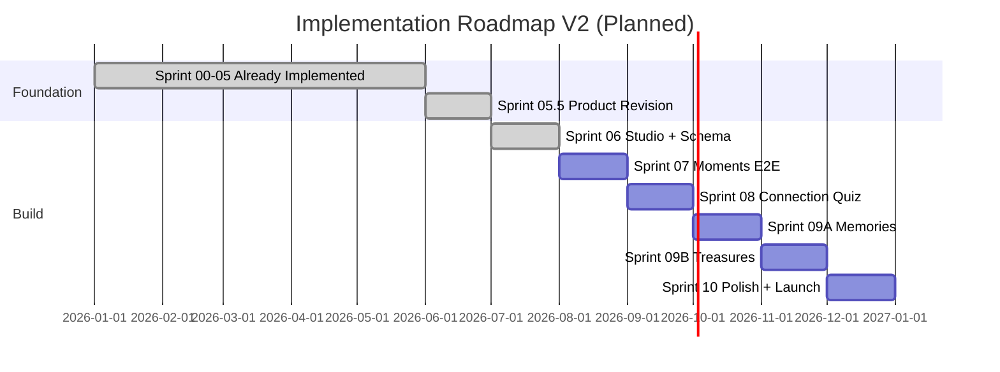

# 11 — Implementation Roadmap V2

> **Sprint:** 05.5 — Product Revision V2 (documentation only)  
> **Status:** **Supersedes** pre-revision Sprint 06–09 scope in [00_INDEX.md](./00_INDEX.md)  
> **Related:** [Product Revision V2](./07_PRODUCT_REVISION_V2.md) · [Experience Modes](./08_EXPERIENCE_MODES.md) · [Architecture Impact](./09_ARCHITECTURE_IMPACT.md) · [Database Revision Plan](./10_DATABASE_REVISION_PLAN.md)

---

## Document Legend

| Label                   | Meaning                          |
| ----------------------- | -------------------------------- |
| **Already Implemented** | Shipped in Sprints 00–05         |
| **Planned**             | Approved roadmap — not yet built |
| **Future Idea**         | Post-V2 or optional              |

---

## Roadmap Principles

1. **Each sprint is independently deployable** — no "big bang" release.
2. **Moments ships first** — validates full pipeline before premium modes.
3. **Database changes precede UI** that depends on them.
4. **Founder decisions unchanged** — see [05_FOUNDER_DECISIONS.md](./05_FOUNDER_DECISIONS.md).
5. **Docs updated per sprint** — schema changes update `03_DATABASE.md`.

---

## Pre-Revision vs V2

| Pre-revision plan                                              | V2 plan                                                                     |
| -------------------------------------------------------------- | --------------------------------------------------------------------------- |
| Sprint 06: Order management + experience drafts (single shape) | Sprint 06: Order management + **mode selection** + schema migration         |
| Sprint 07+: Experience delivery                                | Sprint 07: **Moments** E2E + **Memory Code grace period + trusted devices** |
| —                                                              | Sprint 08: **Connection** (quiz + templates)                                |
| —                                                              | Sprint 09A: **Memories**                                                    |
| —                                                              | Sprint 09B: **Treasures**                                                   |
| —                                                              | Sprint 10: Polish, landing marketing, analytics                             |

---

## Sprint Map Overview



Dates are illustrative — founder sets actual schedule.

---

| Sprint 05.5 — Product Revision V2 ✅ (amended) |

**Status:** Already Implemented (documentation)

| Deliverable                       | Status                                                                                                                      |
| --------------------------------- | --------------------------------------------------------------------------------------------------------------------------- |
| `07_PRODUCT_REVISION_V2.md`       | ✅                                                                                                                          |
| `08_EXPERIENCE_MODES.md`          | ✅                                                                                                                          |
| `09_ARCHITECTURE_IMPACT.md`       | ✅                                                                                                                          |
| `10_DATABASE_REVISION_PLAN.md`    | ✅                                                                                                                          |
| `11_IMPLEMENTATION_ROADMAP_V2.md` | ✅                                                                                                                          |
| `00_INDEX.md` updated             | ✅                                                                                                                          |
| Code / SQL changes                | None                                                                                                                        |
| Founder amendments (post-V2)      | Memory Code grace, hybrid DB, templates, quiz/envelope limits, 09A/09B split                                                |
| Database Design Review            | Founder decisions locked — publish validation matrix in `03_DATABASE.md`                                                    |
| Studio Design Review              | Founder decisions locked — [12_STUDIO_UX.md](./12_STUDIO_UX.md)                                                             |
| Sprint 06 Readiness Review        | ✅ Closed — READY WITH MINOR NOTES; checklist in [11](./11_IMPLEMENTATION_ROADMAP_V2.md#sprint-06-implementation-checklist) |
| **Sprint 05.5 status**            | **CLOSED** — official implementation baseline for Sprint 06+                                                                |

**Deployable:** Yes — docs only, no runtime impact. **Sprint 06 implementation cleared.**

---

## Sprint 06 — Studio Foundation + Mode Schema ✅

**Status:** **Complete** — accepted and closed (Sprint 06 Acceptance Review).

**Goal:** Order-centric Studio with unified editor shell. Admin creates orders (all modes), edits core experience drafts. Database supports modes.

> **UX spec:** [12_STUDIO_UX.md](./12_STUDIO_UX.md) — mandatory read before implementation.

### Deliverables

| Area           | Work                                                                                                               | Status |
| -------------- | ------------------------------------------------------------------------------------------------------------------ | ------ |
| Migration 016  | `experience_mode` on `experiences` + `orders` (TEXT + CHECK); nullable `quiz_title` on `experiences`               | ✅     |
| Repositories   | `OrdersRepository`, `ExperiencesRepository` in `features/studio/repositories/`                                     | ✅     |
| Studio IA      | Sidebar: **Dashboard** + **Orders** only (no Experiences/Themes/Templates)                                         | ✅     |
| Studio routes  | `/studio`, `/studio/orders`, `/studio/orders/new`, `/studio/orders/[id]`                                           | ✅     |
| Studio UI      | Dashboard — **action queue** (not analytics)                                                                       | ✅     |
| Studio UI      | Order list with filters (status, mode, delivery date)                                                              | ✅     |
| Studio UI      | **Single create-order form** (mode + sender + recipient + theme + basics)                                          | ✅     |
| Studio UI      | **Unified Order Editor** on order detail — core sections (letter, **photos shell only**, Memory Code)              | ✅     |
| Studio UI      | Premium mode panels — **"Coming in Sprint X"** stubs (Connection 08, Memories 09A, Treasures 09B)                  | ✅     |
| Server Actions | Order + experience **atomic create**; experience draft save; mode change                                           | ✅     |
| Services       | Mode change handler — confirmation dialog; column update in Sprint 06; child auto-delete when tables 017–019 exist | ✅     |
| Schemas        | `experienceModeSchema`, order/experience input schemas                                                             | ✅     |
| Docs           | Update `03_DATABASE.md` after migration                                                                            | ✅     |

### Deployable Outcome

- Admin logs in → Dashboard shows action queue → creates order (any mode) in one form → edits core draft on unified editor
- Premium orders allowed — core experience editable; premium panel shows stub until Sprint 08–09B
- Recipient experience **not yet live**; publish deferred to Sprint 07

### Dependencies

- **Already Implemented:** Sprint 05 auth, Sprint 04 infrastructure
- **UX locked:** [12_STUDIO_UX.md](./12_STUDIO_UX.md), [05_FOUNDER_DECISIONS.md](./05_FOUNDER_DECISIONS.md)

### Not in Scope

- Quiz/match/envelope live editors (stubs only)
- Publish, preview, QR (Sprint 07)
- Recipient `/e/[token]` pages
- UX Backlog: auto-save, unsaved-changes warning (see [12_STUDIO_UX.md](./12_STUDIO_UX.md#ux-backlog))

### Sprint 06 Implementation Checklist

> From **Sprint 06 Readiness Review** (Sprint 05.5). These are **engineering implementation notes** — not product specification changes. Founder accepted as day-1 checklist. **All items complete.**

| #   | Checklist item              | Detail                                                                                                                                                                                                                                                                                                                                | Status |
| --- | --------------------------- | ------------------------------------------------------------------------------------------------------------------------------------------------------------------------------------------------------------------------------------------------------------------------------------------------------------------------------------- | ------ |
| 1   | **Atomic create**           | Prefer Postgres RPC in migration 016 for `order + experience` create; if not, sequential ops + compensating delete on failure. Do not rely on `runSequentialOperations` alone where rollback is required.                                                                                                                             | ✅     |
| 2   | **Bootstrap draft values**  | Create form fields ≠ all `experiences` NOT NULL columns. On atomic create: generate `experience_token`; map `greeting_name` ← `receiver_name`, `closing_name` ← `sender_name`; use approved non-blank draft placeholders for `letter_content` / `letter_closing`; temporary `memory_key_hash` until admin sets Memory Code in editor. | ✅     |
| 3   | **Photos section**          | **Shell only** in Sprint 06 — slot UI, no upload. Upload pipeline is Sprint 07.                                                                                                                                                                                                                                                       | ✅     |
| 4   | **Mode change (Sprint 06)** | Update `experience_mode` + confirmation dialog. Child-row auto-delete activates when migrations 017–019 exist.                                                                                                                                                                                                                        | ✅     |
| 5   | **AI Guide sync**           | Follow [02_ARCHITECTURE.md](./02_ARCHITECTURE.md) / [05_FOUNDER_DECISIONS.md](./05_FOUNDER_DECISIONS.md) for feature dependency rules over stale [07_AI_GUIDE.md](./07_AI_GUIDE.md) cross-import wording. Add `12_STUDIO_UX.md` to pre-code reading.                                                                                  | ✅     |
| 6   | **Implementation order**    | Migration 016 → types/schemas → repositories → services → actions → Studio layout → routes (list, new, detail) → dashboard                                                                                                                                                                                                            | ✅     |

**Sprint 06 status:** **CLOSED** — fully accepted. Sprint 07 cleared to begin.

### Recommended implementation order

```
016 migration (+ optional RPC) → schemas/types → repositories →
order-creation service → server actions → Studio shell →
/studio/orders* → /studio dashboard → update 03_DATABASE.md
```

---

## Sprint 07 — Moments Experience End-to-End + Memory Code

**Goal:** Full recipient flow for **Moments** mode. Implements **Memory Code grace period (24h)**, trusted devices, Access Code flow (engineering term) for post-grace new devices.

### Planned Deliverables

| Area                   | Work                                                                                         |
| ---------------------- | -------------------------------------------------------------------------------------------- |
| `features/access/`     | Memory Code verification, **24-hour grace period**, trusted device sessions                  |
| `features/experience/` | Recipient shell, themed letter, gallery                                                      |
| `features/photobooth/` | Browser-only photobooth component                                                            |
| `features/preview/`    | Buyer preview link flow                                                                      |
| Studio                 | **Unified publish** — lock + QR in one action; buyer approval default; Skip Preview override |
| Studio                 | Preview link flow; pre-publish checklist                                                     |
| Storage                | Photo upload pipeline (admin → `experience-photos`)                                          |
| Analytics              | Coarse events: experience opened, completed (enum extension if needed), mode                 |
| Database               | **No grace-period migration** — computed from `first_opened_at + 24h` in services            |
| Proxy                  | Rate limiting extension point on `/e/*` (basic)                                              |

### Memory Code Product Rules (Founder Decision)

1. First successful access starts 24h grace — no Memory Code required.
2. Any device opening during grace becomes Trusted Device.
3. After grace: trusted devices → no code; new devices → Memory Code → trusted.

**Terminology:** Product/UI = Memory Code. Code/schema = `memory_key_hash`, `access_attempts`, etc.

### Deployable Outcome

- **Moments** bouquets sold end-to-end with grace-period first experience
- Connection/Memories/Treasures orders in Studio — recipient UI deferred to Sprint 08–09B

### Not in Scope

- Quiz, match, envelope recipient UI
- Connection templates (Sprint 08)

---

## Sprint 08 — Connection Experience (Quiz + Templates)

**Goal:** Ship **Connection** premium mode — couple quiz (max 6 multiple choice) with **starter templates**.

### Planned Deliverables

| Area               | Work                                                                                     |
| ------------------ | ---------------------------------------------------------------------------------------- |
| Migration 017      | `experience_quiz_questions` (options JSONB) + score bands + RLS (no UPDATE post-publish) |
| Studio             | Quiz builder UI; **templates:** Anniversary, Graduation, Birthday, Proposal              |
| `features/quiz/`   | Recipient quiz UI (A/B/C, max 6 questions)                                               |
| Server Actions     | Save quiz config (admin), submit answers (recipient, post-auth)                          |
| Analytics          | Coarse: opened, completed, mode                                                          |
| Publish validation | Connection: 1–6 questions, ≥ 1 score band required                                       |

### Deployable Outcome

- Connection tier fully sellable with templates
- Moments + Connection production-ready

---

## Sprint 09A — Memories Experience

**Goal:** Ship **Memories** mode — Match The Memory game.

### Planned Deliverables

| Area               | Work                                                                                 |
| ------------------ | ------------------------------------------------------------------------------------ |
| Migration 018      | `experience_match_pairs`, `final_unlock_message` + RLS (no UPDATE post-publish)      |
| Studio             | Match pair editor (story + photo slot); optional Memories templates                  |
| `features/match/`  | Tap/drag match UI, unlock final message                                              |
| Publish validation | Memories: ≥ 2 pairs, `final_unlock_message`; each `photo_sort_order` must have photo |

### Deployable Outcome

- Moments + Connection + **Memories** production-ready

### Dependencies

- Sprint 08 establishes mode-specific Studio + recipient pattern

---

## Sprint 09B — Treasures Experience

**Goal:** Ship **Treasures** mode — Secret Envelopes (max 6).

### Planned Deliverables

| Area                  | Work                                                                                |
| --------------------- | ----------------------------------------------------------------------------------- |
| Migration 019         | `experience_envelopes` + RLS (no UPDATE post-publish)                               |
| Studio                | Envelope sequencer (message/photo, final flag, max 6); optional Treasures templates |
| `features/treasures/` | Sequential envelope open UI                                                         |
| Publish validation    | Treasures: 2–6 envelopes, exactly 1 final                                           |

### Deployable Outcome

- **All four modes** production-ready — full Product V2 achieved

### Dependencies

- Sprint 09A (shared mode patterns)

---

## Sprint 10 — Polish, Marketing, Analytics

**Goal:** Launch-quality refinement across all modes.

### Planned Deliverables

| Area          | Work                                                    |
| ------------- | ------------------------------------------------------- |
| Landing page  | Four-mode comparison; marketing-owned pricing copy      |
| Studio        | Dashboard metrics (orders by mode, completion rates)    |
| Performance   | Moments fast-path audit; lazy-load premium game bundles |
| Accessibility | Keyboard nav, reduced motion                            |
| Docs          | Sync `01_PROJECT_CONTEXT.md` vision with V2             |
| Ops           | 365-day archival job (Future Idea if not done)          |

### Deployable Outcome

- Investor-ready demo across all tiers
- Marketing site reflects platform positioning

---

## UX Backlog (Approved — Not Sprint 06)

> Full list: [12_STUDIO_UX.md](./12_STUDIO_UX.md#ux-backlog)

| Item                                  | Target sprint                        |
| ------------------------------------- | ------------------------------------ |
| Auto-save draft                       | Post–Sprint 06                       |
| Unsaved changes warning before leave  | Post–Sprint 06                       |
| Desktop-first layout + tablet support | Ongoing (Sprint 06 baseline desktop) |
| Collapsed order status groups in UI   | Post–Sprint 06                       |
| Copy preview link + WhatsApp template | Sprint 07                            |
| Visual photo slot grid                | Sprint 09A/09B                       |
| Inline templates                      | Sprint 08                            |

---

## Post-V2 Backlog (Future Idea)

| Item                               | Notes                                                |
| ---------------------------------- | ---------------------------------------------------- |
| Studio analytics dashboard         | Charts, export                                       |
| `IP_HASH_PEPPER` rate limiting     | Full implementation                                  |
| Automated test suite               | RLS, Memory Code grace period, game grading          |
| Fifth experience mode              | Schema designed for extension                        |
| Theme preview images               | `/public/themes/`                                    |
| Supabase `gen types`               | Type generation from live schema                     |
| MED-01 / LOW-01 / LOW-02 tech debt | [06_DEVELOPMENT_GUIDE.md](./06_DEVELOPMENT_GUIDE.md) |

---

## Deployability Matrix

| After sprint | What works in production                                          |
| ------------ | ----------------------------------------------------------------- |
| 05.5         | Landing + Studio login (unchanged)                                |
| 06           | Studio order-centric IA + unified editor + action-queue dashboard |
| 07           | **Moments** full delivery + Memory Code grace period              |
| 08           | Moments + **Connection** (with templates)                         |
| 09A          | + **Memories**                                                    |
| 09B          | All **four modes**                                                |
| 10           | Launch-polished **four modes** + marketing                        |

---

## Risk Register (Planned)

| Risk                        | Mitigation                                                                           |
| --------------------------- | ------------------------------------------------------------------------------------ |
| Sprint 09 too large         | **Resolved** — split into 09A (Memories) + 09B (Treasures) per founder decision      |
| Premium modes delay Moments | Sprint 07 ships Moments independently                                                |
| Schema rework               | Follow [10_DATABASE_REVISION_PLAN.md](./10_DATABASE_REVISION_PLAN.md); additive only |
| Scope creep (5th mode)      | Founder gate per [07_AI_GUIDE.md](./07_AI_GUIDE.md)                                  |
| Low-end phone perf          | Moments default; lazy-load games                                                     |

---

## Founder Checklist Before Each Sprint

- [ ] Read [00_INDEX.md](./00_INDEX.md) current sprint scope
- [ ] Confirm sprint matches this roadmap (or document deviation)
- [x] For Sprint 06 Studio: follow [12_STUDIO_UX.md](./12_STUDIO_UX.md) and [implementation checklist](./11_IMPLEMENTATION_ROADMAP_V2.md#sprint-06-implementation-checklist) — **Sprint 06 closed**
- [ ] Approve any new founder decisions in `05_FOUNDER_DECISIONS.md`
- [ ] Approve migration files before apply to production

---

## Related Documents

- [07_PRODUCT_REVISION_V2.md](./07_PRODUCT_REVISION_V2.md)
- [08_EXPERIENCE_MODES.md](./08_EXPERIENCE_MODES.md)
- [09_ARCHITECTURE_IMPACT.md](./09_ARCHITECTURE_IMPACT.md)
- [10_DATABASE_REVISION_PLAN.md](./10_DATABASE_REVISION_PLAN.md)
- [12_STUDIO_UX.md](./12_STUDIO_UX.md) — Studio admin UX specification
- [00_INDEX.md](./00_INDEX.md)
