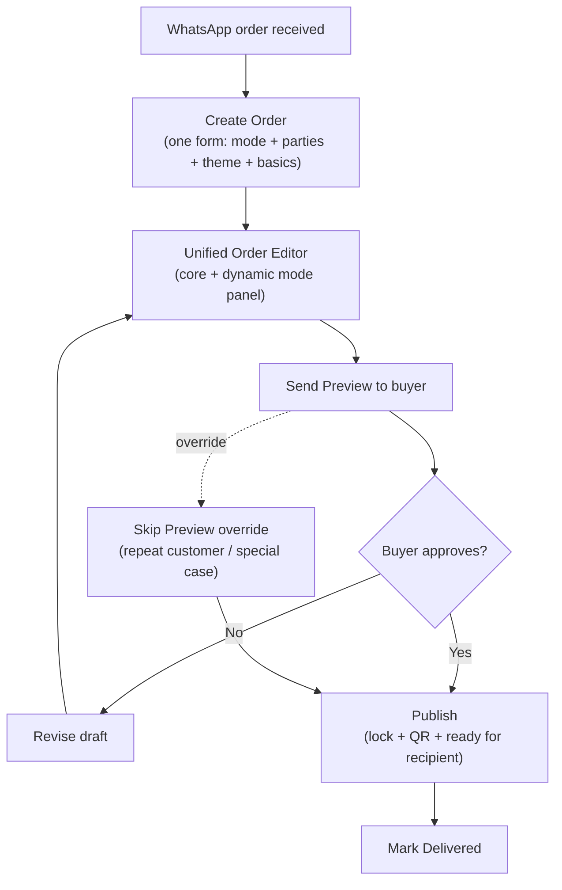

# 12 — Studio UX

> **Sprint:** 05.5 — Studio Design Review (documentation only — **no code**)  
> **Status:** Founder decisions final — Studio Design Review closed  
> **Baseline:** Sprint 05.5 closed — this doc is authoritative for Sprint 06+ Studio work  
> **Related:** [Founder Decisions](./05_FOUNDER_DECISIONS.md) · [Roadmap V2](./11_IMPLEMENTATION_ROADMAP_V2.md) · [Experience Modes](./08_EXPERIENCE_MODES.md) · [Architecture](./02_ARCHITECTURE.md)

---

## Document Legend

| Label                   | Meaning                                            |
| ----------------------- | -------------------------------------------------- |
| **Already Implemented** | Shipped in Sprints 00–05                           |
| **Planned**             | Approved for an upcoming sprint                    |
| **UX Backlog**          | Approved improvement — not in current sprint scope |

---

## Purpose

This document is the **single source of truth for Studio (Admin Dashboard) UX**. Engineering implements Studio against this spec — not against ad-hoc navigation or workflow assumptions.

**Mental model (founder-facing):**

> _"Saya mengelola pesanan. Setiap pesanan punya satu pengalaman digital."_

---

## Information Architecture

### Navigation (Final)

Sidebar contains **only two items**:

| Nav item      | Route            | Purpose                                   |
| ------------- | ---------------- | ----------------------------------------- |
| **Dashboard** | `/studio`        | Action queue — orders needing work today  |
| **Orders**    | `/studio/orders` | Primary workspace — list and order detail |

### Explicitly excluded from navigation

| Item        | Verdict            | Reason                                                      |
| ----------- | ------------------ | ----------------------------------------------------------- |
| Experiences | ❌ Not a menu      | 1:1 with orders — order detail is the experience workspace  |
| Themes      | ❌ Not a menu      | 5 fixed themes — picker inside editor only                  |
| Templates   | ❌ Not a menu      | Inline "Start from template" inside mode panel (Sprint 08+) |
| Settings    | ❌ Deferred        | Admin config is env-based for V2                            |
| Analytics   | ❌ Not primary nav | Coarse metrics in Sprint 10 Dashboard only                  |

### Route map (Planned)

```
/studio                          Dashboard (action queue)
/studio/orders                   Order list
/studio/orders/new               Create order (single form)
/studio/orders/[id]              Unified Order Editor (primary workspace)
/studio/login                    Auth (Already Implemented)
```

**Rule:** Studio routes are **order-centric**. Never `/studio/experiences/[id]`.

---

## Admin Workflow (Final)



### Workflow rules

| Rule                | Detail                                                                                                                                                      |
| ------------------- | ----------------------------------------------------------------------------------------------------------------------------------------------------------- |
| Create Order        | **One form** — mode, sender, recipient, theme, event type, optional WhatsApp/notes. Mode is a field, not a separate wizard step.                            |
| Experience creation | **Atomic with order** — experience row created in same transaction as order (1:1 from day one).                                                             |
| Design              | All editing on `/studio/orders/[id]` — Unified Order Editor.                                                                                                |
| Preview             | Default path before publish. Buyer approves via preview link.                                                                                               |
| Skip Preview        | **Override** for repeat customers or special requests — not the default.                                                                                    |
| Publish             | **Single action** — locks content (`content_locked_at`), generates QR to `experience-qr` bucket, sets experience published. No separate "Generate QR" step. |
| Delivered           | Manual status update after physical bouquet delivery.                                                                                                       |

### Primary status display

Order detail shows **order status** as the primary badge. Experience publish state is a **secondary indicator** (e.g. "Experience: Draft / Published") — never a competing primary workflow.

---

## Unified Order Editor

### Pattern (Final)

**One page shell** at `/studio/orders/[id]`. Mode-specific UI is a **dynamic panel** composed from mode features — not separate editor routes per mode.

```
/studio/orders/[id]
├── Order header (order #, status, mode badge, delivery date)
├── Section: Core (theme, greeting/closing names, letter)     — all modes
├── Section: Photos (slots 1–6)                               — all modes; Sprint 06: shell only (upload Sprint 07)
├── Section: Mode panel (dynamic by experience_mode)          — see below
├── Section: Memory Code                                      — all modes
└── Action bar: Save draft | Send preview | Publish
```

### Mode panel behavior

| Mode         | Sprint 06–07 panel                         | Sprint when live editor ships   |
| ------------ | ------------------------------------------ | ------------------------------- |
| `moments`    | Full core editing only                     | Sprint 07 (publish E2E)         |
| `connection` | **Live** — quiz builder + inline templates | Sprint 08 ✅                    |
| `memories`   | **Coming in Sprint 09A** stub              | Sprint 09A — match pair editor  |
| `treasures`  | **Coming in Sprint 09B** stub              | Sprint 09B — envelope sequencer |

**Founder decision (final):** Premium modes **may be selected** at order creation in Sprint 06–07. Admin completes full **Core Experience** (letter, photos, theme, Memory Code). Premium panel shows stub until that sprint's editor ships. **Do not block** premium order creation.

### Code composition (aligns with architecture)

| UI layer                                  | Location                                          |
| ----------------------------------------- | ------------------------------------------------- |
| Editor shell, order header, core sections | `features/studio/components/`                     |
| Connection panel                          | `features/quiz/components/` (composed into shell) |
| Memories panel                            | `features/match/components/`                      |
| Treasures panel                           | `features/treasures/components/`                  |

Mode features supply **panels**, not **pages**.

### UX consistency rules

| Rule               | Application                                                          |
| ------------------ | -------------------------------------------------------------------- |
| Same page chrome   | Order header and action bar identical across modes                   |
| Same section order | Core → Photos → Mode → Memory Code → Actions                         |
| Same action verbs  | "Save draft", "Send preview", "Publish" — never mode-specific labels |
| Mode badge         | Consistent pill: Moments / Connection / Memories / Treasures         |
| Theme picker       | Inside core section — not a separate admin area                      |

---

## Create Order Form (Final)

Single form at `/studio/orders/new` (or modal — implementation choice).

| Field                   | Required | Notes                                        |
| ----------------------- | -------- | -------------------------------------------- |
| `experience_mode`       | ✅       | First field — tier selection                 |
| `sender_name`           | ✅       |                                              |
| `receiver_name`         | ✅       |                                              |
| `theme_id`              | ✅       | Picker from 5 themes                         |
| `event_type`            | ✅       | birthday, anniversary, etc.                  |
| `buyer_whatsapp`        | Optional | Future: "Open WhatsApp" link on order detail |
| `admin_notes`           | Optional |                                              |
| `scheduled_delivery_at` | Optional | Surfaces on Dashboard queue                  |

**On save:** Create `orders` row + `experiences` row in one operation. Copy `experience_mode` from order to experience. Set both to draft status.

**Engineering note (Sprint 06 Readiness):** The create form does not collect all `experiences` NOT NULL fields. Bootstrap draft values on atomic create — see [11_IMPLEMENTATION_ROADMAP_V2.md](./11_IMPLEMENTATION_ROADMAP_V2.md#sprint-06-implementation-checklist).

---

## Dashboard (Sprint 06)

**Action queue** — not an analytics dashboard.

| Content                      | Purpose                                                      |
| ---------------------------- | ------------------------------------------------------------ |
| Orders needing action        | Draft, awaiting preview, awaiting approval, ready to publish |
| Today's scheduled deliveries | `scheduled_delivery_at` filter                               |
| **New Order** CTA            | Primary action                                               |

**Not in Sprint 06:** Charts, funnel analytics, mode comparison graphs (Sprint 10 at earliest).

---

## Publish & Preview (Sprint 07)

### Preview (default path)

1. Admin sends preview link to buyer (copy + optional WhatsApp message template).
2. Order status → `preview_sent`.
3. Buyer approves → order status → `approved`.
4. Publish enabled.

### Skip Preview (override)

| When                                            | How                                                                                            |
| ----------------------------------------------- | ---------------------------------------------------------------------------------------------- |
| Repeat customer, trusted buyer, urgent delivery | Admin explicitly chooses "Skip preview" — records override; publish allowed without `approved` |

### Publish (single action)

| Step                                | Result                                                                                       |
| ----------------------------------- | -------------------------------------------------------------------------------------------- |
| Run publish validation              | Mode-specific checklist (see [03_DATABASE.md](./03_DATABASE.md#planned-v2-schema-sprint-06)) |
| Set `content_locked_at`             | Content immutable                                                                            |
| Set experience `status = published` |                                                                                              |
| Generate QR                         | Upload to `experience-qr` bucket; set `qr_storage_path`                                      |
| Show QR download                    | Admin downloads printable QR for bouquet                                                     |

No separate "Generate QR" admin step.

### Pre-publish checklist

Visual checklist before Publish button enables — green/red per requirement (letter, Memory Code, mode-specific rules, buyer approval unless skipped). Implemented in `publish-checklist.tsx`.

---

## Mode Change (Pre-Publish)

When admin changes `experience_mode` on a draft:

1. Studio shows **confirmation dialog** listing data to be deleted (when child tables exist).
2. On confirm: auto-delete incompatible child rows (migrations 017–019+).
3. Premium stub panel updates to new mode.

**Sprint 06:** Child tables do not exist yet — handler updates `experience_mode` + shows confirmation dialog; delete logic no-ops until Sprint 08–09B.

---

## Responsive Design

| Priority          | Target                                                        |
| ----------------- | ------------------------------------------------------------- |
| **Primary**       | Desktop (founder daily workflow)                              |
| **Secondary**     | Tablet support                                                |
| **Not optimized** | Phone — admin may check status; full editing is desktop-first |

---

## UX Backlog

Approved improvements — **not Sprint 06 scope** unless explicitly pulled in.

| Item                                          | Priority    | Notes                                                                                     |
| --------------------------------------------- | ----------- | ----------------------------------------------------------------------------------------- |
| **Auto-save draft**                           | High        | Reduce data loss; debounced save on editor fields                                         |
| **Unsaved changes warning**                   | High        | Before navigating away from `/studio/orders/[id]`                                         |
| **Desktop-first, tablet support**             | Medium      | Layout breakpoints; touch-friendly targets on tablet                                      |
| Collapsed order status groups in UI           | Medium      | 4 visible groups mapping to 7 DB statuses                                                 |
| Copy preview link + WhatsApp message template | Medium      | **Copy button shipped**; WhatsApp template text shown after Send Preview (session-scoped) |
| Visual photo slot grid (Memories/Treasures)   | Medium      | Sprint 09A/09B                                                                            |
| Inline templates ("Start from Anniversary")   | Medium      | Sprint 08 — not a Templates nav page                                                      |
| Order search by receiver name                 | Medium      | Volume growth                                                                             |
| Duplicate order (repeat buyers)               | Future Idea |                                                                                           |
| `buyer_whatsapp` → Open WhatsApp link         | Future Idea |                                                                                           |

---

## Fifth Mode Scalability

| Area                         | Scales?                        |
| ---------------------------- | ------------------------------ |
| Sidebar (Dashboard + Orders) | ✅ No nav change               |
| Unified editor               | ✅ Add mode panel via registry |
| Create order form            | ✅ Add 5th mode option         |
| Publish validation           | ✅ Add row to matrix           |

---

## Sprint 06 Implementation Checklist

> Full engineering checklist (atomic create, bootstrap values, photos shell): [11_IMPLEMENTATION_ROADMAP_V2.md](./11_IMPLEMENTATION_ROADMAP_V2.md#sprint-06-implementation-checklist)

**Status:** ✅ **Complete** — Sprint 06 closed.

- [x] Sidebar: Dashboard + Orders only
- [x] Routes: `/studio`, `/studio/orders`, `/studio/orders/new`, `/studio/orders/[id]`
- [x] Create order: single form; atomic order + experience creation (RPC or compensating delete)
- [x] Bootstrap draft values for required `experiences` columns on create
- [x] Unified Order Editor shell with core sections
- [x] Photos section: live upload (6 slots, WebP pipeline)
- [x] Publish workflow: checklist, preview, skip override, publish + QR download
- [x] Premium mode panels: "Coming in Sprint X" stubs
- [x] Dashboard: action queue (not analytics)
- [x] Mode change: confirmation dialog; column update (child delete when 017–019 exist)
- [x] Update `features/studio/config/routes.ts` with new routes

---

## Related Documents

- [05_FOUNDER_DECISIONS.md](./05_FOUNDER_DECISIONS.md) — locked Studio UX decisions
- [11_IMPLEMENTATION_ROADMAP_V2.md](./11_IMPLEMENTATION_ROADMAP_V2.md) — sprint deliverables
- [09_ARCHITECTURE_IMPACT.md](./09_ARCHITECTURE_IMPACT.md) — engineering impact
- [03_DATABASE.md](./03_DATABASE.md) — publish validation matrix
- [02_ARCHITECTURE.md](./02_ARCHITECTURE.md) — technical architecture
