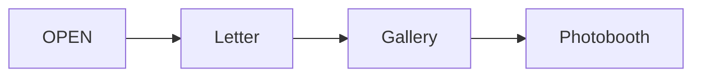
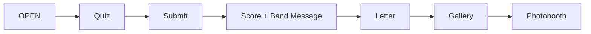
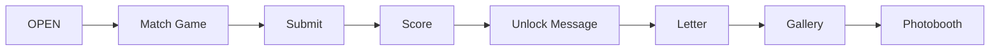
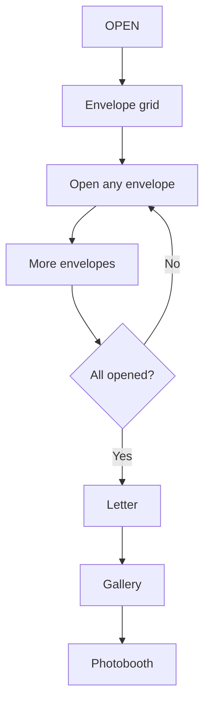

# 13 — Experience Journey Diagram (SSOT)

> **Status:** **Approved**  
> **Version:** v1.0  
> **Approval date:** 2026-07-13  
> **Authority:** This document is the **Single Source of Truth (SSOT)** for recipient and buyer-preview journey ordering across all experience modes. When product flow questions arise, consult this document first.  
> **Related:** [08_EXPERIENCE_MODES.md](./08_EXPERIENCE_MODES.md) · [05_FOUNDER_DECISIONS.md](./05_FOUNDER_DECISIONS.md) · [14_REPLAYABLE_EXPERIENCE.md](./14_REPLAYABLE_EXPERIENCE.md) · [04_SECURITY.md](./04_SECURITY.md) · [11_IMPLEMENTATION_ROADMAP_V2.md](./11_IMPLEMENTATION_ROADMAP_V2.md)

---

## Product Vision Correction — Replayability (CF-R1 + CF-R2)

> **Locked** — [14_REPLAYABLE_EXPERIENCE.md](./14_REPLAYABLE_EXPERIENCE.md) · Sprint 10: [15](./15_SPRINT_10_CF-R2_REPLAY_RESET.md)

| ID          | Rule                                                                         |
| ----------- | ---------------------------------------------------------------------------- |
| **CF-R1**   | Replayable digital gift — reload after trigger replays the emotional journey |
| **CF-R2-A** | Photobooth first reach → silent DELETE of `experience_envelope_opens`        |
| **CF-R2-B** | No visit detection, timers, session cookies, or intent inference             |
| **CF-R2-C** | Reload after trigger → ✉️ fresh start (intentional, not a bug)               |

Connection, Memories, Moments: **no Sprint 10 changes**. Treasures: **CF-R2 shipped** (Sprint 10).

---

## Purpose

Celebrate Florist ships four **experience modes**. Each mode has a distinct emotional identity, but premium interactive modes share a consistent **reward philosophy**:

> **Interaction first → emotional reward second → shared memories last.**

This document describes the **complete recipient journey** for every mode in step-by-step form. It is written for **Product** (what the recipient feels) and **Engineering** (what data ships when, and what must never leak).

**Legend used throughout:**

| Term             | Meaning                                                                                                              |
| ---------------- | -------------------------------------------------------------------------------------------------------------------- |
| **OPEN**         | Recipient passes the access gate (Memory Code, 24h grace, or trusted device) and the experience page loads           |
| **Gate**         | Content or interaction shown **before** the primary emotional reward; may withhold letter, photos, or hidden answers |
| **Reward**       | The emotional payoff the sender intended — usually the letter and/or unlock message                                  |
| **Continuation** | Gallery and photobooth — shared memory moments after the reward                                                      |

---

## Cross-Mode Comparison

| Mode           | Has game?                    | Reward                       | Gate mechanism                      | Persistence model (V2)                                                  |
| -------------- | ---------------------------- | ---------------------------- | ----------------------------------- | ----------------------------------------------------------------------- |
| **Moments**    | No                           | Letter (immediate)           | Access gate only                    | N/A — all content on first load                                         |
| **Connection** | Quiz                         | Letter                       | Quiz submit unlocks reward payload  | `sessionStorage` (CF-2)                                                 |
| **Memories**   | Match game                   | Unlock message → Letter      | Match submit unlocks reward (FD-M5) | `sessionStorage` (FD-M3, mirrors CF-2)                                  |
| **Treasures**  | Envelope reveals (any order) | Letter (after all envelopes) | Per-envelope server fetch (A-4)     | Server until Photobooth trigger; **CF-R2-A:** clear opens at Photobooth |

### Shared Entry (All Modes)

Every mode begins with the same **access gate** before OPEN:

```
Scan QR / open link
  → evaluateAccessGate()
      → memory_code_required  → Memory Code wall
      → trust_cookie_required → /e/[token]/trust → cookie → redirect
      → granted               → OPEN (experience content begins)
```

Access gate applies to the **whole experience**, not individual sections within a mode.

### Shared Tail (All Modes)

After mode-specific reward content:

```
Gallery (if photos uploaded)
  → Photobooth (client-only keepsake)
```

Photobooth is always last. Gallery is omitted when zero photos exist.

---

## Mode 1 — Moments

### Product Purpose

The simplest, fastest path to emotion. No games, no gates beyond access control. Ideal for concerts, graduations, and buyers who want intimacy without interaction.

**Emotion:** Warmth, immediacy — _"They wrote this for me."_

### Why This Ordering

Moments is the **baseline mode**. There is no game to build curiosity; the letter **is** the experience. Photos and photobooth extend the moment after reading.

### What Is the Reward?

The **letter** (greeting, body, closing, sender name).

### Recipient Journey

```
OPEN
  → Letter
  → Gallery
  → Photobooth
```



### Gate vs Reward

| Phase            | Content delivered on initial load              |
| ---------------- | ---------------------------------------------- |
| **Gate**         | Access gate only (Memory Code / grace / trust) |
| **Reward**       | Letter — **immediate** on OPEN                 |
| **Continuation** | Gallery + Photobooth — **immediate** on OPEN   |

There is no secondary unlock within Moments.

### Security Expectations

| Requirement                     | Status                             |
| ------------------------------- | ---------------------------------- |
| Letter on first load            | ✅ Allowed — letter is the product |
| Signed photo URLs on first load | ✅ Allowed                         |
| Hidden game answers             | N/A — no game                      |
| Recipient accounts              | ❌ Never required                  |

### Buyer Preview Ordering

Mirrors recipient (no gating for buyer):

```
Preview header
  → Letter
  → Memory photos
  → Buyer approval
```

### Engineering Status

**Already implemented** (Sprint 07). No Sprint 08R changes.

---

## Mode 2 — Connection

### Product Purpose

A personal couple quiz — _"How well do you know me?"_ — that builds curiosity and participation **before** the emotional letter reveal.

**Emotion:** Playfulness, validation — _"Let me prove I pay attention."_ The letter becomes a **reward**, not an introduction.

> **Founder decision (CF-1 – CF-4, locked):** Quiz is an emotional interaction, not an evaluation gate. **Any successful submit unlocks the letter**, regardless of score. Score affects the band message only.

### Why This Ordering

Connection differentiates through **interactive gifting**. Reading the letter first (Sprint 08 original flow) treated the quiz as a bonus. The revised flow (Sprint 08R) makes the quiz the **curiosity gate** that earns the letter.

### What Is the Reward?

The **letter** — unlocked after quiz submit.

Score + band message are **feedback**, not the reward. They appear **before** the letter in the vertical scroll order to close the quiz loop emotionally.

### Recipient Journey (Sprint 08R — Implemented)

```
OPEN
  → Quiz
  → Submit
  → Score + Band Message
  → Letter          ← reward
  → Gallery
  → Photobooth
```



### Gate vs Reward

| Phase                | When                         | Content                                                                  |
| -------------------- | ---------------------------- | ------------------------------------------------------------------------ |
| **Gate (Phase A)**   | Initial page load            | Header/theme, greeting name, quiz questions (no correct answers)         |
| **Gate withheld**    | Initial load                 | ❌ `letter_content`, `letter_closing`, `closing_name`, signed photo URLs |
| **Reward (Phase B)** | After successful quiz submit | Score + band message, letter fields, signed gallery URLs                 |
| **Continuation**     | Same unlock as reward        | Gallery + Photobooth (after letter in scroll order)                      |

**CF-4 implementation (approved):**

1. Initial load → **Connection Gate Payload** only
2. `submitQuizAnswersAction` → grading result + **Connection Reward Payload**
3. Client stores unlock blob in `sessionStorage` (CF-2)
4. Letter and Gallery render **only after** successful submit

No separate reward endpoint in v1.

### Unlock Persistence (CF-2)

| Event                         | Behavior                                      |
| ----------------------------- | --------------------------------------------- |
| Same-tab refresh after submit | Unlocked state restored from `sessionStorage` |
| New tab / cleared storage     | Quiz must be replayed (accepted)              |
| Server completion flag        | ❌ None — no migration                        |

**Storage key:** `cf_connection_unlock_${experienceId}`

### Security Expectations

| Requirement                                      | Rule                                           |
| ------------------------------------------------ | ---------------------------------------------- |
| `correct_option_index` in recipient/preview DTOs | ❌ Never                                       |
| Letter in initial HTML/RSC/network payload       | ❌ Never (CF-4)                                |
| Signed photo URLs before quiz submit             | ❌ Never (CF-3)                                |
| Grading                                          | 100% server-side; answers not persisted (OD-5) |
| Score blocks letter unlock                       | ❌ Never (CF-1)                                |
| Submit rate limiting                             | Deferred (MED-05)                              |

### Buyer Preview Ordering (Sprint 08R-C)

Buyer preview is **not gated** — buyer must review full content before approval.

```
Preview header
  → Quiz (questions + score bands, no correct answers)
  → Letter
  → Memory photos
  → Buyer approval
```

Preview order mirrors the **recipient narrative** (quiz before letter) but shows all sections without unlock mechanics.

### Engineering Status

| Component                                            | Status          |
| ---------------------------------------------------- | --------------- |
| Quiz services, repos, Studio, grading                | ✅ Sprint 08    |
| Gate Payload + Reward Payload split                  | ✅ Sprint 08R-A |
| Recipient orchestration (`ConnectionExperienceFlow`) | ✅ Sprint 08R-B |
| Buyer preview reorder (Quiz → Letter → Gallery)      | ✅ Sprint 08R-C |
| Documentation sync                                   | ✅ Sprint 08R-D |

---

## Mode 3 — Memories

### Product Purpose

**Match The Memory** — pair story descriptions with photos shown through a **cinematic reveal window** (FD-M2). Curiosity and nostalgia — not a difficulty exam.

**Emotion:** Nostalgia, emotional anticipation — _"You were there for these moments."_

> **Founder decisions (FD-M1–FD-M5, locked Phase 5.5):** Single reveal style; cinematic window (~20–30% visible); one submission only (supersedes unlimited retry); score never blocks reward (extends CF-1).

### Why This Ordering

Memories shares Connection's **game-first reward philosophy** (CF-5). The match game builds engagement through cinematic photo teasers; the unlock message and letter deliver emotional payoff; gallery and photobooth continue the shared-memory arc.

### What Is the Reward?

1. **Unlock message** (`experiences.final_unlock_message`) — always shown after valid submit (FD-M5)
2. **Letter** — primary emotional reward after the game loop closes

Score reflects how many pairs matched correctly — **fun and nostalgia only**, never a gate.

### Recipient Journey (Sprint 09A Phase 6+)

```
OPEN
  → Match Game (photos via cinematic reveal window — FD-M2)
  → Submit (once — FD-M3)
  → Score
  → Unlock Message
  → Letter
  → Gallery
  → Photobooth
```



**Single submission (FD-M3):** No retry after successful submit in same session. `sessionStorage` unlock mirrors CF-2. New tab / cleared storage = fresh experience (accepted).

**Cinematic reveal (FD-M2):** Recipient never sees full photo during game. ~20–30% visible through centered, feathered window. One style for all photos (FD-M1). Buyer preview shows full photos — no masking.

### Gate vs Reward

| Phase                | When                                         | Content                                                                                                                    |
| -------------------- | -------------------------------------------- | -------------------------------------------------------------------------------------------------------------------------- |
| **Gate (Phase A)**   | Initial load                                 | Header/theme, stories (no mappings), photo options with signed URLs for **masked display only** (no full unmasked gallery) |
| **Gate withheld**    | Initial load                                 | ❌ `photo_sort_order` mappings, unlock message, letter fields, full gallery presentation                                   |
| **Reward (Phase B)** | After valid batch submit (FD-M5 — any score) | Score, unlock message, letter fields, signed gallery URLs                                                                  |
| **Continuation**     | Same unlock as reward                        | Gallery + Photobooth                                                                                                       |

**Implementation pattern:** Mirror Connection Sprint 08R — `MemoriesGatePayload` on load, `MemoriesRewardPayload` after submit, `sessionStorage` persistence (FD-M3 / CF-2 alignment).

### Unlock Persistence (FD-M3)

| Event                                            | Behavior                                        |
| ------------------------------------------------ | ----------------------------------------------- |
| Same-tab refresh after submit                    | Unlocked state restored from `sessionStorage`   |
| New tab / cleared storage                        | Match may be replayed (accepted — same as CF-2) |
| Re-submit after successful submit (same session) | ❌ Blocked — no retry                           |
| Server completion flag                           | ❌ None — no migration                          |

**Storage key (planned):** `cf_memories_unlock_${experienceId}`

### Security Expectations

| Requirement                                  | Rule                                                  |
| -------------------------------------------- | ----------------------------------------------------- |
| `photo_sort_order` in recipient/preview DTOs | ❌ Never (A-3)                                        |
| Correct mappings in buyer preview            | ❌ Never (A-3)                                        |
| Batch grading                                | 100% server-side (A-2)                                |
| Unlock message / letter before submit        | ❌ Never                                              |
| Score blocks reward                          | ❌ Never (FD-M5)                                      |
| Retry after successful submit                | ❌ Never (FD-M3)                                      |
| Full unmasked photos before submit           | ❌ Never during game (FD-M2) — masked URLs in gate OK |

### Buyer Preview Ordering (Sprint 09A Phase 7)

```
Preview header
  → Match structure (stories + full photos, no mappings)
  → Note: recipients see photos through cinematic reveal window
  → Final unlock message (buyer knows reward copy — not a game spoiler)
  → Letter
  → Memory photos
  → Buyer approval
```

Buyer sees structure and full photos for approval; must not be able to solve the game from preview data. **No cinematic masking in preview** (FD-M2).

### Engineering Status

| Component                                                       | Status                   |
| --------------------------------------------------------------- | ------------------------ |
| Migration, types, repos, services, Studio editor                | ✅ Sprint 09A Phases 1–4 |
| Publish validation + mode-change cleanup                        | ✅ Sprint 09A Phase 5    |
| Founder decisions FD-M1–FD-M5 locked                            | ✅ Sprint 09A Phase 5.5  |
| Gate/Reward backend (`fetchMemoriesGatePayload`, etc.)          | ✅ Sprint 09A Phase 6A   |
| Recipient UI (`MemoriesExperienceFlow`, `MatchCinematicReveal`) | ✅ Sprint 09A Phase 6B   |
| Page wiring + sessionStorage unlock                             | ✅ Sprint 09A Phase 6C   |
| Buyer preview                                                   | ✅ Sprint 09A Phase 7    |

---

## Mode 4 — Treasures

> **CF-R1 + CF-R2:** Server-side opens persist until Photobooth trigger; **CF-R2-A** clears opens at Photobooth; reload after trigger restarts ✉️ fresh (CF-R2-C). Shipped Sprint 10. See [14_REPLAYABLE_EXPERIENCE.md](./14_REPLAYABLE_EXPERIENCE.md).

### Product Purpose

**Secret Envelopes** — hidden messages and photos revealed through ceremony and pacing. Recipients open envelopes in **any order** (FD-T1). The letter arrives after **all** envelopes are opened (FD-T4).

**Emotion:** Anticipation, ceremony — _"There's more…"_

### Why This Ordering

Treasures maximizes **unboxing metaphor**. Envelopes are the interactive core. The letter arrives **after** the envelope journey as the culminating emotional reward (CF-5 alignment). Gallery follows as continuation.

> **Note:** Earlier drafts placed an intro letter before envelopes. This SSOT follows the **locked founder direction**: letter follows all envelopes.

### What Is the Reward?

The **letter** — unlocked after **all** envelopes are opened (`openedCount == envelopeCount`).

Individual envelopes contain **micro-rewards** (hidden messages/photos) along the way.

### Recipient Journey (Sprint 09B — implemented)

```
OPEN
  → Envelope grid (all closed)
  → Open any envelope (any order)
  → …
  → All envelopes opened
  → Letter              ← primary reward
  → Gallery
  → Photobooth
```



**Treasure Navigation (FD-T1, FD-T3):**

- ✅ Recipients may open envelopes in **any order**
- ✅ Recipients may **revisit** opened envelopes during the same visit (idempotent reopen)
- ❌ ~~Skip ahead blocked~~ — **withdrawn**; any order is allowed

### Gate vs Reward

| Phase                        | When                        | Content                                                |
| ---------------------------- | --------------------------- | ------------------------------------------------------ |
| **Gate**                     | Initial load + per-envelope | Envelope shells only; **no hidden body** until opened  |
| **Per-envelope fetch (A-4)** | Each open action            | Single envelope content — message and/or photo (FD-T5) |
| **Reward**                   | All envelopes opened        | Letter fields + gallery                                |
| **Continuation**             | After letter                | Gallery + Photobooth                                   |

Treasures uses **server-side progress** (`experience_envelope_opens`) until the Photobooth replay trigger for refresh-safe, cross-tab consistency (FD-T2). **CF-R2-A:** silent DELETE at Photobooth. **CF-R2-C:** reload after trigger intentionally restarts closed. **Shipped Sprint 10.**

### Security Expectations

| Requirement                                | Rule               |
| ------------------------------------------ | ------------------ |
| Hidden envelope content in initial payload | ❌ Never (A-4)     |
| Preview reveals hidden envelope secrets    | ❌ Never (A-3)     |
| Per-envelope fetch                         | ✅ Required (A-4)  |
| Reward before all envelopes opened         | ❌ Blocked (FD-T4) |

### Buyer Preview Ordering (Sprint 09B)

```
Preview header
  → Envelope content (full FD-T5 — all visible)
  → Letter
  → Memory gallery
  → Buyer approval
```

Buyer preview does **not** include photobooth (consistent with other modes).

### Engineering Status

| Component                                               | Status                   |
| ------------------------------------------------------- | ------------------------ |
| Migration, types, repos, services, Studio editor        | ✅ Sprint 09B Phases 1–4 |
| Publish validation + mode-change cleanup                | ✅ Sprint 09B Phase 5    |
| Gate/Reward backend + per-envelope fetch (A-4)          | ✅ Sprint 09B Phase 6    |
| Recipient UI (`TreasuresExperienceFlow`, envelope grid) | ✅ Sprint 09B Phase 6    |
| Buyer preview                                           | ✅ Sprint 09B Phase 7    |
| CF-R2 replay reset (`completeTreasuresJourney`)         | ✅ Sprint 10 (10A–10B)   |
| CRIT-01 `service_role` DELETE grant                     | ✅ Sprint 10 hotfix      |

---

## Buyer Preview vs Recipient — Summary

| Mode           | Recipient gating                                      | Buyer preview gating | Preview section order                                                           |
| -------------- | ----------------------------------------------------- | -------------------- | ------------------------------------------------------------------------------- |
| **Moments**    | None                                                  | None                 | Letter → Photos → Approve                                                       |
| **Connection** | Quiz gates letter + gallery                           | None                 | Quiz → Letter → Photos → Approve                                                |
| **Memories**   | Match gates reward + letter + gallery                 | None                 | Match structure → Unlock msg → Letter → Photos → Approve (full photos, no mask) |
| **Treasures**  | All envelopes opened gates letter (any order — FD-T1) | None                 | Envelope structure → Letter → Photos → Approve                                  |

**Rule:** Buyer preview always shows **structure and non-spoiler context** for approval. Recipient path applies **gate/reward mechanics** to protect emotional timing and hidden answers.

---

## Security Matrix (All Modes)

| Asset                                   | Moments | Connection | Memories | Treasures |
| --------------------------------------- | ------- | ---------- | -------- | --------- |
| Letter on initial recipient load        | ✅      | ❌         | ❌       | ❌        |
| Signed photo URLs on initial load       | ✅      | ❌         | ❌       | ❌        |
| Hidden game answers on initial load     | N/A     | ❌         | ❌       | N/A       |
| Hidden envelope content on initial load | N/A     | N/A        | N/A      | ❌        |
| Grading server-side only                | N/A     | ✅         | ✅       | N/A       |
| Correct answers in preview DTOs         | N/A     | ❌         | ❌       | ❌        |
| Access gate before all content          | ✅      | ✅         | ✅       | ✅        |
| Server-side order enforcement           | N/A     | N/A        | N/A      | ✅        |

---

## Analytics (All Modes — OD-1 Locked)

| Event                                            | When                                             | Status                              |
| ------------------------------------------------ | ------------------------------------------------ | ----------------------------------- |
| `experience_opened`                              | Granted OPEN (all modes)                         | ✅ Implemented                      |
| Mode segmentation                                | JOIN `experiences.experience_mode` at query time | ✅ Implemented                      |
| `experience_completed`                           | —                                                | ❌ **Not in V2** (no migration 020) |
| Per-section events (quiz_submitted, letter_read) | —                                                | ❌ **Not in V2**                    |

Journey changes in Sprint 08R do **not** require new analytics events for V2.

---

## Engineering Notes — Adding Future Modes

When a new experience mode is proposed, answer these questions **before writing code**:

1. **Does this mode have a game or interactive gate?**
   - If yes → define Gate Payload vs Reward Payload split (Connection pattern)
   - If sequential unlock → define server-side unlock index (Treasures pattern)
   - If no → Moments pattern (full payload on OPEN)

2. **What is the reward?**  
   Document explicitly. Only one primary reward per mode.

3. **What must never appear in the initial recipient payload?**  
   List hidden fields. Add to security matrix above.

4. **What persistence model applies?**
   - `sessionStorage` — acceptable for replay-friendly emotional experiences (CF-2)
   - Server state — required when order enforcement or cross-tab consistency matters

5. **How does buyer preview differ from recipient?**  
   Preview shows structure without spoilers; recipient applies gate mechanics.

6. **Update this document first.**  
   Then sync [08_EXPERIENCE_MODES.md](./08_EXPERIENCE_MODES.md), [05_FOUNDER_DECISIONS.md](./05_FOUNDER_DECISIONS.md), and [11_IMPLEMENTATION_ROADMAP_V2.md](./11_IMPLEMENTATION_ROADMAP_V2.md).

---

## Consistency Verification

This document was verified against:

| Source                                                     | Alignment                                                                             |
| ---------------------------------------------------------- | ------------------------------------------------------------------------------------- |
| **CF-1** (any submit unlocks letter)                       | ✅ Connection — score never blocks reward                                             |
| **CF-2** (sessionStorage only)                             | ✅ Connection; ✅ Memories (same pattern)                                             |
| **CF-3** (gallery gated until submit)                      | ✅ Connection; ✅ Memories (same pattern)                                             |
| **CF-4** (no letter in initial payload)                    | ✅ Connection Gate/Reward split documented                                            |
| **CF-5** (premium modes: game → reward → letter → gallery) | ✅ Connection, Memories, Treasures                                                    |
| **FD-M1** (single reveal style)                            | ✅ Memories — one cinematic mechanic                                                  |
| **FD-M2** (cinematic reveal window)                        | ✅ Memories recipient-only presentation                                               |
| **FD-M3** (single submission)                              | ✅ Supersedes unlimited Match Retry                                                   |
| **FD-M4** (2–6 pairs)                                      | ✅ Aligns with A-1                                                                    |
| **FD-M5** (score never blocks reward)                      | ✅ Extends CF-1 to Memories                                                           |
| **Sprint 08R planning**                                    | ✅ Phase A/B architecture                                                             |
| **Sprint 09A Phase 5**                                     | ✅ Publish validation implemented                                                     |
| **Sprint 09A Phase 5.5**                                   | ✅ FD-M1–FD-M5 locked                                                                 |
| **A-2** (batch submit)                                     | ✅ Memories                                                                           |
| **A-3** (preview without spoilers)                         | ✅ Memories, Treasures                                                                |
| **A-4** (per-envelope fetch)                               | ✅ Treasures                                                                          |
| **Match Retry**                                            | ⚠️ **SUPERSEDED** by FD-M3 — see [05_FOUNDER_DECISIONS.md](./05_FOUNDER_DECISIONS.md) |
| **Treasure Navigation**                                    | ✅ Revisit allowed; any order allowed (FD-T1)                                         |
| **OD-1** (no experience_completed)                         | ✅ Analytics section                                                                  |
| **OD-5** (stateless grading)                               | ✅ Connection + Memories                                                              |

### Known Drift — Resolved (Sprint 08R-D)

All documentation drift identified during Sprint 08R planning has been resolved:

| Document                                                              | Was                           | Resolved in             |
| --------------------------------------------------------------------- | ----------------------------- | ----------------------- |
| [08_EXPERIENCE_MODES.md](./08_EXPERIENCE_MODES.md) Connection journey | Letter → Quiz (Sprint 08)     | Sprint 08R-D            |
| [08_EXPERIENCE_MODES.md](./08_EXPERIENCE_MODES.md) Memories journey   | Letter before Match           | Sprint 08R-D            |
| [08_EXPERIENCE_MODES.md](./08_EXPERIENCE_MODES.md) Treasures journey  | Intro letter before envelopes | Sprint 08R-D            |
| [05_FOUNDER_DECISIONS.md](./05_FOUNDER_DECISIONS.md)                  | CF-1–CF-5 not recorded        | Sprint 08R-D            |
| [00_INDEX.md](./00_INDEX.md)                                          | SSOT not linked               | Sprint 08R-D            |
| Match Retry (unlimited) in docs/code comments                         | Superseded by FD-M3           | Sprint 09A Phase 5.5    |
| Grade service `allCorrect` gates reward                               | Superseded by FD-M5           | Phase 6A implementation |

**Rule:** If new drift appears, update this SSOT first, then sync dependent docs in the same sprint.

---

## Implementation Roadmap Cross-Reference

| Sprint                   | Journey impact                                              |
| ------------------------ | ----------------------------------------------------------- |
| **Sprint 08R-A**         | Connection Gate + Reward payload types and services         |
| **Sprint 08R-B**         | Connection recipient orchestration (this SSOT § Connection) |
| **Sprint 08R-C**         | Connection buyer preview reorder                            |
| **Sprint 08R-D**         | Doc sync — drift resolved ✅                                |
| **Sprint 09A Phase 5**   | Memories publish validation ✅                              |
| **Sprint 09A Phase 5.5** | FD-M1–FD-M5 founder lock ✅                                 |
| **Sprint 09A Phase 6A**  | Memories Gate + Reward backend ✅                           |
| **Sprint 09A Phase 6B**  | Recipient UI + cinematic reveal ✅                          |
| **Sprint 09A Phase 6C**  | Page wiring + sessionStorage unlock ✅                      |
| **Sprint 09A Phase 7**   | Memories buyer preview ✅                                   |
| **Sprint 09B**           | Treasures full journey (this SSOT § Treasures) ✅           |
| **Sprint 10**            | CF-R2 Treasures replay reset (this SSOT § Treasures) ✅     |

---

## Document Governance

| Rule                      | Detail                                                                                                                                                                  |
| ------------------------- | ----------------------------------------------------------------------------------------------------------------------------------------------------------------------- |
| **Change authority**      | Founder approval required for journey order changes                                                                                                                     |
| **Engineering authority** | Gate/Reward payload implementation details may be refined by engineering if product requirements in this document are met                                               |
| **Supersedes**            | On journey ordering questions, this document supersedes per-mode sections in [08_EXPERIENCE_MODES.md](./08_EXPERIENCE_MODES.md) until those files are explicitly synced |
| **Version**               | v1.1 — Sprint 10 documentation sync (2026-07-14); Sprints 09A–10 complete                                                                                               |

---

_Official SSOT — linked from [00_INDEX.md](./00_INDEX.md). Sprints 09A, 09B, and 10 complete; engineering freeze in effect._
