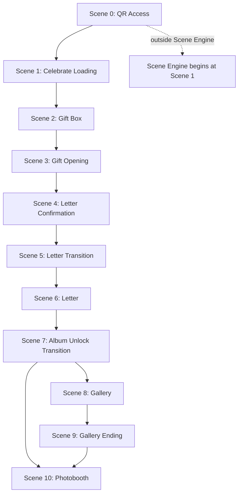

# Sprint 11 — Moments Scene Architecture

> **Status:** **Founder Approved — Locked**  
> **Approval date:** 2026-07-15  
> **Mode:** `moments`  
> **Sprint type:** Planning only — **no production code**  
> **Parent:** [16_SPRINT_11_EXPERIENCE_ARCHITECTURE.md](../16_SPRINT_11_EXPERIENCE_ARCHITECTURE.md) · [README](./README.md)

---

## Global Experience Rules (GER)

Cross-mode standards: [GER-01–06](../05_FOUNDER_DECISIONS.md#global-experience-rules-ger) · [ADR S11-008](../adr/S11-008-global-experience-rules.md).

| GER    | Applies to Moments                                                                   |
| ------ | ------------------------------------------------------------------------------------ |
| GER-01 | Transition scenes 5, 7 — ~1.0–1.5 s (album unlock may use 0.8–1.2 s per locked spec) |
| GER-02 | ❌ No gameplay timer                                                                 |
| GER-03 | N/A (Memories only)                                                                  |
| GER-05 | N/A (Memories only)                                                                  |
| GER-06 | N/A                                                                                  |

Scene 1 Celebrate Loading (0.5–1 s) is `intro`, not a GER-01 transition.

---

## Architecture Consistency Audit

**Audit date:** 2026-07-15  
**Outcome:** **PASSED**

| Check                          | Result                                                                                     |
| ------------------------------ | ------------------------------------------------------------------------------------------ |
| FD-S11-01 Wrap                 | ✅ Presentation scenes wrap `MomentsExperience`; no repo/service/action changes            |
| FD-S11-02 Back edge            | ✅ Moments is forward-only; no backward navigation                                         |
| FD-S11-03 Persistent Shell     | ✅ Theme/layout frame mounted; scenes 1–10 mount/unmount inside shell                      |
| FD-S11-04 Parameterized graph  | ✅ Fixed graph (N/A for envelope params); gallery conditional skip only                    |
| FD-S11-05 Server initial scene | ✅ Server resolves `moments.celebrate-loading` after access granted                        |
| FD-S11-06 Scene Contract       | ✅ All destination scenes implement contract; transitions are edge-only (see §Scene Types) |
| Doc 13 business journey        | ✅ Reward = Letter · Continuation = Gallery → Photobooth preserved at business layer       |
| Gate/Reward (Moments)          | ✅ No gate/reward split; letter payload on OPEN; presentation delays reveal until Scene 6  |
| CF-R1 / CF-R2                  | ✅ N/A — Treasures only                                                                    |
| Sprint 13 boundary             | ✅ Durations are logical hints only; no animation spec                                     |
| Sprint 14 boundary             | ✅ Photobooth scene defined only; no layouts/frames/stickers                               |

---

## Relationship to Doc 13

[Doc 13](../13_EXPERIENCE_JOURNEY.md) defines the **business-layer** Moments journey:

```
OPEN → Letter → Gallery → Photobooth
```

This document defines the **presentation-layer** scene graph — emotional ceremony before and between those business phases. Doc 13 ordering is **not contradicted**; intro and transition scenes are presentation orchestration only.

| Doc 13 phase                  | Moments presentation scenes       |
| ----------------------------- | --------------------------------- |
| Access gate                   | Scene 0 (outside Scene Engine)    |
| Pre-reward ceremony           | Scenes 1–5                        |
| **Reward — Letter**           | Scene 6                           |
| **Continuation — Gallery**    | Scenes 7–8 (transition + gallery) |
| Gallery closing               | Scene 9                           |
| **Continuation — Photobooth** | Scene 10                          |

---

## Scene Graph Overview



**Gallery skip:** When `photos.length === 0`, Scene 8 and Scene 9 are omitted. Scene 7 transitions directly to Scene 10.

---

## Scene Inventory

### Scene 0 — QR Access

| Field                    | Value                        |
| ------------------------ | ---------------------------- |
| **Scene ID**             | _N/A — outside Scene Engine_ |
| **Type**                 | Access layer                 |
| **Inside Scene Engine?** | **No**                       |

**Responsibility:** Validate access only (`evaluateAccessGate()` — Memory Code, grace, trusted device).

**Content:** Existing access gate UX. Unchanged from Phase A.

---

### Scene 1 — Celebrate Loading

| Field              | Value                       |
| ------------------ | --------------------------- |
| **Scene ID**       | `moments.celebrate-loading` |
| **Type**           | `intro`                     |
| **Scene Contract** | Full                        |

**Content:**

- Celebrate
- _Every moment deserves to be celebrated_

**Target duration:** 0.5–1 second (logical hint for Sprint 13 — not an animation spec).

**Purpose:** Emotional preparation only.

**Transition trigger:** Auto-advance on duration complete → Scene 2.

---

### Scene 2 — Gift Box

| Field              | Value              |
| ------------------ | ------------------ |
| **Scene ID**       | `moments.gift-box` |
| **Type**           | `intro`            |
| **Scene Contract** | Full               |

**Content:**

- For **{Recipient Name}**
- _A surprise is waiting for you._
- _Touch the flower to begin._

**Purpose:** Curiosity.

**Transition trigger:** User interaction (`onComplete`) → Scene 3.

---

### Scene 3 — Gift Opening

| Field              | Value                  |
| ------------------ | ---------------------- |
| **Scene ID**       | `moments.gift-opening` |
| **Type**           | `intro`                |
| **Scene Contract** | Full                   |

**Founder clarification (locked):** The gift box **opens**. A **letter physically appears** from inside the gift box.

**After letter appears:**

- From **{Buyer Name}**
- _Tap the letter to continue._

**Purpose:** Reveal the sender while naturally introducing the letter. Replaces the previous simplified interpretation where only buyer information appeared.

**Transition trigger:** User taps letter (`onComplete`) → Scene 4.

**Note:** Letter **content** is not displayed here — only sender reveal and letter as object. Full letter text appears in Scene 6.

---

### Scene 4 — Letter Confirmation

| Field              | Value                         |
| ------------------ | ----------------------------- |
| **Scene ID**       | `moments.letter-confirmation` |
| **Type**           | `intro`                       |
| **Scene Contract** | Full                          |

**Content:**

- _Ready?_
- ♡
- **Open the Letter**

**Replaces:** _"Are you sure?"_ — storytelling instead of system confirmation.

**Purpose:** Emotional pause before reading.

**Transition trigger:** User confirms (`onComplete`) → Scene 5.

---

### Scene 5 — Letter Transition

| Field              | Value                       |
| ------------------ | --------------------------- |
| **Scene ID**       | `moments.letter-transition` |
| **Type**           | `transition`                |
| **Scene Contract** | Minimal — auto-advance only |

**Target duration:** 1–1.5 seconds (logical hint).

**Purpose:** Bridge between confirmation and letter reading.

**This is NOT a destination scene.** Recipient does not interact. Visual animation belongs to **Sprint 13**.

**Transition trigger:** Duration complete → Scene 6.

---

### Scene 6 — Letter

| Field              | Value            |
| ------------------ | ---------------- |
| **Scene ID**       | `moments.letter` |
| **Type**           | `reward`         |
| **Scene Contract** | Full             |

**Content:** Recipient reads the letter (greeting, body, closing — existing letter component).

**CTA:** **Unlock Memories**

**Purpose:** Primary emotional peak (doc 13 reward phase).

**Note:** "Unlock Memories" is **storytelling language** — not a security gate. Moments has no secondary unlock (doc 13).

**Transition trigger:** User CTA (`onComplete`) → Scene 7.

**Business layer:** Consumes existing Moments letter payload from Phase A. No new server fields.

---

### Scene 7 — Album Unlock Transition

| Field              | Value                             |
| ------------------ | --------------------------------- |
| **Scene ID**       | `moments.album-unlock-transition` |
| **Type**           | `transition`                      |
| **Scene Contract** | Minimal — auto-advance only       |

**Target duration:** 0.8–1.2 seconds (maximum 1.5 seconds).

**Purpose:** Bridge only — album opens and transitions into Gallery.

**This is NOT a destination scene.** Sprint 11 defines existence only. Animation belongs to **Sprint 13**.

**Transition trigger:** Duration complete → Scene 8 (if photos exist) or Scene 10 (if gallery skipped).

---

### Scene 8 — Gallery

| Field              | Value             |
| ------------------ | ----------------- |
| **Scene ID**       | `moments.gallery` |
| **Type**           | `continuation`    |
| **Scene Contract** | Full              |

**Content:** Displays memories. Scrollable.

**Guard:** `photos.length > 0` — if zero photos, scene graph **skips** this scene automatically.

**Purpose:** Shared memory continuation (doc 13).

**Transition trigger:** User scroll complete or explicit continue → Scene 9.

---

### Scene 9 — Gallery Ending

| Field              | Value                    |
| ------------------ | ------------------------ |
| **Scene ID**       | `moments.gallery-ending` |
| **Type**           | `continuation-ending`    |
| **Scene Contract** | Full                     |

**Content:** Closing message.

**CTA:** **Continue to Photobooth**

**Purpose:** Emotional closing before celebration.

**Guard:** Same as Scene 8 — skipped when no photos.

**Transition trigger:** User CTA (`onComplete`) → Scene 10.

---

### Scene 10 — Photobooth

| Field              | Value                |
| ------------------ | -------------------- |
| **Scene ID**       | `moments.photobooth` |
| **Type**           | `terminal`           |
| **Scene Contract** | Full                 |

**Sprint 11 scope:** Scene existence and terminal position only.

**Out of scope (Sprint 11):** Layouts, frames, stickers, animations.

**Implementation:** Sprint 14 — Photobooth redesign.

**CF-R2:** N/A for Moments.

---

## Scene Types (Moments)

| Type                  | Scenes | Contract               | Destination?         |
| --------------------- | ------ | ---------------------- | -------------------- |
| `intro`               | 1–4    | Full                   | Yes                  |
| `transition`          | 5, 7   | Minimal (auto-advance) | **No** — bridge only |
| `reward`              | 6      | Full                   | Yes                  |
| `continuation`        | 8      | Full                   | Yes                  |
| `continuation-ending` | 9      | Full                   | Yes                  |
| `terminal`            | 10     | Full                   | Yes (journey end)    |

---

## Edge Table

| From                              | To                                | Trigger                 | Guard                         |
| --------------------------------- | --------------------------------- | ----------------------- | ----------------------------- |
| _(access granted)_                | `moments.celebrate-loading`       | `JOURNEY_START`         | Server-resolved initial scene |
| `moments.celebrate-loading`       | `moments.gift-box`                | Duration complete       | —                             |
| `moments.gift-box`                | `moments.gift-opening`            | User tap flower         | —                             |
| `moments.gift-opening`            | `moments.letter-confirmation`     | User tap letter         | —                             |
| `moments.letter-confirmation`     | `moments.letter-transition`       | User confirm            | —                             |
| `moments.letter-transition`       | `moments.letter`                  | Duration complete       | —                             |
| `moments.letter`                  | `moments.album-unlock-transition` | `CONTINUATION_COMPLETE` | —                             |
| `moments.album-unlock-transition` | `moments.gallery`                 | Duration complete       | `photos.length > 0`           |
| `moments.album-unlock-transition` | `moments.photobooth`              | Duration complete       | `photos.length === 0`         |
| `moments.gallery`                 | `moments.gallery-ending`          | User continue           | —                             |
| `moments.gallery-ending`          | `moments.photobooth`              | `TERMINAL_REACHED`      | —                             |

---

## State & Progress (Moments)

| Concern              | Moments behavior                                                             |
| -------------------- | ---------------------------------------------------------------------------- |
| Progress persistence | None (doc 13 — all content on first load)                                    |
| Initial scene        | Server → `moments.celebrate-loading` (FD-S11-05)                             |
| Page reload          | Full presentation journey restarts from Scene 1                              |
| Business payload     | Letter + photos fetched on OPEN; scenes control **when** content is revealed |
| Scene state          | Scene Manager only — no new persistence                                      |

---

## Explicit Non-Goals (This Document)

This document defines **scene architecture, emotional pacing, scene order, and scene responsibility**.

This document does **NOT** define:

- Animation implementation
- Timing curves
- Camera movement
- Fade, blur, zoom, or visual effects

Those belong exclusively to **Sprint 13 Motion System**.

This document does **NOT** define:

- Photobooth layouts, frames, or stickers (Sprint 14)
- Backend, payload, or schema changes
- Connection, Memories, or Treasures flows

---

## Integration (Wrap Architecture)

```
page.tsx (RSC)
  → evaluateAccessGate()          ← Scene 0
  → fetchPublishedExperience()    ← Moments full payload (unchanged)
  → resolveInitialScene → moments.celebrate-loading
  └── RecipientExperienceView
        └── MomentsExperience (wrapped)
              └── SceneEngineHost
                    └── PersistentShell
                          └── Active Scene (1–10)
```

Existing `MomentsExperience` child components map to scene slots at implementation time (Sprint 12+). Sprint 11 defines slots only.

---

## Founder Sign-Off

| Item                      | Status                                                   |
| ------------------------- | -------------------------------------------------------- |
| Moments scene flow        | ✅ Founder approved 2026-07-15                           |
| FD-S11-07 recorded        | ✅ [05_FOUNDER_DECISIONS.md](../05_FOUNDER_DECISIONS.md) |
| Implementation authorized | **No**                                                   |
