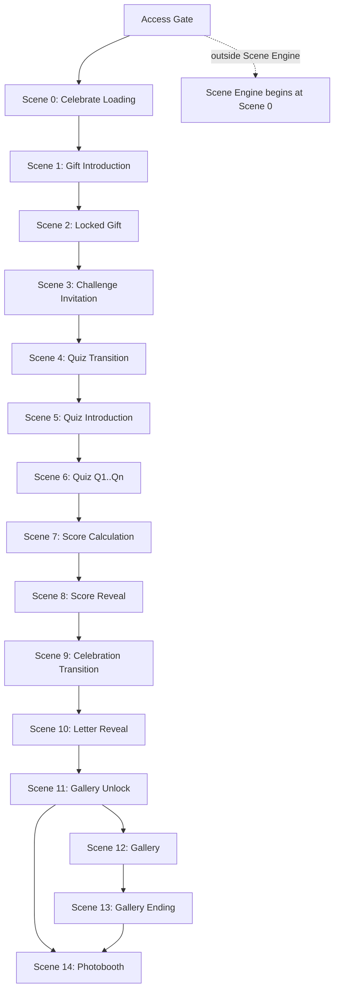

# Sprint 11 — Connection Scene Architecture

> **Status:** **Founder Approved — Locked**  
> **Approval date:** 2026-07-16  
> **Mode:** `connection`  
> **Sprint type:** Planning only — **no production code**  
> **Parent:** [16_SPRINT_11_EXPERIENCE_ARCHITECTURE.md](../16_SPRINT_11_EXPERIENCE_ARCHITECTURE.md) · [README](./README.md)

---

## Global Experience Rules (GER)

[GER-01–06](../05_FOUNDER_DECISIONS.md#global-experience-rules-ger) · [ADR S11-008](../adr/S11-008-global-experience-rules.md)

| GER    | Applies to Connection                                                                                                  |
| ------ | ---------------------------------------------------------------------------------------------------------------------- |
| GER-01 | Transition scenes 4, 7, 9 — ~1.0–1.5 s; Scene 11 gallery unlock 2–3 s (override)                                       |
| GER-02 | ❌ **No gameplay timer** — reflective quiz; recipient reads and answers without pressure (founder revision 2026-07-16) |
| GER-03 | N/A                                                                                                                    |
| GER-05 | N/A                                                                                                                    |
| GER-06 | N/A (no gameplay timer in this mode)                                                                                   |

**Founder rationale:** Connection questions may contain longer text. Countdown would create unnecessary anxiety and reduce the emotional experience.

---

## Architecture Consistency Audit

**Audit date:** 2026-07-16  
**Auditors:** Principal Software Architect · UX Architect · Creative Director · Devil's Advocate  
**Outcome:** **PASSED** — no blocking issues

| Check                           | Result                                                                                                               |
| ------------------------------- | -------------------------------------------------------------------------------------------------------------------- |
| FD-S11-01 Wrap                  | ✅ Presentation scenes wrap `ConnectionExperienceFlow`; gate/reward services and `submitQuizAnswersAction` unchanged |
| FD-S11-02 Back edge             | ✅ Connection forward-only; no back navigation during or after quiz (Treasures-only back edge unchanged)             |
| FD-S11-03 Persistent Shell      | ✅ Theme/layout frame mounted; scenes 0–14 mount/unmount inside shell                                                |
| FD-S11-04 Parameterized graph   | ✅ Quiz questions = parameterized `gate-dynamic` scenes (one per question)                                           |
| FD-S11-05 Server initial scene  | ✅ Server resolves gate entry; unlock restore via sessionStorage re-read (see §Unlock Restore)                       |
| FD-S11-06 Scene Contract        | ✅ Destination scenes full contract; transitions minimal                                                             |
| Doc 13 business journey         | ✅ Quiz → Submit → Score + Band → Letter → Gallery → Photobooth preserved                                            |
| CF-1 (any submit unlocks)       | ✅ Score tone warm/celebratory; never blocks letter                                                                  |
| CF-2 (sessionStorage)           | ✅ Unlock blob unchanged; same-tab refresh restores reward path                                                      |
| CF-3 / CF-4 (gate/reward split) | ✅ Locked Gift reveals nothing; letter/sender withheld until Scene 10                                                |
| Phase A implementation          | ✅ Wraps existing `QuizPlayer` logic via scene slots; submit remains batch server action                             |
| Sprint 13 boundary              | ✅ Durations are logical hints only                                                                                  |
| Sprint 14 boundary              | ✅ Photobooth scene placement only                                                                                   |

### Devil's Advocate — Reviewed Risks (Non-Blocking)

| Risk                                                                  | Verdict                                   | Mitigation                                                                                                                 |
| --------------------------------------------------------------------- | ----------------------------------------- | -------------------------------------------------------------------------------------------------------------------------- |
| Quiz UX differs from Phase A (one question/screen vs all-on-one-page) | Accepted — Sprint 12+ presentation change | Client accumulates answers; **single** `submitQuizAnswersAction` after last answer — no backend change                     |
| Submit async during Scene 7                                           | Expected                                  | Scene 7 (`Calculating...`) covers network latency; Scene 8 requires submit result                                          |
| sessionStorage not visible to SSR                                     | Known Phase A pattern                     | Server resolves gate entry scene; client re-reads `cf_connection_unlock_*` on mount and transitions to Scene 8 if unlocked |
| Mid-quiz refresh loses in-progress answers                            | Same as Phase A                           | Only completed submit persists; acceptable per CF-2                                                                        |
| Gallery empty                                                         | Must skip                                 | Scenes 12–13 omitted when `photos.length === 0` (same guard as Moments)                                                    |

---

## Relationship to Doc 13

[Doc 13](../13_EXPERIENCE_JOURNEY.md) defines the **business-layer** Connection journey:

```
OPEN → Quiz → Submit → Score + Band → Letter → Gallery → Photobooth
```

This document defines the **presentation-layer** scene graph — emotional ceremony, curiosity gate, and cinematic bridges. Doc 13 ordering is **not contradicted**.

| Doc 13 phase                  | Connection presentation scenes                   |
| ----------------------------- | ------------------------------------------------ |
| Access gate                   | Outside Scene Engine                             |
| Pre-quiz ceremony             | Scenes 0–5                                       |
| **Gate — Quiz**               | Scene 6 (parameterized: one question per screen) |
| Submit + score prep           | End of Scene 6 → Scene 7                         |
| **Score + Band feedback**     | Scene 8 (+ Scene 9 celebration bridge)           |
| **Reward — Letter**           | Scene 10                                         |
| **Continuation — Gallery**    | Scenes 11–12 (+ Scene 13 ending)                 |
| **Continuation — Photobooth** | Scene 14                                         |

**CF-4 preserved:** Initial load delivers **Connection Gate Payload** only. Reward payload fetched via `submitQuizAnswersAction` when the last quiz answer is selected — before Scene 8 displays score.

---

## Scene Graph Overview



**Gallery skip:** When `photos.length === 0`, Scenes 12 and 13 are omitted. Scene 11 transitions directly to Scene 14.

**Unlock restore:** When `cf_connection_unlock_${experienceId}` exists in sessionStorage, client resolves to Scene 8 (Score Reveal) — skipping Scenes 0–6. See §Unlock Restore.

---

## Scene Inventory

### Access Gate (Outside Scene Engine)

| Field                    | Value                                                       |
| ------------------------ | ----------------------------------------------------------- |
| **Scope**                | `evaluateAccessGate()` — Memory Code, grace, trusted device |
| **Inside Scene Engine?** | **No**                                                      |

Unchanged from Phase A.

---

### Scene 0 — Celebrate Loading

| Field              | Value                          |
| ------------------ | ------------------------------ |
| **Scene ID**       | `connection.celebrate-loading` |
| **Type**           | `intro`                        |
| **Scene Contract** | Full                           |

**Display:**

- Celebrate
- _Every moment deserves to be celebrated._

**Target duration:** 0.5–1 second (logical hint for Sprint 13).

**Purpose:** Brand transition only.

**Transition trigger:** Duration complete → Scene 1.

---

### Scene 1 — Gift Introduction

| Field              | Value                          |
| ------------------ | ------------------------------ |
| **Scene ID**       | `connection.gift-introduction` |
| **Type**           | `intro`                        |
| **Scene Contract** | Full                           |

**Display:**

- For **{Recipient Name}**
- _I have something special for you._
- _Touch the flower to begin._

**Transition trigger:** User taps flower (`onComplete`) → Scene 2.

---

### Scene 2 — Locked Gift

| Field              | Value                    |
| ------------------ | ------------------------ |
| **Scene ID**       | `connection.locked-gift` |
| **Type**           | `gate`                   |
| **Scene Contract** | Full                     |

**Behavior:** Gift box appears. Recipient naturally attempts to open it. The gift **does NOT open**.

**Withheld intentionally (CF-4):**

- ❌ No letter
- ❌ No sender
- ❌ No hint about reward type

**Emotional target:** _"There is something inside… but I can't open it yet."_

**Purpose:** Curiosity — establishes the locked gift metaphor before the quiz gate.

**Transition trigger:** User interaction (attempt to open / acknowledge) → Scene 3.

---

### Scene 3 — Challenge Invitation

| Field              | Value                             |
| ------------------ | --------------------------------- |
| **Scene ID**       | `connection.challenge-invitation` |
| **Type**           | `gate`                            |
| **Scene Contract** | Full                              |

**Display:**

- ♡
- _Someone prepared a little challenge for you._
- _Complete it, and something special will be waiting._

**Button:** **I'm Ready**

**Purpose:** Warm invitation — not an exam, not a warning.

**Transition trigger:** User taps I'm Ready → Scene 4.

---

### Scene 4 — Quiz Transition

| Field              | Value                        |
| ------------------ | ---------------------------- |
| **Scene ID**       | `connection.quiz-transition` |
| **Type**           | `transition`                 |
| **Scene Contract** | Minimal — auto-advance       |

**Display:**

- Quiz Time
- ♡

**Target duration:** 1.0–1.5 seconds (GER-01).

**Purpose:** Transition only. No interaction. Animation belongs to Sprint 13.

**Transition trigger:** Duration complete → Scene 5.

---

### Scene 5 — Quiz Introduction

| Field              | Value                          |
| ------------------ | ------------------------------ |
| **Scene ID**       | `connection.quiz-introduction` |
| **Type**           | `gate`                         |
| **Scene Contract** | Full                           |

**Display:**

- _How well do you know me?_
- ♡
- _Answer every question to unlock your gift._

**Button:** **Start**

**Founder rule:** Use **"gift"** — NOT **"letter"** — recipient still does not know the reward type.

**Transition trigger:** User taps Start → Scene 6 (first question).

---

### Scene 6 — Quiz (Parameterized)

| Field              | Value                                       |
| ------------------ | ------------------------------------------- |
| **Scene ID**       | `connection.quiz.question.{n}` (n = 0..Q-1) |
| **Type**           | `gate-dynamic`                              |
| **Scene Contract** | Full (per question screen)                  |

**Founder decisions (locked):**

| Rule                    | Detail                                                                 |
| ----------------------- | ---------------------------------------------------------------------- |
| One question per screen | ❌ No multiple questions on one page                                   |
| No Next button          | Selecting an answer **immediately** advances                           |
| No Back navigation      | Forward-only within quiz                                               |
| Progress indicator      | ✅ Simple indicator allowed                                            |
| Feedback during quiz    | ❌ No "Correct" or "Wrong"                                             |
| Scoring                 | Hidden until Scene 8                                                   |
| **Gameplay timer**      | ❌ **None** — Connection is reflective; no countdown (GER-02 revision) |

**Purpose:** Conversation-like experience — not an exam. Recipient may read, think, and remember without time pressure.

**Business layer:** Consumes quiz questions from **Connection Gate Payload** (no correct answers in payload).

**Submit timing:** When the **last** question is answered, client calls existing `submitQuizAnswersAction` with all accumulated answers. Scene 7 covers async wait.

**Transition triggers:**

- Answer selected → next `connection.quiz.question.{n+1}`
- Last answer selected → submit → Scene 7

**Parameterized graph (FD-S11-04):** Graph builder generates Q scene nodes from `quiz.questions.length`. Engine core unchanged.

---

### Scene 7 — Score Calculation

| Field              | Value                                      |
| ------------------ | ------------------------------------------ |
| **Scene ID**       | `connection.score-calculation`             |
| **Type**           | `transition`                               |
| **Scene Contract** | Minimal — auto-advance when submit settles |

**Display:**

- _Calculating..._
- ♡
- _Your score is being prepared..._

**Target duration:** 0.8–1.5 seconds (extends if submit still pending).

**Purpose:** Transition while `submitQuizAnswersAction` completes.

**Transition trigger:** Submit success → Scene 8. Submit failure → error handling (Sprint 12 UX; retry allowed).

**Side effect:** On success, write `cf_connection_unlock_${experienceId}` via existing unlock-session helper (CF-2).

---

### Scene 8 — Score Reveal

| Field              | Value                     |
| ------------------ | ------------------------- |
| **Scene ID**       | `connection.score-reveal` |
| **Type**           | `reward-partial`          |
| **Scene Contract** | Full                      |

**Tone:** Warm. Celebratory. **Never negative** (CF-1).

**Example:**

- ♡
- _You know me pretty well._
- **92%**

**Button:** **Reveal My Gift**

**Founder rule:** Reward remains **mysterious** — do NOT reveal that the reward is a letter.

**Purpose:** Close the quiz loop emotionally before the letter payoff.

**Data source:** `ConnectionQuizSubmitResult.result` from submit action (existing).

**Transition trigger:** User taps Reveal My Gift → Scene 9.

---

### Scene 9 — Celebration Transition

| Field              | Value                               |
| ------------------ | ----------------------------------- |
| **Scene ID**       | `connection.celebration-transition` |
| **Type**           | `transition`                        |
| **Scene Contract** | Minimal — auto-advance              |

**Display:** Firework / celebration bridge (visual only — Sprint 13).

**Target duration:** 1.0–1.5 seconds (GER-01). No interaction.

**Purpose:** Celebrate completing the challenge.

**Transition trigger:** Duration complete → Scene 10.

---

### Scene 10 — Letter Reveal

| Field              | Value                      |
| ------------------ | -------------------------- |
| **Scene ID**       | `connection.letter-reveal` |
| **Type**           | `reward`                   |
| **Scene Contract** | Full                       |

**Behavior (Sprint 13 animates; Sprint 11 defines architecture only):**

- Gift box **finally opens**
- Letter slowly emerges, gradually unfolds
- Contents appear progressively with emotional pacing
- Reward **finally revealed**

**Button:** **Unlock Memories**

**Purpose:** Emotional payoff of the entire challenge (doc 13 reward phase).

**Data source:** `ConnectionQuizSubmitResult.reward.letter` via existing reward payload adapter.

**Note:** "Unlock Memories" is storytelling language — not a security gate.

**Transition trigger:** User CTA → Scene 11.

---

### Scene 11 — Gallery Unlock

| Field              | Value                       |
| ------------------ | --------------------------- |
| **Scene ID**       | `connection.gallery-unlock` |
| **Type**           | `transition`                |
| **Scene Contract** | Minimal — auto-advance      |

**Behavior:** Album remains closed, then gradually opens. Photos become visible.

**Target duration:** 2–3 seconds. No interaction.

**Purpose:** Pure cinematic bridge into Gallery.

**Transition trigger:** Duration complete → Scene 12 (if photos) or Scene 14 (if gallery skipped).

---

### Scene 12 — Gallery

| Field              | Value                |
| ------------------ | -------------------- |
| **Scene ID**       | `connection.gallery` |
| **Type**           | `continuation`       |
| **Scene Contract** | Full                 |

**Content:** Scrollable gallery — photos, titles, descriptions.

**Guard:** `photos.length > 0`

**Business layer:** Same as Phase A `PhotoGallery` — signed URLs from reward payload.

**Transition trigger:** User continue → Scene 13.

---

### Scene 13 — Gallery Ending

| Field              | Value                       |
| ------------------ | --------------------------- |
| **Scene ID**       | `connection.gallery-ending` |
| **Type**           | `continuation-ending`       |
| **Scene Contract** | Full                        |

**Display:**

- _Thank you for sharing these memories._
- ♡
- _Celebrate this moment._

**Button:** **Continue to Photobooth**

**Guard:** Same as Scene 12.

**Transition trigger:** User CTA → Scene 14.

---

### Scene 14 — Photobooth

| Field              | Value                   |
| ------------------ | ----------------------- |
| **Scene ID**       | `connection.photobooth` |
| **Type**           | `terminal`              |
| **Scene Contract** | Full                    |

**Sprint 11 scope:** Scene placement only.

**Implementation:** Sprint 14 — no layouts, frames, or stickers in this spec.

**CF-R2:** N/A (Connection unchanged).

---

## Scene Types (Connection)

| Type                  | Scenes           | Contract | Destination?          |
| --------------------- | ---------------- | -------- | --------------------- |
| `intro`               | 0, 1             | Full     | Yes                   |
| `gate`                | 2, 3, 5          | Full     | Yes                   |
| `gate-dynamic`        | 6 (per question) | Full     | Yes                   |
| `transition`          | 4, 7, 9, 11      | Minimal  | **No**                |
| `reward-partial`      | 8                | Full     | Yes (score/band only) |
| `reward`              | 10               | Full     | Yes (letter payoff)   |
| `continuation`        | 12               | Full     | Yes                   |
| `continuation-ending` | 13               | Full     | Yes                   |
| `terminal`            | 14               | Full     | Yes                   |

**New type `reward-partial`:** Presents post-submit feedback (score + band) before full reward reveal. Engine treats as standard destination scene; type aids Sprint 12 component taxonomy.

---

## Edge Table

| From                                | To                                  | Trigger                  | Guard                         |
| ----------------------------------- | ----------------------------------- | ------------------------ | ----------------------------- |
| _(access granted)_                  | `connection.celebrate-loading`      | `JOURNEY_START`          | No sessionStorage unlock      |
| _(access granted)_                  | `connection.score-reveal`           | `JOURNEY_START`          | sessionStorage unlock present |
| `connection.celebrate-loading`      | `connection.gift-introduction`      | Duration complete        | —                             |
| `connection.gift-introduction`      | `connection.locked-gift`            | User tap flower          | —                             |
| `connection.locked-gift`            | `connection.challenge-invitation`   | User acknowledge         | —                             |
| `connection.challenge-invitation`   | `connection.quiz-transition`        | I'm Ready                | —                             |
| `connection.quiz-transition`        | `connection.quiz-introduction`      | Duration complete        | —                             |
| `connection.quiz-introduction`      | `connection.quiz.question.0`        | Start                    | —                             |
| `connection.quiz.question.{n}`      | `connection.quiz.question.{n+1}`    | Answer selected          | n < Q-1                       |
| `connection.quiz.question.{n}`      | `connection.score-calculation`      | Answer selected + submit | n = Q-1                       |
| `connection.score-calculation`      | `connection.score-reveal`           | Submit success           | —                             |
| `connection.score-reveal`           | `connection.celebration-transition` | Reveal My Gift           | —                             |
| `connection.celebration-transition` | `connection.letter-reveal`          | Duration complete        | —                             |
| `connection.letter-reveal`          | `connection.gallery-unlock`         | Unlock Memories          | —                             |
| `connection.gallery-unlock`         | `connection.gallery`                | Duration complete        | `photos.length > 0`           |
| `connection.gallery-unlock`         | `connection.photobooth`             | Duration complete        | `photos.length === 0`         |
| `connection.gallery`                | `connection.gallery-ending`         | User continue            | —                             |
| `connection.gallery-ending`         | `connection.photobooth`             | `TERMINAL_REACHED`       | —                             |

---

## Unlock Restore (CF-2 + FD-S11-05)

Phase A stores unlock in `cf_connection_unlock_${experienceId}` (sessionStorage).

| Event                         | Scene Engine behavior                                                                                     |
| ----------------------------- | --------------------------------------------------------------------------------------------------------- |
| First visit (no unlock)       | Server → `connection.celebrate-loading` (Scene 0)                                                         |
| Same-tab refresh after submit | Client reads sessionStorage → resolve to `connection.score-reveal` (Scene 8); skip gate ceremony and quiz |
| New tab / cleared storage     | Full gate path from Scene 0; quiz must be replayed (accepted per doc 13)                                  |

**Hydration rule:** Server always renders gate entry path for SSR safety. Client Scene Manager re-reads sessionStorage on mount and transitions to Scene 8 if unlock blob exists — matching Phase A `readConnectionUnlockSession` pattern wrapped by Scene Engine.

**Note:** Phase A displays score + letter + gallery simultaneously on unlock. Scene model replays from Score Reveal forward — acceptable presentation enhancement; does not change persistence contract.

---

## State & Progress

| Concern            | Connection behavior                                                     |
| ------------------ | ----------------------------------------------------------------------- |
| Gate payload       | Connection Gate Payload on page load (CF-4)                             |
| Reward payload     | `submitQuizAnswersAction` after last quiz answer                        |
| Unlock persistence | `sessionStorage` via existing unlock-session helpers (CF-2)             |
| In-quiz answers    | Client-only until submit; lost on mid-quiz refresh (Phase A equivalent) |
| Business state     | Existing features only — Scene Engine read-only + events                |

---

## Integration (Wrap Architecture)

```
page.tsx (RSC)
  → evaluateAccessGate()
  → fetchConnectionGatePayload()     ← gate only (CF-4)
  → resolveInitialScene → connection.celebrate-loading
  └── RecipientExperienceView
        └── ConnectionExperienceFlow (wrapped)
              └── SceneEngineHost
                    └── PersistentShell
                          └── Active Scene (0–14)
                                └── QuizPlayer (scene slot) · QuizScoreResult · LetterView · ...
```

**Preserved Phase A contracts:**

- `submitQuizAnswersAction` — batch submit after all answers collected
- `writeConnectionUnlockSession` / `readConnectionUnlockSession`
- Gate/Reward payload types unchanged
- Grading 100% server-side (OD-5)

---

## Explicit Non-Goals

- Animation, timing curves, camera, fade, blur, zoom (Sprint 13)
- Photobooth layouts/frames/stickers (Sprint 14)
- Backend, payload, schema, or grading changes
- Buyer preview scene architecture (unchanged)
- Memories or Treasures flows

---

## Founder Sign-Off

| Item                      | Status                                                   |
| ------------------------- | -------------------------------------------------------- |
| Connection scene flow     | ✅ Founder approved 2026-07-16                           |
| FD-S11-08 recorded        | ✅ [05_FOUNDER_DECISIONS.md](../05_FOUNDER_DECISIONS.md) |
| Implementation authorized | **No**                                                   |
