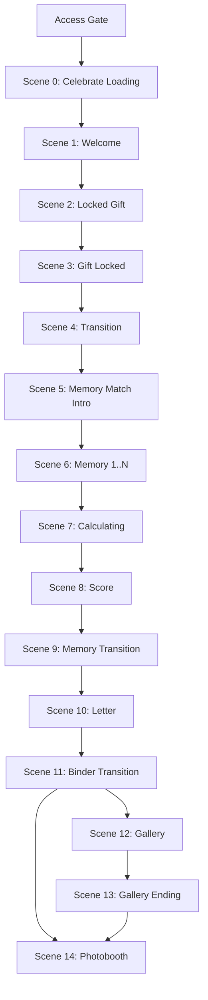

# Sprint 11 — Memories Scene Architecture

> **Status:** **Founder Approved — Locked**  
> **Approval date:** 2026-07-16  
> **Mode:** `memories`  
> **Sprint type:** Planning only — **no production code**  
> **Parent:** [16_SPRINT_11_EXPERIENCE_ARCHITECTURE.md](../16_SPRINT_11_EXPERIENCE_ARCHITECTURE.md) · [README](./README.md)

---

## Global Experience Rules (GER)

[GER-01–06](../05_FOUNDER_DECISIONS.md#global-experience-rules-ger) · [ADR S11-008](../adr/S11-008-global-experience-rules.md)

| GER    | Applies to Memories                                                                              |
| ------ | ------------------------------------------------------------------------------------------------ |
| GER-01 | Transitions 4, 7, 9 — ~1.0–1.5 s; binder (Scene 11) **2–3 s override**; memory transition ~1–2 s |
| GER-02 | ✅ **20 s per memory** — V1 sole gameplay timer mode (FD-S11-11)                                 |
| GER-03 | ✅ Timer expiry: _Time's up._ (~0.8–1 s) → auto-advance (extends FD-S11-13)                      |
| GER-05 | ✅ Expiry without selection: first story by `sortOrder` (§Timer Expiration)                      |
| GER-06 | No fail/restart; pacing only                                                                     |

---

## Architecture Consistency Audit

**Audit date:** 2026-07-16  
**Auditors:** Principal Product Architect · UX Architect · Creative Director · Devil's Advocate  
**Outcome:** **PASSED** — no blocking issues

### Required Audit Answers

| #   | Question                                             | Answer                                                                            |
| --- | ---------------------------------------------------- | --------------------------------------------------------------------------------- |
| 1   | Violates Founder Decisions?                          | **No** — FD-S11-09–13 are presentation-only; FD-M1–M5 preserved (see §FD-M2 note) |
| 2   | Violates Gate/Reward architecture?                   | **No** — Gate Payload on load; Reward Payload after batch submit                  |
| 3   | Hidden technical debt?                               | **No blocking** — timer implicit selection documented (§Timer Expiration)         |
| 4   | Affects schema?                                      | **No**                                                                            |
| 5   | Affects `submitMatchAnswersAction`?                  | **No** — action, service, and schema unchanged                                    |
| 6   | Affects scoring?                                     | **No** — `gradeMatchAnswers()` unchanged                                          |
| 7   | Affects unlock logic?                                | **No** — FD-M5 / FD-M3 / `buildMemoriesRewardPayload()` unchanged                 |
| 8   | Affects sessionStorage flow?                         | **No** — `cf_memories_unlock_${experienceId}` unchanged                           |
| 9   | Hydration risk?                                      | **No** — same client re-read pattern as Connection (§Unlock Restore)              |
| 10  | Approve as official Sprint 11 Memories architecture? | **Yes**                                                                           |

| Check                          | Result                                                                     |
| ------------------------------ | -------------------------------------------------------------------------- |
| FD-S11-01 Wrap                 | ✅ Wraps `MemoriesExperienceFlow`; gate/reward services unchanged          |
| FD-S11-02 Back edge            | ✅ Forward-only; no back navigation during match                           |
| FD-S11-03 Persistent Shell     | ✅ Scenes 0–14 mount/unmount inside shell                                  |
| FD-S11-04 Parameterized graph  | ✅ One `gate-dynamic` scene per memory pair (2–6)                          |
| FD-S11-05 Server initial scene | ✅ Server → Scene 0; unlock restore → Scene 8                              |
| FD-S11-06 Scene Contract       | ✅ Full on destinations; minimal on transitions                            |
| FD-S11-07 / FD-S11-08          | ✅ Independent mode doc; Moments/Connection patterns reused where stated   |
| Doc 13 business journey        | ✅ Match → Submit → Score → Unlock Message → Letter → Gallery → Photobooth |
| CF-R1 / CF-R2                  | ✅ N/A — Treasures only                                                    |
| FD-M3 single submission        | ✅ One batch submit after all memory scenes                                |
| FD-M5 reward never blocked     | ✅ Any valid submit unlocks reward path                                    |

### Devil's Advocate — Reviewed Risks (Non-Blocking)

| Risk                                                                     | Verdict                         | Mitigation                                                                                                                                                                                                                     |
| ------------------------------------------------------------------------ | ------------------------------- | ------------------------------------------------------------------------------------------------------------------------------------------------------------------------------------------------------------------------------ |
| **FD-M2 vs FD-S11-12** (static ~20–30% window vs progressive 10→30%)     | Accepted presentation evolution | FD-S11-12 operates within FD-M2 principle: photo **never fully visible** during game; single reveal style (FD-M1)                                                                                                              |
| **FD-S11-09 presentation reversal** (photo→story vs Phase A story→photo) | Accepted — presentation only    | Submit payload `{ storySortOrder, selectedPhotoSortOrder }` unchanged                                                                                                                                                          |
| **Timer expiry without user selection**                                  | Requires client rule            | Phase A requires all pairs answered at submit; on timer expiry without tap, client records **implicit selection** (Sprint 12: default first story option by `sortOrder`) — grades as incorrect if wrong; **no backend change** |
| **Unlock message not named in founder Scene list**                       | Documented in Scene 10          | FD-M5 + doc 13 require unlock message before letter; rendered at start of Scene 10 when non-empty                                                                                                                              |
| **Mid-match refresh loses answers**                                      | Same as Phase A / Connection    | Only completed submit persists in sessionStorage                                                                                                                                                                               |
| **Gallery skip**                                                         | Same guard as other modes       | Scenes 12–13 omitted when `photos.length === 0`                                                                                                                                                                                |

---

## Relationship to Doc 13

[Doc 13](../13_EXPERIENCE_JOURNEY.md) defines the **business-layer** Memories journey:

```
OPEN → Match Game → Submit → Score → Unlock Message → Letter → Gallery → Photobooth
```

This document defines the **presentation-layer** scene graph. Doc 13 ordering is **not contradicted**.

| Doc 13 phase                         | Memories presentation scenes                   |
| ------------------------------------ | ---------------------------------------------- |
| Access gate                          | Outside Scene Engine                           |
| Pre-match ceremony                   | Scenes 0–5                                     |
| **Gate — Match Game**                | Scene 6 (parameterized: one memory per screen) |
| Submit + calculating                 | End of Scene 6 → Scene 7                       |
| **Score feedback**                   | Scene 8                                        |
| **Memory → Letter bridge**           | Scene 9                                        |
| **Reward — Unlock Message + Letter** | Scene 10                                       |
| **Continuation — Gallery**           | Scenes 11–12 (+ Scene 13 ending)               |
| **Continuation — Photobooth**        | Scene 14                                       |

**CF-4 / Gate-Reward preserved:** Initial load delivers **Memories Gate Payload** only. Reward payload via `submitMatchAnswersAction` after last memory answered — before Scene 8.

---

## Founder Decisions (This Mode)

| ID            | Decision                                                                                                            |
| ------------- | ------------------------------------------------------------------------------------------------------------------- |
| **FD-S11-09** | Presentation reversal: **Photo first → choose Story** (Phase A was Story → choose Photo). Business logic unchanged. |
| **FD-S11-10** | **One Memory per Scene** — parameterized `gate-dynamic` progression.                                                |
| **FD-S11-11** | **20-second countdown** per memory — presentation pressure, not punishment.                                         |
| **FD-S11-12** | **Progressive photo reveal** — ~10% → 15% → 20% → 25% → 30%; never fully visible during game.                       |
| **FD-S11-13** | **Timer expiration** auto-advances to next memory — no restart, no reset, no backend change.                        |

Full spec: [05_FOUNDER_DECISIONS.md](../05_FOUNDER_DECISIONS.md#fd-s11-09--memories-presentation-reversal-approved).

---

## Scene Graph Overview



**Gallery skip:** When `photos.length === 0`, Scenes 12 and 13 omitted; Scene 11 → Scene 14.

**Unlock restore:** sessionStorage present → Scene 8. See §Unlock Restore.

---

## Scene Inventory

### Access Gate (Outside Scene Engine)

Unchanged — `evaluateAccessGate()` before Scene Engine begins.

---

### Scene 0 — Celebrate Loading

| Field        | Value                        |
| ------------ | ---------------------------- |
| **Scene ID** | `memories.celebrate-loading` |
| **Type**     | `intro`                      |

**Display:**

- Celebrate
- _Every moment deserves to be celebrated._

**Target duration:** 0.5–1 second.

**Purpose:** Loading / brand transition only.

---

### Scene 1 — Welcome

| Field        | Value              |
| ------------ | ------------------ |
| **Scene ID** | `memories.welcome` |
| **Type**     | `intro`            |

**Display:**

- For **{Recipient Name}**
- _(theme-appropriate copy)_
- _Touch the flower to begin._

**Background:** Current theme (Bloom / Pure / Warm / Play / Sky).

**Transition trigger:** Tap flower → Scene 2.

---

### Scene 2 — Locked Gift

| Field        | Value                  |
| ------------ | ---------------------- |
| **Scene ID** | `memories.locked-gift` |
| **Type**     | `gate`                 |

**Behavior:** Gift box appears immediately — **NOT** an album, **NOT** a letter. Same philosophy as Connection.

Recipient clicks gift box → **cannot open**. No letter, no sender, no reward hint. Reward type remains mysterious (letter, gallery, photobooth, anything).

**Transition trigger:** Failed open attempt → Scene 3.

---

### Scene 3 — Gift Locked

| Field        | Value                  |
| ------------ | ---------------------- |
| **Scene ID** | `memories.gift-locked` |
| **Type**     | `gate`                 |

**Display:**

- ♡
- _Your gift is still locked._
- _Complete the challenge to unlock something special._

**Button:** **I'm Ready**

**Founder rule:** Do **NOT** mention Letter. Preserve mystery.

**Transition trigger:** I'm Ready → Scene 4.

---

### Scene 4 — Transition

| Field        | Value                       |
| ------------ | --------------------------- |
| **Scene ID** | `memories.match-transition` |
| **Type**     | `transition`                |

**Target duration:** 1–1.5 seconds. Presentation only. No interaction.

**Examples:** _Memory Match_ · _Preparing your challenge..._

**Transition trigger:** Duration complete → Scene 5.

---

### Scene 5 — Memory Match Intro

| Field        | Value                  |
| ------------ | ---------------------- |
| **Scene ID** | `memories.match-intro` |
| **Type**     | `gate`                 |

**Display:**

- ♡
- _Some memories are waiting to be found._
- _Match every memory to unlock your surprise._

**Button:** **Start**

**Founder rule:** Do **NOT** mention Letter.

**Transition trigger:** Start → Scene 6 (first memory).

---

### Scene 6 — Memory Match (Parameterized)

| Field              | Value                                                        |
| ------------------ | ------------------------------------------------------------ |
| **Scene ID**       | `memories.match.memory.{n}` (n = 0..N-1, N = pair count 2–6) |
| **Type**           | `gate-dynamic`                                               |
| **Scene Contract** | Full (per memory screen)                                     |

**Founder revision — presentation reversal (FD-S11-09):**

| Phase A (current UI)     | Sprint 11+ presentation             |
| ------------------------ | ----------------------------------- |
| One Story → three Photos | **One Photo → three Story options** |

Recipient chooses which story belongs to the photo.

**One memory per scene (FD-S11-10):** Memory 1 → Memory 2 → … — NOT all on one page.

**Timer (FD-S11-11):** 20-second countdown per memory. Emotional pressure — not punishment.

**Progressive photo reveal (FD-S11-12):**

| Elapsed | Approx. visibility |
| ------- | ------------------ |
| Start   | ~10%               |
| 5 sec   | ~15%               |
| 10 sec  | ~20%               |
| 15 sec  | ~25%               |
| 20 sec  | ~30%               |

Photo **NEVER** becomes fully visible during gameplay (FD-M2 compliant).

**Correct / Wrong:** Recipient **NEVER** sees Correct or Wrong during gameplay. All grading after batch submit only (unchanged).

**Timer expiration (FD-S11-13 + GER-03, GER-06):**

- Show **♡ Time's up.** (~0.8–1 second) — no popup or blocking dialog
- Then auto-advance to next memory
- ❌ No restart · No game over · No progress reset · No backend change
- If no story selected when timer expires: client records **implicit selection** (GER-05; see §Timer Expiration)

**Transition triggers:**

- Story selected → next `memories.match.memory.{n+1}`
- Last memory resolved → `submitMatchAnswersAction` → Scene 7

**Business layer:** Unchanged — accumulates `MatchAnswerSubmission[]`; single batch submit after all memories.

---

### Scene 7 — Calculating

| Field        | Value                  |
| ------------ | ---------------------- |
| **Scene ID** | `memories.calculating` |
| **Type**     | `transition`           |

**Display:**

- ♡
- _Looking through every memory..._

**Target duration:** 0.8–1.5 seconds (extends if submit pending).

**Transition trigger:** Submit success → Scene 8.

**Side effect:** On success, write `cf_memories_unlock_${experienceId}` (FD-M3 / CF-2).

---

### Scene 8 — Score

| Field        | Value                   |
| ------------ | ----------------------- |
| **Scene ID** | `memories.score-reveal` |
| **Type**     | `reward-partial`        |

**Display (examples):**

- **9 / 10** — _Amazing._
- **7 / 10** — _Well done._

**Tone:** Warm. Celebratory. Never negative (CF-1 / FD-M5).

**Button:** **Unlock Your Gift** — NOT Letter; reward still hidden.

**Data source:** `MemoriesSubmitResult.result` from submit action.

**Transition trigger:** Unlock Your Gift → Scene 9.

---

### Scene 9 — Memory Transition

| Field        | Value                        |
| ------------ | ---------------------------- |
| **Scene ID** | `memories.memory-transition` |
| **Type**     | `transition`                 |

**Founder revision:** NOT fireworks. NOT album flip.

**Behavior (Sprint 13 animates):** Individual printed photos float across screen — more and more — slowly gather, merge, transform into the Letter.

**Target duration:** ~1–2 seconds. No interaction.

**Purpose:** Emotionally bridge Memories → Letter.

**Transition trigger:** Duration complete → Scene 10.

---

### Scene 10 — Letter

| Field        | Value                    |
| ------------ | ------------------------ |
| **Scene ID** | `memories.letter-reveal` |
| **Type**     | `reward`                 |

**Behavior:**

1. **Unlock message** (`final_unlock_message`) when non-empty — **FD-M5 / doc 13** (not omitted in founder list; required at reward phase)
2. Letter appears with typing animation
3. Recipient reads

**Button:** **Unlock** (storytelling → gallery bridge)

**Data source:** `MemoriesSubmitResult.reward`

**Transition trigger:** Unlock → Scene 11.

---

### Scene 11 — Binder Transition

| Field        | Value                        |
| ------------ | ---------------------------- |
| **Scene ID** | `memories.binder-transition` |
| **Type**     | `transition`                 |

**Behavior:** Binder closed → binder opening → pages visible → Gallery.

**Target duration:** 2–3 seconds. Presentation only.

**Transition trigger:** Duration complete → Scene 12 (if photos) or Scene 14 (skip).

---

### Scene 12 — Gallery

| Field        | Value              |
| ------------ | ------------------ |
| **Scene ID** | `memories.gallery` |
| **Type**     | `continuation`     |

Scrollable. All photos, captions — same Phase A `PhotoGallery` business logic.

**Guard:** `photos.length > 0`

**Transition trigger:** User continue → Scene 13.

---

### Scene 13 — Gallery Ending

| Field        | Value                     |
| ------------ | ------------------------- |
| **Scene ID** | `memories.gallery-ending` |
| **Type**     | `continuation-ending`     |

**Display:**

- ♡
- _Thank you for creating these beautiful memories._

**Button:** **Celebrate this moment** → Photobooth

**Guard:** Same as Scene 12.

---

### Scene 14 — Photobooth

| Field        | Value                 |
| ------------ | --------------------- |
| **Scene ID** | `memories.photobooth` |
| **Type**     | `terminal`            |

Sprint 14 implementation. Sprint 11 defines placement only.

---

## Timer Expiration — Implicit Selection Rule

Phase A `gradeMatchAnswers()` requires **every pair answered** at batch submit. There is no server-side "unanswered" state.

When the 20-second timer expires without user selection (FD-S11-13, GER-03, GER-05):

1. Display GER-03 interstitial: ♡ _Time's up._ (~0.8–1 s).
2. Scene Engine auto-advances to the next memory.
3. Client records an **implicit story selection** — first story option by `sortOrder` (GER-05) — so the batch remains complete at submit time.
4. Grading treats mismatched implicit selection as **incorrect** — same score impact as a wrong tap.
5. **No** schema, action, service, or grading logic changes.

This satisfies the founder intent ("no restart, no reset, no backend changes") while preserving the existing submit contract.

---

## Unlock Restore (FD-M3 + FD-S11-05)

| Event                         | Scene Engine behavior                                                              |
| ----------------------------- | ---------------------------------------------------------------------------------- |
| First visit (no unlock)       | Server → `memories.celebrate-loading` (Scene 0)                                    |
| Same-tab refresh after submit | Client reads sessionStorage → `memories.score-reveal` (Scene 8); skip gate + match |
| New tab / cleared storage     | Full path from Scene 0; match replayed (accepted per doc 13)                       |

**Hydration:** Server renders gate entry; client re-reads `readMemoriesUnlockSession()` on mount — same pattern as Connection.

---

## Edge Table

| From                               | To                            | Trigger                        | Guard                 |
| ---------------------------------- | ----------------------------- | ------------------------------ | --------------------- |
| _(access granted, no unlock)_      | `memories.celebrate-loading`  | `JOURNEY_START`                | —                     |
| _(access granted, unlock present)_ | `memories.score-reveal`       | `JOURNEY_START`                | sessionStorage        |
| `memories.celebrate-loading`       | `memories.welcome`            | Duration complete              | —                     |
| `memories.welcome`                 | `memories.locked-gift`        | Tap flower                     | —                     |
| `memories.locked-gift`             | `memories.gift-locked`        | Failed open                    | —                     |
| `memories.gift-locked`             | `memories.match-transition`   | I'm Ready                      | —                     |
| `memories.match-transition`        | `memories.match-intro`        | Duration complete              | —                     |
| `memories.match-intro`             | `memories.match.memory.0`     | Start                          | —                     |
| `memories.match.memory.{n}`        | `memories.match.memory.{n+1}` | Story selected or timer expiry | n < N-1               |
| `memories.match.memory.{n}`        | `memories.calculating`        | Last memory + submit           | n = N-1               |
| `memories.calculating`             | `memories.score-reveal`       | Submit success                 | —                     |
| `memories.score-reveal`            | `memories.memory-transition`  | Unlock Your Gift               | —                     |
| `memories.memory-transition`       | `memories.letter-reveal`      | Duration complete              | —                     |
| `memories.letter-reveal`           | `memories.binder-transition`  | Unlock                         | —                     |
| `memories.binder-transition`       | `memories.gallery`            | Duration complete              | `photos.length > 0`   |
| `memories.binder-transition`       | `memories.photobooth`         | Duration complete              | `photos.length === 0` |
| `memories.gallery`                 | `memories.gallery-ending`     | User continue                  | —                     |
| `memories.gallery-ending`          | `memories.photobooth`         | `TERMINAL_REACHED`             | —                     |

---

## Integration (Wrap Architecture)

```
page.tsx (RSC)
  → evaluateAccessGate()
  → fetchMemoriesGatePayload()        ← gate only
  → resolveInitialScene → memories.celebrate-loading
  └── RecipientExperienceView
        └── MemoriesExperienceFlow (wrapped)
              └── SceneEngineHost
                    └── PersistentShell
                          └── Active Scene (0–14)
                                └── MatchGamePanel (scene slots) · MatchScoreResult · LetterView · ...
```

**Preserved Phase A contracts:**

- `submitMatchAnswersAction` + `submitMatchAnswers` service
- `gradeMatchAnswers()` — batch grading, FD-M5
- `buildMemoriesRewardPayload()`
- `writeMemoriesUnlockSession` / `readMemoriesUnlockSession`
- Gate/Reward payload types unchanged

---

## Explicit Non-Goals

- Animation, timing curves, camera, fade, blur, zoom (Sprint 13)
- Photobooth redesign (Sprint 14)
- Backend, schema, payload, or grading changes
- Buyer preview scene architecture
- Connection or Treasures flows

---

## Founder Sign-Off

| Item                        | Status                         |
| --------------------------- | ------------------------------ |
| Memories scene flow         | ✅ Founder approved 2026-07-16 |
| FD-S11-09 through FD-S11-13 | ✅ Recorded                    |
| Implementation authorized   | **No**                         |
