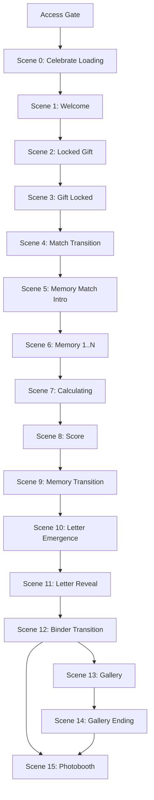

# Sprint 11 — Memories Scene Architecture

> **Status:** **Founder Approved — Locked** · **Theme Lab living presentation revised 2026-07-21**  
> **Approval date:** 2026-07-16  
> **Mode:** `memories`  
> **Sprint type:** Planning + Theme Lab presentation (Sprint 12.5) — **production `/e/[token]` Scene Engine still NOT AUTHORIZED**  
> **Parent:** [16_SPRINT_11_EXPERIENCE_ARCHITECTURE.md](../16_SPRINT_11_EXPERIENCE_ARCHITECTURE.md) · [README](./README.md) · [Sprint 12.5](../sprint-12-5/README.md) · [DDR-S12-036](../sprint-12/CELEBRATE_DESIGN_DECISION_REGISTER.md)

---

## Global Experience Rules (GER)

[GER-01–06](../05_FOUNDER_DECISIONS.md#global-experience-rules-ger) · [ADR S11-008](../adr/S11-008-global-experience-rules.md)

| GER    | Applies to Memories                                                                                                                                                  |
| ------ | -------------------------------------------------------------------------------------------------------------------------------------------------------------------- |
| GER-01 | Transitions 4, 7, **10 (letter-emergence)** — ~1.0–1.5 s; binder (Scene 12) **2–3 s override**; memory transition (Scene 9 origami) **~3 s** (Moments Scene 5 reuse) |
| GER-02 | ✅ **20 s per memory** — V1 sole gameplay timer mode (FD-S11-11)                                                                                                     |
| GER-03 | ✅ Timer expiry: _Time's up._ (~0.8–1 s) → auto-advance (extends FD-S11-13)                                                                                          |
| GER-05 | ✅ Expiry without selection: first story by `sortOrder` (§Timer Expiration)                                                                                          |
| GER-06 | No fail/restart; pacing only                                                                                                                                         |

---

## Architecture Consistency Audit

**Audit date:** 2026-07-16  
**Auditors:** Principal Product Architect · UX Architect · Creative Director · Devil's Advocate  
**Outcome:** **PASSED** — no blocking issues

### Required Audit Answers

| #   | Question                                             | Answer                                                                            |
| --- | ---------------------------------------------------- | --------------------------------------------------------------------------------- |
| 1   | Violates Founder Decisions?                          | **No** — FD-S11-09–13 are presentation-only; FD-M1–M5 preserved (see §FD-M2 note) |
| 2   | Violates Gate/Reward architecture?                   | **No** — Gate Payload on load; Reward Payload after batch submit                  |
| 3   | Hidden technical debt?                               | **No blocking** — timer implicit selection documented (§Timer Expiration)         |
| 4   | Affects schema?                                      | **No**                                                                            |
| 5   | Affects `submitMatchAnswersAction`?                  | **No** — action, service, and schema unchanged                                    |
| 6   | Affects scoring?                                     | **No** — `gradeMatchAnswers()` unchanged                                          |
| 7   | Affects unlock logic?                                | **No** — FD-M5 / FD-M3 / `buildMemoriesRewardPayload()` unchanged                 |
| 8   | Affects sessionStorage flow?                         | **No** — `cf_memories_unlock_${experienceId}` unchanged                           |
| 9   | Hydration risk?                                      | **No** — same client re-read pattern as Connection (§Unlock Restore)              |
| 10  | Approve as official Sprint 11 Memories architecture? | **Yes**                                                                           |

| Check                          | Result                                                                     |
| ------------------------------ | -------------------------------------------------------------------------- |
| FD-S11-01 Wrap                 | ✅ Wraps `MemoriesExperienceFlow`; gate/reward services unchanged          |
| FD-S11-02 Back edge            | ✅ Forward-only; no back navigation during match                           |
| FD-S11-03 Persistent Shell     | ✅ Scenes 0–15 mount/unmount inside shell                                  |
| FD-S11-04 Parameterized graph  | ✅ One `gate-dynamic` scene per memory pair (2–6)                          |
| FD-S11-05 Server initial scene | ✅ Server → Scene 0; unlock restore → Scene 8                              |
| FD-S11-06 Scene Contract       | ✅ Full on destinations; minimal on transitions                            |
| FD-S11-07 / FD-S11-08          | ✅ Independent mode doc; Moments/Connection patterns reused where stated   |
| Doc 13 business journey        | ✅ Match → Submit → Score → Unlock Message → Letter → Gallery → Photobooth |
| CF-R1 / CF-R2                  | ✅ N/A — Treasures only                                                    |
| FD-M3 single submission        | ✅ One batch submit after all memory scenes                                |
| FD-M5 reward never blocked     | ✅ Any valid submit unlocks reward path                                    |

### Devil's Advocate — Reviewed Risks (Non-Blocking)

| Risk                                                                     | Verdict                         | Mitigation                                                                                                                                                                                                                     |
| ------------------------------------------------------------------------ | ------------------------------- | ------------------------------------------------------------------------------------------------------------------------------------------------------------------------------------------------------------------------------ |
| **FD-M2 vs FD-S11-12** (static ~20–30% window vs progressive 10→30%)     | Accepted presentation evolution | Theme Lab uses **black spotlight** progressive aperture within FD-M2: photo **never fully visible**; single reveal style (FD-M1)                                                                                               |
| **FD-S11-09 presentation reversal** (photo→story vs Phase A story→photo) | Accepted — presentation only    | Submit payload `{ storySortOrder, selectedPhotoSortOrder }` unchanged                                                                                                                                                          |
| **Timer expiry without user selection**                                  | Requires client rule            | Phase A requires all pairs answered at submit; on timer expiry without tap, client records **implicit selection** (Sprint 12: default first story option by `sortOrder`) — grades as incorrect if wrong; **no backend change** |
| **Unlock message not named in founder Scene list**                       | Documented in Scene 11          | FD-M5 + doc 13 require unlock message before/with letter; rendered at Scene 11 when non-empty                                                                                                                                  |
| **Mid-match refresh loses answers**                                      | Same as Phase A / Connection    | Only completed submit persists in sessionStorage                                                                                                                                                                               |
| **Gallery skip**                                                         | Same guard as other modes       | Scenes 13–14 omitted when `photos.length === 0`                                                                                                                                                                                |

---

## Relationship to Doc 13

[Doc 13](../13_EXPERIENCE_JOURNEY.md) defines the **business-layer** Memories journey:

```
OPEN → Match Game → Submit → Score → Unlock Message → Letter → Gallery → Photobooth
```

This document defines the **presentation-layer** scene graph. Doc 13 ordering is **not contradicted**.

| Doc 13 phase                         | Memories presentation scenes                        |
| ------------------------------------ | --------------------------------------------------- |
| Access gate                          | Outside Scene Engine                                |
| Pre-match ceremony                   | Scenes 0–5                                          |
| **Gate — Match Game**                | Scene 6 (parameterized: one memory per screen)      |
| Submit + calculating                 | End of Scene 6 → Scene 7                            |
| **Score feedback**                   | Scene 8                                             |
| **Memory → Letter bridge**           | Scene 9 (origami) → **Scene 10 (letter emergence)** |
| **Reward — Unlock Message + Letter** | Scene 11                                            |
| **Continuation — Gallery**           | Scenes 12–13 (+ Scene 14 ending)                    |
| **Continuation — Photobooth**        | Scene 15                                            |

**CF-4 / Gate-Reward preserved:** Initial load delivers **Memories Gate Payload** only. Reward payload via `submitMatchAnswersAction` after last memory answered — before Scene 8.

---

## Founder Decisions (This Mode)

| ID            | Decision                                                                                                                                         |
| ------------- | ------------------------------------------------------------------------------------------------------------------------------------------------ |
| **FD-S11-09** | Presentation reversal: **Photo first → choose Story** (Phase A was Story → choose Photo). Business logic unchanged.                              |
| **FD-S11-10** | **One Memory per Scene** — parameterized `gate-dynamic` progression.                                                                             |
| **FD-S11-11** | **20-second countdown** per memory — presentation pressure, not punishment.                                                                      |
| **FD-S11-12** | **Progressive photo reveal** — Theme Lab: **black spotlight** aperture ~10% → 15% → 20% → 25% → 30% (not blur); never fully visible during game. |
| **FD-S11-13** | **Timer expiration** auto-advances to next memory — no restart, no reset, no backend change.                                                     |

Full spec: [05_FOUNDER_DECISIONS.md](../05_FOUNDER_DECISIONS.md#fd-s11-09--memories-presentation-reversal-approved).

---

## Scene Graph Overview



**Gallery skip:** When `photos.length === 0`, Scenes 13 and 14 omitted; Scene 12 → Scene 15.

**Scene 10 Letter Emergence:** Inserted 2026-07-21 (Founder) — gift opens + To/From letter head (same living beat as Connection Scene 10). Former letter / gallery / photobooth numbers shift +1 (letter reveal = Scene 11 … photobooth = Scene 15).

**Unlock restore:** sessionStorage present → Scene 8. See §Unlock Restore.

---

## Theme Lab Living Presentation (Sprint 12.5)

Founder-authorized reuse for Theme Lab at `/theme-lab/bloom` (wrappers only; Moments + Connection remain locked). Production Scene Engine wiring remains **NOT AUTHORIZED**.

| Memories scene         | Theme Lab living source                                    |
| ---------------------- | ---------------------------------------------------------- |
| 0 `celebrate-loading`  | Moments / Connection loading                               |
| 1 `welcome`            | Moments gift-box (flower tap)                              |
| 2 `locked-gift`        | Moments gift-opening + `lockedOnly` (3 failed taps)        |
| 3 `gift-locked`        | Connection challenge-invitation (visual + copy as-is)      |
| 4 `match-transition`   | **New** scrapbook MEMORY MATCH! celebration                |
| 5 `match-intro`        | **New** emotional gift + Start                             |
| 6 `match.memory.{n}`   | **New** photo → story match (spotlight reveal + 20s)       |
| 7 `calculating`        | Connection score-calculation                               |
| 8 `score-reveal`       | Connection score-reveal                                    |
| 9 `memory-transition`  | Moments Scene 5 letter-transition (**origami sakura**)     |
| 10 `letter-emergence`  | Connection Scene 10 letter-emergence (gift open + To/From) |
| 11 `letter-reveal`     | Moments Scene 6 letter                                     |
| 12 `binder-transition` | Moments Scene 7 album-unlock                               |
| 13 `gallery`           | Moments Scene 8 gallery                                    |
| 14 `gallery-ending`    | Moments Scene 9 gallery ending                             |
| 15 `photobooth`        | Moments Scene 10 photobooth (Sprint 14 redesign deferred)  |

Code SSOT: `features/experience/scene-engine/memories/`.

---

## Scene Inventory

### Access Gate (Outside Scene Engine)

Unchanged — `evaluateAccessGate()` before Scene Engine begins.

---

### Scene 0 — Celebrate Loading

| Field        | Value                        |
| ------------ | ---------------------------- |
| **Scene ID** | `memories.celebrate-loading` |
| **Type**     | `intro`                      |

**Display:**

- Celebrate
- _Every moment deserves to be celebrated._

**Target duration:** 0.5–1 second.

**Purpose:** Loading / brand transition only.

---

### Scene 1 — Welcome

| Field        | Value              |
| ------------ | ------------------ |
| **Scene ID** | `memories.welcome` |
| **Type**     | `intro`            |

**Display:**

- For **{Recipient Name}**
- _(theme-appropriate copy)_
- _Touch the flower to begin._

**Background:** Current theme (Bloom / Pure / Warm / Play / Sky).

**Transition trigger:** Tap flower → Scene 2.

---

### Scene 2 — Locked Gift

| Field        | Value                  |
| ------------ | ---------------------- |
| **Scene ID** | `memories.locked-gift` |
| **Type**     | `gate`                 |

**Behavior:** Gift box appears immediately — **NOT** an album, **NOT** a letter. Same philosophy as Connection.

Recipient taps gift → **cannot open**. Theme Lab: **3 failed open taps**, then advance (same as Connection locked-gift). No letter, no sender, no reward hint.

**Transition trigger:** Failed open attempts complete → Scene 3.

---

### Scene 3 — Gift Locked

| Field        | Value                  |
| ------------ | ---------------------- |
| **Scene ID** | `memories.gift-locked` |
| **Type**     | `gate`                 |

**Presentation (Theme Lab / Founder):** Reuses Connection `connection.challenge-invitation` living scene **as-is** (visual + copy). Architecture microcopy below may be reconciled later without a visual fork.

**Display (architecture wording):**

- ♡
- _Your gift is still locked._
- _Complete the challenge to unlock something special._

**Button:** **I'm Ready**

**Founder rule:** Do **NOT** mention Letter. Preserve mystery.

**Transition trigger:** I'm Ready → Scene 4.

---

### Scene 4 — Match Transition

| Field        | Value                       |
| ------------ | --------------------------- |
| **Scene ID** | `memories.match-transition` |
| **Type**     | `transition`                |

**Presentation (Theme Lab):** Living scrapbook **MEMORY MATCH!** celebration — starburst, memory cards, sakura/petals. No CTA.

**Target duration:** ~1.5–1.8 seconds. Presentation only. No interaction.

**Transition trigger:** Duration complete → Scene 5.

---

### Scene 5 — Memory Match Intro

| Field        | Value                  |
| ------------ | ---------------------- |
| **Scene ID** | `memories.match-intro` |
| **Type**     | `gate`                 |

**Presentation (Theme Lab):** Living emotional gate — gift motif, Start CTA.

**Display:**

- ♡
- _Some memories are waiting to be found._
- _Match every memory to unlock your surprise._

**Button:** **Start**

**Founder rule:** Do **NOT** mention Letter.

**Transition trigger:** Start → Scene 6 (first memory).

---

### Scene 6 — Memory Match (Parameterized)

| Field              | Value                                                        |
| ------------------ | ------------------------------------------------------------ |
| **Scene ID**       | `memories.match.memory.{n}` (n = 0..N-1, N = pair count 2–6) |
| **Type**           | `gate-dynamic`                                               |
| **Scene Contract** | Full (per memory screen)                                     |

**Founder revision — presentation reversal (FD-S11-09):**

| Phase A (current UI)     | Sprint 11+ presentation             |
| ------------------------ | ----------------------------------- |
| One Story → three Photos | **One Photo → three Story options** |

Recipient chooses which story belongs to the photo.

**One memory per scene (FD-S11-10):** Memory 1 → Memory 2 → … — NOT all on one page.

**Timer (FD-S11-11):** 20-second countdown per memory. Emotional pressure — not punishment.

**Progressive photo reveal (FD-S11-12) — Theme Lab living:**

| Elapsed | Spotlight aperture |
| ------- | ------------------ |
| Start   | ~10%               |
| 5 sec   | ~15%               |
| 10 sec  | ~20%               |
| 15 sec  | ~25%               |
| 20 sec  | ~30%               |

**Reveal style:** **Black mask + soft spotlight** (not blur). Photo under the hole is sharp. Photo **NEVER** becomes fully visible during gameplay (FD-M2 compliant).

Optional one-time hint may slightly enlarge the aperture without revealing the answer.

**Correct / Wrong:** Recipient **NEVER** sees Correct or Wrong during gameplay. All grading after batch submit only (unchanged).

**Timer expiration (FD-S11-13 + GER-03, GER-06):**

- Show **♡ Time's up.** (~0.8–1 second) — no popup or blocking dialog
- Then auto-advance to next memory
- ❌ No restart · No game over · No progress reset · No backend change
- If no story selected when timer expires: client records **implicit selection** (GER-05; see §Timer Expiration)

**Transition triggers:**

- Story selected → next `memories.match.memory.{n+1}`
- Last memory resolved → `submitMatchAnswersAction` → Scene 7

**Business layer:** Unchanged — accumulates `MatchAnswerSubmission[]`; single batch submit after all memories.

---

### Scene 7 — Calculating

| Field        | Value                  |
| ------------ | ---------------------- |
| **Scene ID** | `memories.calculating` |
| **Type**     | `transition`           |

**Presentation (Theme Lab / Founder):** Reuses Connection `connection.score-calculation` living scene as-is.

**Display (architecture examples):**

- ♡
- _Looking through every memory..._ / _Almost there…_

**Target duration:** ~2 seconds in Theme Lab (extends if submit pending).

**Transition trigger:** Submit success / duration complete → Scene 8.

**Side effect:** On success, write `cf_memories_unlock_${experienceId}` (FD-M3 / CF-2).

---

### Scene 8 — Score

| Field        | Value                   |
| ------------ | ----------------------- |
| **Scene ID** | `memories.score-reveal` |
| **Type**     | `reward-partial`        |

**Presentation (Theme Lab / Founder):** Reuses Connection `connection.score-reveal` living scene as-is (percent + warm headline + **Reveal My Gift** CTA).

**Display (architecture examples):**

- **9 / 10** or **92%** — _Amazing._ / warm headline
- Supporting message — never negative (CF-1 / FD-M5)

**Button:** **Reveal My Gift** / **Unlock Your Gift** — NOT Letter; reward still hidden.

**Data source:** `MemoriesSubmitResult.result` from submit action (lab: synthetic score fixture).

**Transition trigger:** CTA → Scene 9.

---

### Scene 9 — Memory Transition

| Field        | Value                        |
| ------------ | ---------------------------- |
| **Scene ID** | `memories.memory-transition` |
| **Type**     | `transition`                 |

**Presentation (Theme Lab / Founder):** Reuses Moments Scene 5 `moments.letter-transition` — **dense origami sakura surge** (not fireworks, not album flip, not photo-float).

**Target duration:** ~3 seconds (Moments living duration). No interaction.

**Purpose:** Emotionally bridge Memories match reward → letter path.

**Transition trigger:** Duration complete → Scene 10.

---

### Scene 10 — Letter Emergence

| Field              | Value                       |
| ------------------ | --------------------------- |
| **Scene ID**       | `memories.letter-emergence` |
| **Type**           | `transition`                |
| **Scene Contract** | Minimal — auto-advance      |

**Inserted:** 2026-07-21 (Founder) — becomes official **Scene 10**; subsequent scenes shift +1 (same pattern as Connection letter-emergence insert).

**Presentation (Theme Lab / Founder):** Reuses Connection `connection.letter-emergence` living scene as-is.

**Display (emotional bridge only):**

- Locked gift **finally opens** (lid rests aside; warm glow from inside)
- Letter card rises showing **To** (recipient) + **From** (buyer) only
- Floating petals / soft sparkles allowed
- ❌ **No** continue CTA

**Target duration:** ~1.0–1.5 seconds. No interaction.

**Purpose:** Extra emotional beat before full letter body — gift unlocked, letter head only.

**Data source:** `greeting_name` / `closing_name` (lab: experience fixture). Full `letter_content` stays for Scene 11.

**Transition trigger:** Duration complete → Scene 11.

---

### Scene 11 — Letter Reveal

| Field        | Value                    |
| ------------ | ------------------------ |
| **Scene ID** | `memories.letter-reveal` |
| **Type**     | `reward`                 |

**Presentation (Theme Lab / Founder):** Reuses Moments Scene 6 `moments.letter` living scene.

**Was:** Architecture Scene 10 before letter-emergence insert (2026-07-21).

**Behavior:**

1. **Unlock message** (`final_unlock_message`) when non-empty — **FD-M5 / doc 13**
2. Letter appears with typing / sentence reveal
3. Recipient reads

**Button:** Moments letter CTA (e.g. **Unlock Memories**) — storytelling → gallery bridge

**Data source:** `MemoriesSubmitResult.reward` (lab: experience letter fields)

**Transition trigger:** Unlock / continue → Scene 12.

---

### Scene 12 — Binder Transition

| Field        | Value                        |
| ------------ | ---------------------------- |
| **Scene ID** | `memories.binder-transition` |
| **Type**     | `transition`                 |

**Presentation (Theme Lab / Founder):** Reuses Moments Scene 7 `moments.album-unlock-transition` living scene (album unlock keyframes).

**Was:** Architecture Scene 11 before letter-emergence insert.

**Target duration:** ~3 seconds. Presentation only.

**Transition trigger:** Duration complete → Scene 13 (if photos) or Scene 15 (skip).

---

### Scene 13 — Gallery

| Field        | Value              |
| ------------ | ------------------ |
| **Scene ID** | `memories.gallery` |
| **Type**     | `continuation`     |

**Presentation (Theme Lab / Founder):** Reuses Moments Scene 8 `moments.gallery`.

**Was:** Architecture Scene 12 before letter-emergence insert.

Scrollable. All photos, captions — same Phase A `PhotoGallery` business logic.

**Guard:** `photos.length > 0`

**Transition trigger:** User continue → Scene 14.

---

### Scene 14 — Gallery Ending

| Field        | Value                     |
| ------------ | ------------------------- |
| **Scene ID** | `memories.gallery-ending` |
| **Type**     | `continuation-ending`     |

**Presentation (Theme Lab / Founder):** Reuses Moments Scene 9 `moments.gallery-ending`.

**Was:** Architecture Scene 13 before letter-emergence insert.

**Display:**

- ♡
- _Thank you for creating these beautiful memories._

**Button:** **Celebrate this moment** → Photobooth

**Guard:** Same as Scene 13.

---

### Scene 15 — Photobooth

| Field        | Value                 |
| ------------ | --------------------- |
| **Scene ID** | `memories.photobooth` |
| **Type**     | `terminal`            |

**Presentation (Theme Lab / Founder):** Reuses Moments Scene 10 `moments.photobooth` (Sprint 14 redesign deferred — same as Connection).

**Was:** Architecture Scene 14 before letter-emergence insert.

Sprint 11 defines placement; Theme Lab hosts the Moments living photobooth wrapper.

---

## Timer Expiration — Implicit Selection Rule

Phase A `gradeMatchAnswers()` requires **every pair answered** at batch submit. There is no server-side "unanswered" state.

When the 20-second timer expires without user selection (FD-S11-13, GER-03, GER-05):

1. Display GER-03 interstitial: ♡ _Time's up._ (~0.8–1 s).
2. Scene Engine auto-advances to the next memory.
3. Client records an **implicit story selection** — first story option by `sortOrder` (GER-05) — so the batch remains complete at submit time.
4. Grading treats mismatched implicit selection as **incorrect** — same score impact as a wrong tap.
5. **No** schema, action, service, or grading logic changes.

This satisfies the founder intent ("no restart, no reset, no backend changes") while preserving the existing submit contract.

---

## Unlock Restore (FD-M3 + FD-S11-05)

| Event                         | Scene Engine behavior                                                              |
| ----------------------------- | ---------------------------------------------------------------------------------- |
| First visit (no unlock)       | Server → `memories.celebrate-loading` (Scene 0)                                    |
| Same-tab refresh after submit | Client reads sessionStorage → `memories.score-reveal` (Scene 8); skip gate + match |
| New tab / cleared storage     | Full path from Scene 0; match replayed (accepted per doc 13)                       |

**Hydration:** Server renders gate entry; client re-reads `readMemoriesUnlockSession()` on mount — same pattern as Connection.

---

## Edge Table

| From                               | To                            | Trigger                           | Guard                 |
| ---------------------------------- | ----------------------------- | --------------------------------- | --------------------- |
| _(access granted, no unlock)_      | `memories.celebrate-loading`  | `JOURNEY_START`                   | —                     |
| _(access granted, unlock present)_ | `memories.score-reveal`       | `JOURNEY_START`                   | sessionStorage        |
| `memories.celebrate-loading`       | `memories.welcome`            | Duration complete                 | —                     |
| `memories.welcome`                 | `memories.locked-gift`        | Tap flower                        | —                     |
| `memories.locked-gift`             | `memories.gift-locked`        | Failed open                       | —                     |
| `memories.gift-locked`             | `memories.match-transition`   | I'm Ready                         | —                     |
| `memories.match-transition`        | `memories.match-intro`        | Duration complete                 | —                     |
| `memories.match-intro`             | `memories.match.memory.0`     | Start                             | —                     |
| `memories.match.memory.{n}`        | `memories.match.memory.{n+1}` | Story selected or timer expiry    | n < N-1               |
| `memories.match.memory.{n}`        | `memories.calculating`        | Last memory + submit              | n = N-1               |
| `memories.calculating`             | `memories.score-reveal`       | Submit success                    | —                     |
| `memories.score-reveal`            | `memories.memory-transition`  | Reveal My Gift / Unlock Your Gift | —                     |
| `memories.memory-transition`       | `memories.letter-emergence`   | Duration complete                 | —                     |
| `memories.letter-emergence`        | `memories.letter-reveal`      | Duration complete                 | —                     |
| `memories.letter-reveal`           | `memories.binder-transition`  | Unlock / continue                 | —                     |
| `memories.binder-transition`       | `memories.gallery`            | Duration complete                 | `photos.length > 0`   |
| `memories.binder-transition`       | `memories.photobooth`         | Duration complete                 | `photos.length === 0` |
| `memories.gallery`                 | `memories.gallery-ending`     | User continue                     | —                     |
| `memories.gallery-ending`          | `memories.photobooth`         | `TERMINAL_REACHED`                | —                     |

---

## Integration (Wrap Architecture)

```
page.tsx (RSC)
  → evaluateAccessGate()
  → fetchMemoriesGatePayload()        ← gate only
  → resolveInitialScene → memories.celebrate-loading
  └── RecipientExperienceView
        └── MemoriesExperienceFlow (wrapped)
              └── SceneEngineHost
                    └── PersistentShell
                          └── Active Scene (0–15)
                                └── MatchGamePanel (scene slots) · MatchScoreResult · LetterView · ...
```

**Preserved Phase A contracts:**

- `submitMatchAnswersAction` + `submitMatchAnswers` service
- `gradeMatchAnswers()` — batch grading, FD-M5
- `buildMemoriesRewardPayload()`
- `writeMemoriesUnlockSession` / `readMemoriesUnlockSession`
- Gate/Reward payload types unchanged

---

## Explicit Non-Goals

- Production Scene Engine / `/e/[token]` wiring (until Founder authorizes)
- Photobooth redesign (Sprint 14) — Moments wrapper is interim
- Backend, schema, payload, or grading changes
- Buyer preview scene architecture
- Treasures flows

---

## Founder Sign-Off

| Item                                        | Status                                                                  |
| ------------------------------------------- | ----------------------------------------------------------------------- |
| Memories scene flow (2026-07-16)            | ✅ Founder approved                                                     |
| FD-S11-09 through FD-S11-13                 | ✅ Recorded                                                             |
| Theme Lab living presentation (Scenes 0–15) | ✅ Founder-directed reuse · Scene 10 letter-emergence insert 2026-07-21 |
| Production Scene Engine implementation      | **No** — not authorized                                                 |
