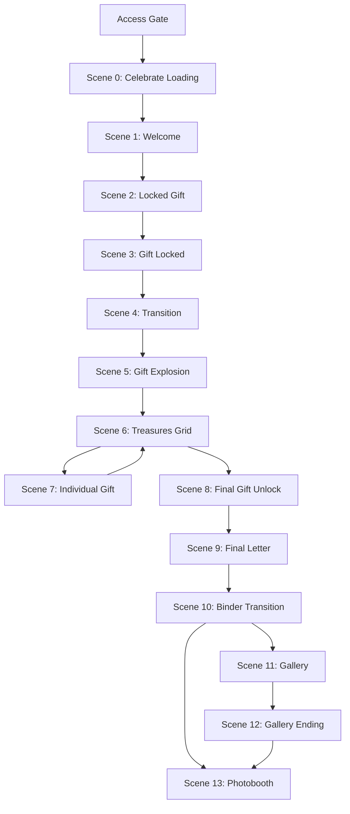

# Sprint 11 — Treasures Scene Architecture

> **Status:** **Founder Approved — Locked**  
> **Approval date:** 2026-07-16  
> **Mode:** `treasures`  
> **Sprint type:** Planning only — **no production code**  
> **Parent:** [16_SPRINT_11_EXPERIENCE_ARCHITECTURE.md](../16_SPRINT_11_EXPERIENCE_ARCHITECTURE.md) · [README](./README.md)

---

## Architecture Consistency Audit

**Audit date:** 2026-07-16  
**Auditors:** CPO · UX · Creative Director · Software Architect · CTO · Systems Designer · Devil's Advocate  
**Outcome:** **PASSED** — no blocking issues

### Required Audit Questions

| #   | Question                    | Answer                                                                                          |
| --- | --------------------------- | ----------------------------------------------------------------------------------------------- |
| 1   | Violates Founder Decisions? | **No** — FD-S11-01–06 preserved; FD-S11-02 back edge mapped to Gift Content → Grid              |
| 2   | Violates Phase A?           | **No** — presentation-only; `openEnvelopeAction`, `fetchTreasuresRewardAction`, CF-R2 unchanged |
| 3   | Violates Gate/Reward?       | **No** — A-4 per-gift fetch; reward letter after all opens (FD-T4)                              |
| 4   | Schema changes?             | **No**                                                                                          |
| 5   | Backend changes?            | **No**                                                                                          |
| 6   | Submit/action changes?      | **No**                                                                                          |
| 7   | Hidden technical debt?      | **No blocking** — see Devil's Advocate notes                                                    |
| 8   | SSR/Hydration risks?        | **No** — server-owned opens + initial scene (FD-S11-05)                                         |
| 9   | Sprint 12 conflict?         | **No** — defines gift visual states and scene slots                                             |
| 10  | Sprint 13 conflict?         | **No** — logical durations; explosion animation deferred                                        |
| 11  | Sprint 14 Photobooth?       | **No** — Scene 13 placement only                                                                |
| 12  | Theme Packs scalable?       | **Yes** — theme drives background motion; graph unchanged                                       |
| 13  | V2 with 10–20 gifts?        | **Engine yes** (FD-S11-04); **V1 capped at 6** envelopes — expansion needs Founder Decision     |
| 14  | Fifth mode scalable?        | **Yes** — new graph + registry; engine unchanged                                                |

| Check                          | Result                                                                  |
| ------------------------------ | ----------------------------------------------------------------------- |
| FD-S11-01 Wrap                 | ✅ Wraps `TreasuresExperienceFlow`; actions/services unchanged          |
| FD-S11-02 Back edge            | ✅ Gift Content (Scene 7) → Gift Grid (Scene 6) only                    |
| FD-S11-03 Persistent Shell     | ✅ Scenes 0–13 mount/unmount inside shell                               |
| FD-S11-04 Parameterized graph  | ✅ 2–6 gifts; Scene 5 explosion + Scene 7 per `sortOrder`               |
| FD-S11-05 Server initial scene | ✅ From `experience_envelope_opens` + reward eligibility                |
| FD-S11-06 Scene Contract       | ✅ Full on destinations; minimal on transitions                         |
| GER-01                         | ✅ Transitions ~1.0–1.5 s; Scene 5 max 3 s override; binder 2–3 s       |
| GER-02                         | ❌ No gameplay timer (Treasures)                                        |
| CF-R2                          | ✅ Photobooth Scene 13 → `completeTreasuresJourneyAction` (ADR S11-007) |
| FD-T1 / FD-T3 / FD-T4 / FD-T5  | ✅ Preserved at business layer                                          |
| A-4 per-envelope fetch         | ✅ Each gift open → `openEnvelopeAction`                                |

### Devil's Advocate — Reviewed (Non-Blocking)

| Topic                                      | Assessment                                               | Mitigation                                                                                                                                                             |
| ------------------------------------------ | -------------------------------------------------------- | ---------------------------------------------------------------------------------------------------------------------------------------------------------------------- |
| **Gift icon vs envelope (Phase A UI)**     | Presentation-only rebrand                                | Business entities remain `experience_envelopes`; docs use "Gift" for recipient-facing presentation                                                                     |
| **Scene 7 "letter" animation vs FD-T5**    | Wording risk                                             | Scene 7 reveals **envelope micro-content** (message/photo) via cinematic letter **object** — NOT `TreasuresRewardPayload.letter`. Primary reward letter = Scene 9 only |
| **Final Gold locked until normals opened** | UX stricter than Phase A grid (final could open anytime) | **Presentation guard only** — Final Gold disabled on grid until all non-`isFinal` gifts opened; `openEnvelopeAction` unchanged; FD-T1 preserved at API                 |
| **Scene 5 "six boxes" copy**               | Hard-coded 6 conflicts with 2–5 envelope configs         | Explosion parameterized: **N boxes = envelope count** (2–6); six is illustrative at max cap                                                                            |
| **Scene 8 vs Scene 7 for final gift**      | Two paths for open                                       | Regular gifts → Scene 7; Final Gold open → Scene 8 (premium reveal) → Scene 9; both call same `openEnvelopeAction`                                                     |
| **Doc 13 product copy says "envelopes"**   | SSOT business layer unchanged                            | Doc 13 journey semantics preserved; presentation layer uses Gift metaphor per FD-S11-15                                                                                |

---

## Relationship to Doc 13

[Doc 13](../13_EXPERIENCE_JOURNEY.md) **business-layer** Treasures journey:

```
OPEN → Envelope grid → Open any (any order) → … → All opened → Letter → Gallery → Photobooth
```

Presentation layer maps **Gift** to existing **envelope** business entities (`sortOrder`, `isFinal`, `openEnvelopeAction`).

| Doc 13 phase                          | Treasures presentation scenes                       |
| ------------------------------------- | --------------------------------------------------- |
| Access gate                           | Outside Scene Engine                                |
| Pre-grid ceremony                     | Scenes 0–5                                          |
| **Gate — gift grid + opens**          | Scene 6 ⇄ Scene 7 (back edge); Scene 8 (final gold) |
| **Reward — Letter**                   | Scene 9                                             |
| **Continuation — Gallery**            | Scenes 10–11 (+ Scene 12 ending)                    |
| **Continuation — Photobooth + CF-R2** | Scene 13                                            |

---

## Founder Decisions (This Mode)

| ID            | Decision                                                                                                                                          |
| ------------- | ------------------------------------------------------------------------------------------------------------------------------------------------- |
| **FD-S11-14** | Treasures scene flow Scenes 0–13 (this document)                                                                                                  |
| **FD-S11-15** | **Gift presentation** replaces envelope icon during gameplay; letter object only after opening a gift; three states: Closed / Opened / Final Gold |
| **FD-S11-16** | Scene 5 Gift Explosion — one gift becomes N discoverable gifts (parameterized 2–6)                                                                |
| **FD-S11-17** | Final Gold gift — presentation lock until all non-final gifts opened; elegant reveal (no fireworks)                                               |

Presentation naming only — no schema, payload, or action changes.

---

## Global Experience Rules (GER)

[GER-01–06](../05_FOUNDER_DECISIONS.md#global-experience-rules-ger) · [ADR S11-008](../adr/S11-008-global-experience-rules.md)

| GER             | Applies to Treasures                                                  |
| --------------- | --------------------------------------------------------------------- |
| GER-01          | Transitions 4, 10 — ~1.0–1.5 s; Scene 5 **max 3 s**; binder **2–3 s** |
| GER-02          | ❌ No gameplay timer                                                  |
| GER-03 / GER-05 | N/A                                                                   |

---

## Scene Graph Overview



**Gallery skip:** When `photos.length === 0`, Scenes 11–12 omitted; Scene 10 → Scene 13.

---

## Scene Inventory

### Access Gate (Outside Scene Engine)

Unchanged — `evaluateAccessGate()` before Scene Engine.

---

### Scene 0 — Celebrate Loading

| Field        | Value                         |
| ------------ | ----------------------------- |
| **Scene ID** | `treasures.celebrate-loading` |
| **Type**     | `intro`                       |

**Display:** Celebrate · _Every moment deserves to be celebrated._

**Target duration:** 0.5–1 second (intro; same as other modes).

---

### Scene 1 — Welcome

| Field        | Value               |
| ------------ | ------------------- |
| **Scene ID** | `treasures.welcome` |
| **Type**     | `intro`             |

**Display:** For **{Recipient Name}** · _Touch the flower to begin._

**Background:** Theme-driven motion (Bloom / Pure / Warm / Play / Sky).

**Transition:** Tap flower → Scene 2.

---

### Scene 2 — Locked Gift

| Field        | Value                   |
| ------------ | ----------------------- |
| **Scene ID** | `treasures.locked-gift` |
| **Type**     | `gate`                  |

Single **Gift Box** appears — NOT envelope, NOT letter. Recipient taps; gift **cannot** open. Reward type remains mysterious (same philosophy as Moments/Connection).

**Transition:** Failed open → Scene 3.

---

### Scene 3 — Gift Locked

| Field        | Value                   |
| ------------ | ----------------------- |
| **Scene ID** | `treasures.gift-locked` |
| **Type**     | `gate`                  |

**Display:**

- ♡
- _Once you open it, there's no turning back._
- _Are you ready?_

**Button:** **Yes**

**Purpose:** Explain why the reward remains locked.

**Transition:** Yes → Scene 4.

---

### Scene 4 — Transition

| Field        | Value                            |
| ------------ | -------------------------------- |
| **Scene ID** | `treasures.preparing-transition` |
| **Type**     | `transition`                     |

**Target duration:** 1.0–1.5 seconds (GER-01). No interaction.

**Example:** _Preparing your surprises..._

**Transition:** Duration complete → Scene 5.

---

### Scene 5 — Gift Explosion Transition

| Field        | Value                      |
| ------------ | -------------------------- |
| **Scene ID** | `treasures.gift-explosion` |
| **Type**     | `transition`               |

**Founder-approved sequence (Sprint 13 animates):**

1. Single Gift Box (from Scene 2) moves to center
2. Brief pause → glow → **POP**
3. Bursts into **N** smaller Gift Boxes (N = envelope count, 2–6)
4. Boxes fly outward to grid positions
5. Camera settles → interactive grid appears

**Target duration:** Maximum **3 seconds** (GER-01 override).

**Purpose:** Narratively explain one mysterious gift becoming N discoverable surprises. **Not gameplay.**

**Transition:** Complete → Scene 6.

---

### Scene 6 — Treasures Grid

| Field        | Value                 |
| ------------ | --------------------- |
| **Scene ID** | `treasures.gift-grid` |
| **Type**     | `gate`                |

**Display:** N Gift Boxes (parameterized 2–6).

**Visual states (FD-S11-15):**

| State          | Presentation                                                     |
| -------------- | ---------------------------------------------------------------- |
| **Closed**     | Standard gift box                                                |
| **Opened**     | Opened gift                                                      |
| **Final Gold** | Gold gift, subtle premium glow — elegant, not flashy (`isFinal`) |

**Rules:**

- Open gifts in **any order** (FD-T1) — among tappable gifts
- **Final Gold** presentation-disabled until all **non-final** gifts opened (FD-S11-17)
- Revisit opened gifts (FD-T3)
- **Back edge destination** after Scene 7

**Business layer:** `RecipientEnvelopeGateView` / `EnvelopeGrid` slot — `openEnvelopeAction` on tap.

**Transition:** Gift selected → Scene 7 (regular) or Scene 8 (final gold when eligible).

---

### Scene 7 — Individual Gift

| Field              | Value                                |
| ------------------ | ------------------------------------ |
| **Scene ID**       | `treasures.gift-content.{sortOrder}` |
| **Type**           | `gate-dynamic`                       |
| **Scene Contract** | Full                                 |

**Presentation sequence (Sprint 13 animates):**

Gift animation → letter **object** unfolds → **message** → **photo** (as configured)

**Critical (FD-T5):** Content from `openEnvelopeAction` — envelope **message and/or photo**. This is **not** the primary experience letter (`TreasuresRewardPayload.letter`).

**Button:** **Back** → Scene 6 (FD-S11-02 back edge).

**Business layer:** Unchanged per-envelope fetch (A-4). Idempotent reopen (FD-T3).

**Repeat** until all non-final gifts opened.

---

### Scene 8 — Final Gift Unlock

| Field        | Value                         |
| ------------ | ----------------------------- |
| **Scene ID** | `treasures.final-gift-unlock` |
| **Type**     | `gate`                        |

**When:** Every **normal** (non-final) gift has been opened. Only Final Gold remains on grid.

**Behavior:** Recipient opens Final Gold. **No fireworks. No confetti.** Elegant premium reveal only.

**Business layer:** `openEnvelopeAction` on `isFinal` sortOrder. When `rewardEligible`, triggers `fetchTreasuresRewardAction` (existing).

**Transition:** Reveal complete → Scene 9.

---

### Scene 9 — Final Letter

| Field        | Value                    |
| ------------ | ------------------------ |
| **Scene ID** | `treasures.final-letter` |
| **Type**     | `reward`                 |

**Behavior:** Primary **reward letter** appears (typing animation — Sprint 13). Recipient reads.

**Button:** **Unlock** (storytelling → gallery; same pattern as other modes).

**Data source:** `TreasuresRewardPayload.letter` via existing reward fetch.

**Guard:** `rewardEligible` — all envelopes opened (FD-T4).

**Transition:** Unlock → Scene 10.

---

### Scene 10 — Binder Transition

| Field        | Value                         |
| ------------ | ----------------------------- |
| **Scene ID** | `treasures.binder-transition` |
| **Type**     | `transition`                  |

Binder closed → opening → pages visible → Gallery.

**Target duration:** 2–3 seconds. No interaction.

**Transition:** Duration complete → Scene 11 or Scene 13 (gallery skip).

---

### Scene 11 — Gallery

| Field        | Value               |
| ------------ | ------------------- |
| **Scene ID** | `treasures.gallery` |
| **Type**     | `continuation`      |

Scrollable gallery — existing captions and photos from reward payload.

**Guard:** `photos.length > 0`

---

### Scene 12 — Gallery Ending

| Field        | Value                      |
| ------------ | -------------------------- |
| **Scene ID** | `treasures.gallery-ending` |
| **Type**     | `continuation-ending`      |

**Display:**

- ♡
- _Every little surprise led you here._
- _Thank you for discovering them all._

**Button:** **Celebrate this moment** → Photobooth

**Guard:** Same as Scene 11.

---

### Scene 13 — Photobooth

| Field        | Value                  |
| ------------ | ---------------------- |
| **Scene ID** | `treasures.photobooth` |
| **Type**     | `terminal`             |

**CF-R2-A:** First `onEnter` → `completeTreasuresJourneyAction` (fire-and-forget). ADR S11-007.

**Implementation:** Sprint 14 — placement only in Sprint 11.

---

## Scene Types (Treasures)

| Type                  | Scenes       | Contract | Destination?                |
| --------------------- | ------------ | -------- | --------------------------- |
| `intro`               | 0, 1         | Full     | Yes                         |
| `gate`                | 2, 3, 6, 8   | Full     | Yes                         |
| `gate-dynamic`        | 7 (per gift) | Full     | Yes                         |
| `transition`          | 4, 5, 10     | Minimal  | **No**                      |
| `reward`              | 9            | Full     | Yes (primary reward letter) |
| `continuation`        | 11           | Full     | Yes                         |
| `continuation-ending` | 12           | Full     | Yes                         |
| `terminal`            | 13           | Full     | Yes                         |

---

## Edge Table

| From                             | To                               | Trigger            | Guard                          |
| -------------------------------- | -------------------------------- | ------------------ | ------------------------------ |
| _(access, no opens)_             | `treasures.celebrate-loading`    | `JOURNEY_START`    | —                              |
| _(access, partial opens)_        | `treasures.gift-grid`            | `JOURNEY_START`    | server opens                   |
| _(access, reward ready)_         | `treasures.final-letter` or grid | `JOURNEY_START`    | server resolution              |
| `treasures.celebrate-loading`    | `treasures.welcome`              | Duration complete  | —                              |
| `treasures.welcome`              | `treasures.locked-gift`          | Tap flower         | —                              |
| `treasures.locked-gift`          | `treasures.gift-locked`          | Failed open        | —                              |
| `treasures.gift-locked`          | `treasures.preparing-transition` | Yes                | —                              |
| `treasures.preparing-transition` | `treasures.gift-explosion`       | Duration complete  | —                              |
| `treasures.gift-explosion`       | `treasures.gift-grid`            | Duration complete  | —                              |
| `treasures.gift-grid`            | `treasures.gift-content.{so}`    | `GIFT_OPENED`      | !isFinal                       |
| `treasures.gift-content.{so}`    | `treasures.gift-grid`            | `GIFT_BACK`        | FD-S11-02                      |
| `treasures.gift-grid`            | `treasures.final-gift-unlock`    | `GIFT_OPENED`      | isFinal + all non-final opened |
| `treasures.final-gift-unlock`    | `treasures.final-letter`         | Reveal complete    | rewardEligible                 |
| `treasures.final-letter`         | `treasures.binder-transition`    | Unlock             | —                              |
| `treasures.binder-transition`    | `treasures.gallery`              | Duration complete  | photos > 0                     |
| `treasures.binder-transition`    | `treasures.photobooth`           | Duration complete  | photos = 0                     |
| `treasures.gallery`              | `treasures.gallery-ending`       | User continue      | —                              |
| `treasures.gallery-ending`       | `treasures.photobooth`           | `TERMINAL_REACHED` | —                              |

**Trigger alias:** `GIFT_OPENED` / `GIFT_BACK` map to existing `ENVELOPE_OPENED` / `ENVELOPE_BACK` at engine vocabulary layer.

---

## State & Progress (Phase A)

| Concern          | Treasures behavior                                         |
| ---------------- | ---------------------------------------------------------- |
| Progress         | Server `experience_envelope_opens` (FD-T2)                 |
| Per-gift content | `openEnvelopeAction` (A-4)                                 |
| Reward letter    | `fetchTreasuresRewardAction` when `rewardEligible` (FD-T4) |
| Replay reset     | CF-R2-A at Photobooth Scene 13                             |
| sessionStorage   | **Not used** for Treasures progress                        |
| Initial scene    | Server from opens count + reward state (FD-S11-05)         |

**CF-R2-C reload after photobooth:** Server opens empty → initial scene = ceremony entry or grid per server policy; full replay from closed gifts.

---

## Integration (Wrap Architecture)

```
page.tsx (RSC)
  → evaluateAccessGate()
  → fetchTreasuresGatePayload() + envelope opens
  → resolveInitialScene
  └── RecipientExperienceView
        └── TreasuresExperienceFlow (wrapped)
              └── SceneEngineHost
                    └── PersistentShell
                          └── Active Scene (0–13)
                                └── EnvelopeGrid → Gift presentation
                                └── openEnvelopeAction / fetchTreasuresRewardAction
                                └── TreasuresPhotoboothWithReplayReset → Scene 13
```

**Preserved:** All Phase A services, repos, actions, payloads, grading (N/A), CF-R2.

---

## Scalability Notes

| Concern     | V1                           | Future                                                                        |
| ----------- | ---------------------------- | ----------------------------------------------------------------------------- |
| Gift count  | 2–6 (founder cap)            | 10–20 requires Founder Decision + publish rules; graph builder parameter only |
| Theme packs | Theme tokens on shell/scenes | New theme assets; no engine change                                            |
| Mode 5+     | N/A                          | New graph + registry (FD-S11-04)                                              |

---

## Explicit Non-Goals

- Animation curves, camera, particle systems (Sprint 13)
- Photobooth UI (Sprint 14)
- Backend, schema, envelope table renames
- Buyer preview changes
- Moments / Connection / Memories modifications

---

## Founder Sign-Off

| Item                      | Status                         |
| ------------------------- | ------------------------------ |
| Treasures scene flow      | ✅ Founder approved 2026-07-16 |
| FD-S11-14–17              | ✅ Recorded                    |
| Implementation authorized | **No**                         |
